---
lab:
  title: Power BI Desktop에서 데이터 준비
  module: Module 2 - Get Data in Power BI
---

# **Power BI Desktop에서 데이터 준비**

**이 랩을 완료하는 데 걸리는 예상 완료 시간은 45분입니다.**

In this lab you commence the development of a Power BI Desktop solution for the Adventure Works company. It involves connecting to source data, previewing the data, and using data preview techniques to understand the characteristics and quality of the source data.

이 랩에서는 다음 작업을 수행하는 방법을 알아봅니다.

- Power BI Desktop 열기

- Power BI Desktop 옵션 설정

- 원본 데이터에 연결

- 원본 데이터 미리 보기

- 데이터 미리 보기 기법을 사용하여 데이터를 더 잘 파악

### **랩 사례**

This lab is one of many in a series of labs that was designed as a complete story from data preparation to publication as reports and dashboards. You can complete the labs in any order. However, if you intend to work through multiple labs, for the first 10 labs, we suggest you do them in the following order:

1. **Power BI Desktop에서 데이터 준비**

2. Power BI Desktop에서 데이터 로드

3. Power BI Desktop에서 데이터 모델링

5. Power BI Desktop에서 DAX 계산 만들기 1부

6. Power BI Desktop에서 DAX 계산 만들기, 2부

7. Power BI Desktop에서 보고서 디자인, 1부

8. Power BI Desktop에서 보고서 디자인, 2부

9. Power BI 대시보드 만들기

10. Power BI Desktop에서 데이터 분석 수행

11. 행 수준 보안 적용

## **연습 1: 데이터 준비**

In this exercise you will create eight Power BI Desktop queries. Six queries will source data from SQL Server, and two from CSV files.

### **작업 1: Power BI Desktop 파일 저장**

이 작업에서는 먼저 Power BI Desktop 파일을 저장합니다.

1. Power BI Desktop을 열려면 작업 표시줄에서 Microsoft Power BI Desktop 바로 가기를 클릭합니다.

    

1. 시작 창을 닫으려면 창 오른쪽 위의 **X**를 클릭합니다.

    

1. 파일을 저장하려면 **파일** 리본 탭을 클릭하여 Backstage 뷰를 엽니다.

1. **저장**을 선택합니다.

    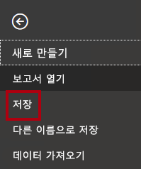

1. **다른 이름으로 저장** 창에서 **D:\PL300\MySolution** 폴더로 이동합니다.

1. **파일 이름** 상자에 **판매 분석**을 입력합니다.

    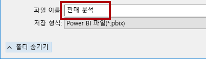

1. **저장**을 클릭합니다.

    

    팁: 왼쪽 위에 있는 **저장** 아이콘을 클릭하여 파일을 저장할 수도 있습니다.

    

### **작업 2: Power BI Desktop 옵션 설정**

이 작업에서는 Power BI Desktop 옵션을 설정합니다.

1. Power BI Desktop에서 **파일** 리본 탭을 클릭하여 Backstage 보기를 엽니다.

1. 왼쪽에서 **옵션 및 설정**을 선택한 다음, **옵션**을 선택합니다.

    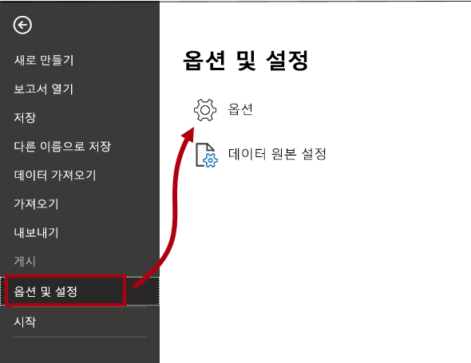

1. **옵션** 창의 왼쪽에 있는 **현재 파일** 그룹에서 **데이터 로드**를 선택합니다.

    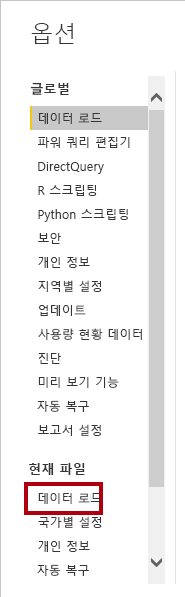

    현재 파일에 대한 **데이터 로드** 설정은 모델링할 때 기본 동작을 결정하는 설정 옵션을 허용합니다.

1. **관계** 그룹에서는 이미 선택되어 있는 두 옵션의 선택을 취소합니다.

    

    While having these two options enabled can be helpful when developing a data model, you disabled them earlier to support the lab experience. When you create relationships in the <bpt id="p1">**</bpt>Load Data in Power BI Desktop<ept id="p1">**</ept> lab, you’ll learn why you are adding each one.

1. **확인**을 클릭합니다.

    

1. Power BI Desktop 파일을 저장합니다.

### **작업 3: SQL Server에서 데이터 가져오기**

이 작업에서는 SQL Server 테이블을 기반으로 쿼리를 만듭니다.

1. **데이터** 그룹 안에 있는 **홈** 리본 탭에서 **SQL Server**를 클릭합니다.

    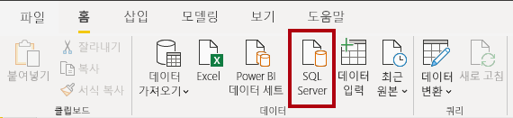

2. **SQL Server 데이터베이스** 창의 **서버** 상자에 **localhost**를 입력합니다.

    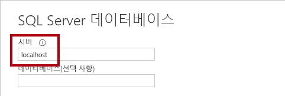

    이 랩에서는 Adventure Works 회사를 위한 Power BI Desktop 솔루션 개발을 시작합니다.

3. **확인**을 클릭합니다.

    

4. **탐색기** 창의 왼쪽에서 **AdventureWorksDW2020** 데이터베이스를 확장합니다.

    여기에는 원본 데이터에 연결하여 데이터를 미리 보고 데이터 미리 보기 기법을 사용하여 원본 데이터의 특징과 품질을 이해하는 과정이 포함됩니다.

    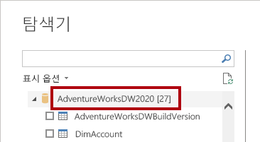

5. **DimEmployee** 테이블을 선택하지만 체크하지 마십시오.

    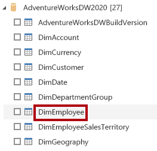

6. 오른쪽 창에 테이블 데이터의 미리 보기가 있습니다.

    미리 보기 데이터에서는 열과 행의 샘플을 각각 확인할 수 있습니다.

7. 쿼리를 만들려면 다음 6개의 테이블 옆에 있는 체크박스를 선택합니다.

    - DimEmployee

    - DimEmployeeSalesTerritory

    - DimProduct

    - DimReseller

    - DimSalesTerritory

    - FactResellerSales

8. 선택한 테이블의 데이터에 변환을 적용하려면 **데이터 변환**을 클릭합니다.

    You won’t be transforming the data in this lab. The objectives of this lab focus on exploring and profiling the data in the <bpt id="p1">**</bpt>Power Query Editor<ept id="p1">**</ept> window.

    

### **작업 4: SQL Server 쿼리 미리 보기**

In this task you will preview the data of the SQL Server queries. First, you will learn relevant information about the data. You will also use column quality, column distribution, and column profile tools to understand the data and to assess data quality.

1. 왼쪽의 **Power Query 편집기** 창에 **쿼리** 창이 표시됩니다.

    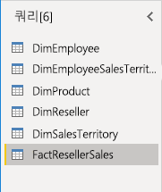

    **쿼리** 창에는 선택한 각 테이블에 대한 쿼리가 하나 있습니다.

2. 첫 번째 쿼리인 **DimEmployee**를 선택합니다.

    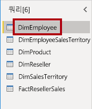

    The <bpt id="p1">**</bpt>DimEmployee<ept id="p1">**</ept> table in the SQL Server database stores one row for each employee. A subset of the rows from this table represents the salespeople, which will be relevant to the model you’ll develop.

3. 왼쪽 아래의 상태 표시줄에는 테이블 통계에 33개의 열과 296개의 행이 있습니다.

    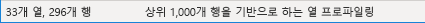

4. 데이터 미리 보기 창에서 가로로 스크롤하여 모든 열을 검토합니다.

5. 마지막 5개의 열에는 **테이블** 또는 **값** 링크가 포함되어 있습니다.

    These five columns represent relationships to other tables in the database. They can be used to join tables together. You’ll join tables in the <bpt id="p1">**</bpt>Load Data in Power BI Desktop<ept id="p1">**</ept> lab.

6. 열 품질을 평가하려면 **데이터 미리 보기** 그룹 안에 있는 **보기**  리본 탭에서 **열 품질**을 체크합니다.

    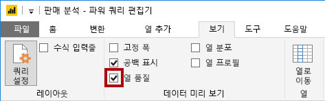

    열 품질 기능을 사용하면 열에서 발견된 유효한 값, 오류 또는 빈 값의 비율을 쉽게 확인할 수 있습니다.

7. **위치** 열(여섯 번째 마지막 열)의 경우, 행의 94%가 비어 있습니다(null).

    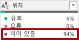

8. 열 분포를 평가하려면 **보기** 리본 탭의 **데이터 미리 보기** 그룹 내에서 **열 분포**를 선택합니다.

    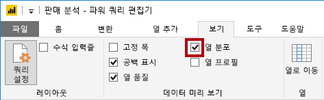

9. **위치** 열을 다시 검토하고 4개의 Distinct 값과 하나의 고유 값이 있는지 확인합니다.

10. **EmployeeKey**(첫 번째) 열에 대한 열 분포를 검토 합니다. 여기에는 296개의 상이 값과 296개의 고유 값이 있습니다.

    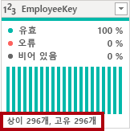

    When the distinct and unique counts are the same, it means the column contains unique values. When modeling, it’s important that some model tables have unique columns. These unique columns can be used to create one-to-many relationships, which you will do in the <bpt id="p1">**</bpt>Model Data in Power BI Desktop, Part 1<ept id="p1">**</ept> lab.

11. **쿼리** 창에서 **DimEmployeeSalesTerritory** 쿼리를 선택합니다.

    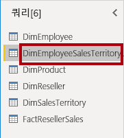

    The <bpt id="p1">**</bpt>DimEmployeeSalesTerritory<ept id="p1">**</ept> table stores one row for each employee and the sales territory regions they manage. The table supports relating many regions to a single employee. Some employees manage one, two, or possibly more regions. When you model this data, you’ll need to define a many-to-many relationship, which you’ll do in the <bpt id="p1">**</bpt>Model Data in Power BI Desktop, Part 2<ept id="p1">**</ept> lab.

12. **쿼리** 창에서 **DimProduct** 쿼리를 선택합니다.

    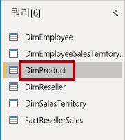

    **DimProduct** 테이블에는 회사에서 판매하는 제품당 하나의 행이 포함되어 있습니다.

13. 마지막 열을 표시하려면 가로로 스크롤합니다.

14. **DimProductSubcategory** 열을 확인하세요.

    **Power BI Desktop에서 데이터 로드** 랩에서 이 쿼리에 변환을 추가할 때 **DimProductSubcategory** 열을 사용하여 테이블을 조인합니다.

15. **쿼리** 창에서 **DimProduct** 쿼리를 선택합니다.

    

    The <bpt id="p1">**</bpt>DimReseller<ept id="p1">**</ept> table contains one row per reseller. Resellers sell, distribute, or value add to the Adventure Works products.

16. 열 값을 보려면 **보기** 리본 탭의 **데이터 미리 보기** 그룹 내에서 **열 프로필**을 선택합니다.

    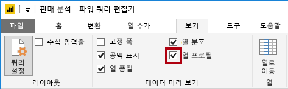

17. **BusinessType** 열 머리글을 선택합니다.

18. 데이터 미리 보기 창 아래에 새 창이 표시됩니다.

19. 데이터 미리 보기 창에서 열 통계 및 값 분포를 검토합니다.

20. 데이터 품질 문제 확인: 웨어하우스에는 2개의 레이블 (**Warehouse**및 철자가 잘못된 **Ware House**)이 있습니다.

    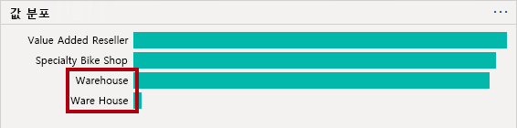

21. **Ware House** 표시줄 위에 커서를 놓은 다음, 이 값을 가진 5개의 행이 있는지 확인합니다.

    **Power BI Desktop에서 데이터 로드** 랩에서 변환을 적용하여 이 5개 행의 레이블을 재지정합니다.

22. **쿼리** 창에서 **DimEmployeeSalesTerritory** 쿼리를 선택합니다.

    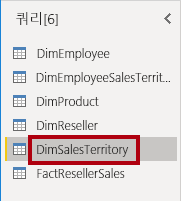

    The <bpt id="p1">**</bpt>DimSalesTerritory<ept id="p1">**</ept> table contains one row per sales region, including <bpt id="p2">**</bpt>Corporate HQ<ept id="p2">**</ept> (headquarters). Regions are assigned to a country, and countries are assigned to groups. In the <bpt id="p1">**</bpt>Model Data in Power BI Desktop, Part 1<ept id="p1">**</ept> lab, you’ll create a hierarchy to support analysis at region, country, or group level.

23. **쿼리** 창에서 **FactResellerSales** 쿼리를 선택합니다.

    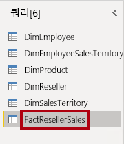

    **FactResellerSales** 테이블에는 판매 주문 라인당 하나의 행이 포함되어 있으며, 하나의 판매 주문에는 하나 이상의 품목이 포함되어 있습니다.

24. **TotalProductCost** 열의 열 품질을 검토하고 행의 8%가 비어 있는지 확인합니다.

    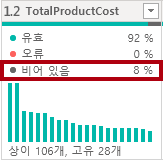

    이 랩은 데이터 준비부터 보고서 및 대시보드로 게시에 이르기까지 전체 사례로 고안된 랩 시리즈 중 하나입니다.

### **작업 5: CSV 파일에서 데이터 가져오기**

이 작업에서는 CSV 파일을 기반으로 쿼리를 생성합니다.

1. 새 쿼리를 추가하려면 **파워 쿼리 편집기** 창에서 **새 쿼리** 그룹 내에 있는 **홈** 리본 탭에서 **새 원본** 아래쪽 화살표를 클릭한 다음, **텍스트/CSV**를 선택합니다.

    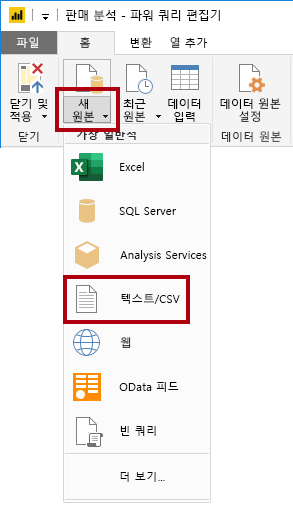

2. **열기** 창에서 **D:\PL300\Resources** 폴더로 이동하고 **ResellerSalesTargets.csv** 파일을 선택합니다.

3. **열기**를 클릭합니다.

4. **ResellerSalesSalesTargets.csv** 창에서 미리 보기 데이터를 검토합니다.

5. **확인**을 클릭합니다.

    

  
‎ 

6. **쿼리** 창에 **ResellerSalesTargets** 쿼리가 추가된 것을 확인합니다.

    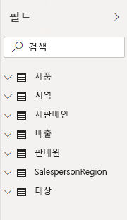

    어떤 순서로든 랩을 완료할 수 있습니다.

7. 빈 값이 포함된 열이 없습니다.

    월별 목표 판매량이 없을 때에는 그 대신 하이픈 문자가 저장됩니다.

8. 열 이름 왼쪽에 있는 각 열 머리글의 아이콘을 검토합니다.

    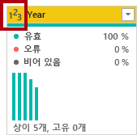

    그러나 여러 랩을 진행하려는 경우 처음 10개 랩은 다음 순서를 따르는 것이 좋습니다.

    **Power BI Desktop에서 데이터 로드** 랩에서 다양한 변환을 적용하여 **Date**, **EmployeeKey**, **TargetAmount**의 세 열로만 구성된 다른 모양의 결과를 얻습니다.

### **작업 6: CSV 파일에서 추가 데이터 가져오기**

이 작업에서는 다른 CSV 파일을 기반으로 추가 쿼리를 만듭니다.

1. 이전 작업의 단계를 사용하여 **D:\PL300\Resources\ColorFormats.csv** 파일을 기반으로 한 쿼리를 만듭니다.

    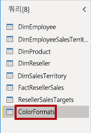

    The <bpt id="p1">**</bpt>ColorFormats<ept id="p1">**</ept> CSV file contains one row per product color. Each row records the HEX codes to format background and font colors. You’ll integrate this data with the <bpt id="p1">**</bpt>DimProduct<ept id="p1">**</ept> query data in the <bpt id="p2">**</bpt>Load Data in Power BI Desktop<ept id="p2">**</ept> lab.

### **작업 7: 완료**

이 작업에서는 랩을 완료합니다.

1. **보기** 리본 탭의 **데이터 미리 보기** 그룹 내부에서 이 랩의 앞부분에서 사용하도록 설정한 다음 세 가지 데이터 미리 보기 옵션을 선택 취소합니다.

    - 열 품질

    - 열 분포

    - 열 프로필

    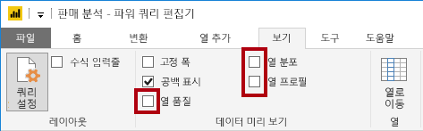

2. Power BI Desktop 파일을 저장하려면 **Power Query 편집기** 창의 **파일** Backstage 뷰에서 **저장을** 선택합니다.

    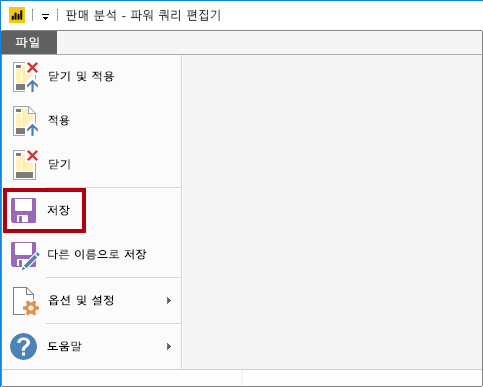

3. 쿼리를 적용하라는 메시지가 표시되면 **나중에 적용**을 클릭합니다.

    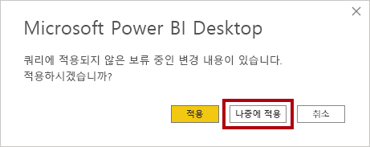

    Applying the queries will load their data to the data model. You’re not ready to do that, as there are many transformations that must be applied first.

4. 다음 랩을 시작하려는 경우 Power BI Desktop을 열어 둡니다.

    **Power BI Desktop에서 데이터 로드** 랩에서 쿼리에 다양한 변환을 적용한 다음 해당 쿼리를 적용하여 데이터 모델에 로드할 것입니다.
