---
lab:
  title: Power BI Desktop에서 데이터 로드
  module: Module 3 - Clean, Transform, and Load Data in Power BI
ms.openlocfilehash: 8e8373127cbc8023c0c299e3b2c75b4a82986308
ms.sourcegitcommit: d88b7941fe3805f0bc2979ea864c5483ec289c75
ms.translationtype: HT
ms.contentlocale: ko-KR
ms.lasthandoff: 06/04/2022
ms.locfileid: "146071893"
---
# <a name="load-data-in-power-bi-desktop"></a>**Power BI Desktop에서 데이터 로드**

**이 랩을 완료하는 데 걸리는 예상 완료 시간은 45분입니다.**

이 랩에서는 이전 랩에서 만든 각 쿼리에 대한 변환 적용을 시작합니다. 그런 다음 쿼리를 적용하여 각 항목 데이터 모델에 테이블로 로드합니다.

이 랩에서는 다음 작업을 수행하는 방법을 알아봅니다.

- 다양한 변환 적용

- 쿼리를 적용하여 데이터 모델에 로드

### <a name="lab-story"></a>**랩 사례**

이 랩은 데이터 준비부터 보고서 및 대시보드로 게시에 이르기까지 전체 사례로 고안된 랩 시리즈 중 하나입니다. 어떤 순서로든 랩을 완료할 수 있습니다. 그러나 여러 랩을 진행하려는 경우 처음 10개 랩은 다음 순서를 따르는 것이 좋습니다.

1. Power BI Desktop에서 데이터 준비

2. **Power BI Desktop에서 데이터 로드**

3. Power BI Desktop에서 데이터 모델링


5. Power BI Desktop에서 DAX 계산 만들기, 1부

6. Power BI Desktop에서 DAX 계산 만들기, 2부

7. Power BI Desktop에서 보고서 디자인, 1부

8. Power BI Desktop에서 보고서 디자인, 2부

9. Power BI 대시보드 만들기

10. Power BI Desktop에서 데이터 분석 수행

11. 행 수준 보안 적용

## <a name="exercise-1-load-data"></a>**연습 1: 데이터 로드**

이 연습에서는 이전 랩에서 만든 각 쿼리에 변환을 적용합니다.

### <a name="task-1-get-started"></a>**작업 1: 시작하기**

이 작업에서는 랩용 환경을 설정합니다.

*중요: 이전 랩에서 계속 진행해 온 경우(그리고 해당 랩을 성공적으로 완료한 경우) 이 작업을 완료하지 마세요. 대신, 다음 작업부터 진행하세요.*

1. Power BI Desktop을 열려면 작업 표시줄에서 Microsoft Power BI Desktop 바로 가기를 클릭합니다.

    

1. 시작 창을 닫으려면 창 왼쪽 위의 **X** 를 클릭합니다.

    

1. 시작 Power BI Desktop 파일을 열려면 **파일** 리본 탭을 클릭하여 Backstage 뷰를 엽니다.

1. **보고서 열기** 를 선택합니다.

    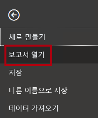

1. **보고서 찾아보기** 를 클릭합니다.

    

1. **열기** 창에서 **D:\PL300\Labs\02-load-data-with-power-query-in-power-bi-desktop\Starter** 폴더로 이동합니다.

1. **판매 분석** 파일을 선택합니다.

1. **열기** 를 클릭합니다.

    

1. 열려 있는 정보 창을 모두 닫습니다.

1. 리본 아래에서 노란색 경고 메시지를 확인합니다.

    이 메시지는 쿼리가 모델 테이블로 로드되지 않았다는 사실을 경고합니다. 이 랩의 후반에서 쿼리를 적용하겠습니다.

1. 경고 메시지를 해제하려면 노란색 경고 메시지 오른쪽의 **X** 를 클릭합니다.

    

1. 파일 복사본을 만들려면 **파일** 리본 탭을 클릭하여 Backstage 뷰를 엽니다.

1. **다른 이름으로 저장** 을 선택합니다.

    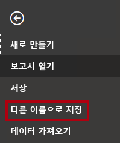

1. 변경 내용을 적용하라는 메시지가 표시되면 **나중에 적용** 을 클릭합니다.

    

1. **다른 이름으로 저장** 창에서 **D:\PL300\MySolution** 폴더로 이동합니다.

1. **저장** 을 클릭합니다.

    

1. **Power Query 편집기** 창을 열려면 **홈** 리본 탭의 **쿼리** 그룹 내에서 **데이터 변환** 아이콘을 클릭합니다.

    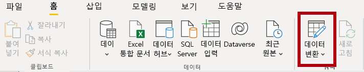

### <a name="task-2-configure-the-salesperson-query"></a>**작업 2: Salesperson 쿼리 구성**

이 작업에서는 **Salesperson** 쿼리를 구성합니다.

1. **파워 쿼리 편집기** 창의 **쿼리** 창에서 **DimEmployee** 쿼리를 선택합니다.

    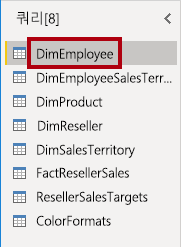

2. 쿼리 이름을 바꾸려면 (오른쪽에 있는) **쿼리 설정** 창의 **이름** 상자에서 텍스트를 **Salesperson** 으로 바꾸고 **Enter** 를 누릅니다.

    쿼리 이름에 따라 모델 테이블 이름이 결정됩니다. 간결하면서도 익숙한 이름을 정의하는 것이 좋습니다.

3. **쿼리** 창에서 쿼리 이름이 업데이트되었는지 확인합니다.

    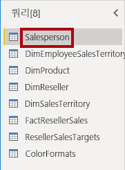

    이제 쿼리 행을 필터링하여 영업 직원인 사원만 검색하겠습니다.

4. 특정 열을 찾으려면 **홈** 리본 탭에서 **열 관리** 와 **열 선택** 아래쪽 화살표를 차례로 클릭하고 **열로 이동** 을 선택합니다.

    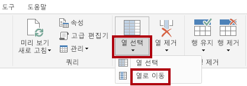

    *팁: 이 기법은 쿼리에 많은 열이 있을 때 유용합니다. 열 수가 많지 않으면 가로로 스크롤하여 원하는 열을 찾을 수 있습니다.*

5. **열로 이동** 창에서 **AZ** 정렬 버튼을 클릭하여 열 이름을 기준으로 목록을 정렬하고 **이름** 을 선택합니다.

    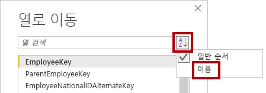

6. **SalesPersonFlag** 열을 선택하고 **확인** 을 클릭합니다.

7. 쿼리를 필터링하려면 **SalesPersonFlag** 열 머리글에서 아래쪽 화살표를 클릭하고 **FALSE** 를 선택 취소합니다.

    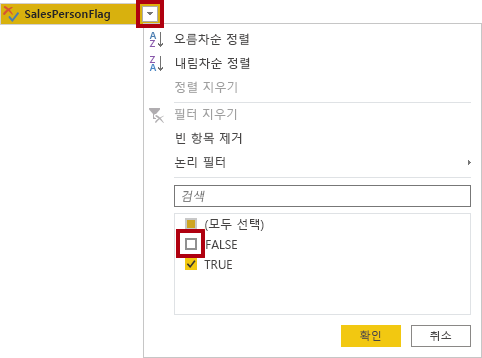

8. **확인** 을 클릭합니다.

    

9. **쿼리 설정** 창의 **적용된 단계** 목록에 **필터링된 행** 단계가 추가됩니다.

    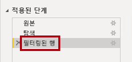

    변환을 생성할 때마다 추가 단계 논리가 생성됩니다. 단계를 편집하거나 삭제할 수 있습니다. 쿼리 변환 단계에서의 쿼리 결과를 미리 보는 단계를 선택할 수도 있습니다.

10. 열을 제거하려면 **홈** 리본 탭의 **열 관리** 그룹을 클릭한 다음 **열 선택** 아이콘을 클릭합니다.

    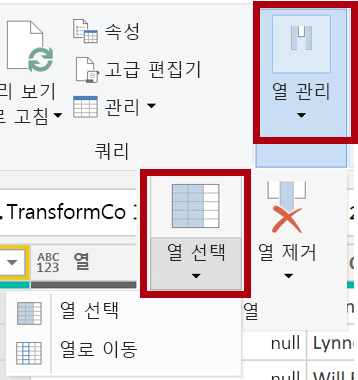

11. **열 선택** 창에서 모든 열을 선택 취소하려면 **(모든 열 선택)** 항목을 선택 취소합니다.

    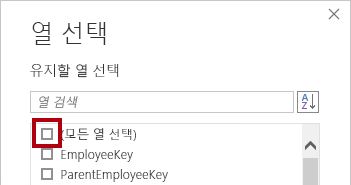

12. 다음 6개 열을 선택하여 열을 포함합니다.

    - EmployeeKey

    - EmployeeNationalIDAlternateKey

    - FirstName

    - LastName

    - Title

    - EmailAddress

13. **확인** 을 클릭합니다.

    

14. **적용된 단계** 목록에서 다른 쿼리 단계가 추가됩니다.

    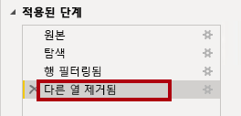

15. 단일 이름 열을 만들려면 먼저 **FirstName** 열 머리글을 선택합니다.

16. **Ctrl** 키를 누른 상태에서 **LastName** 열을 선택합니다.

    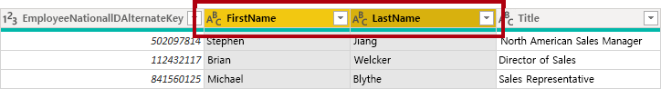

17. 선택한 열 헤더 중 하나를 마우스 오른쪽 단추로 클릭한 다음 컨텍스트 메뉴에서 **열 병합** 을 선택합니다.

    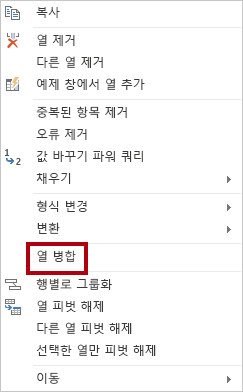

    대부분의 일반적인 변환은 열 머리글을 마우스 오른쪽 단추로 클릭한 다음, 상황에 맞는 메뉴에서 선택하면 적용할 수 있습니다. 하지만 리본에서 더 많은 변환을 사용할 수 있습니다.

18. **열 병합** 창의 **구분 기호** 드롭다운 목록에서 **공간을** 선택합니다.

19. **새 열 이름** 상자에서 텍스트를 **Salesperson** 으로 바꿉니다.

    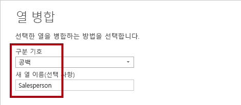

20. **확인** 을 클릭합니다.

    

21. **EmployeeNationalIDAlternateKey** 열의 이름을 변경하려면 **EmployeeNationalIDAlternateKey** 열 헤더를 두 번 클릭합니다.

22. 텍스트를 **EmployeeID** 로 바꾸고 **Enter** 를 누릅니다.

    *중요: 열 이름을 바꿀 때는 반드시 설명을 정확하게 따라야 합니다.*

23. 이전 단계를 사용하여 **EmailAddress** 열의 이름을 **UPN** 으로 변경합니다.

    *UPN은 User Principal Name(사용자 계정 이름)의 약자입니다.*

24. 왼쪽 아래 상태 표시줄에서 쿼리에 열이 5개, 행이 18개 있는지 확인합니다.

    

    *중요: 쿼리가 올바른 결과를 생성하지 않으면 나중에 랩을 완료할 수 없게 되므로 더 진행하지 않는 것이 중요합니다. 쿼리 열 또는 행이 일치하지 않는 경우 이 작업의 단계를 다시 참조하여 문제를 해결하세요.*

### <a name="task-3-configure-the-salespersonregion-query"></a>**작업 3: SalespersonRegion 쿼리 구성**

이 작업에서는 **SalespersonRegion** 쿼리를 구성합니다.

1. **쿼리** 창에서 **DimEmployeeSalesTerritory** 쿼리를 선택합니다.

    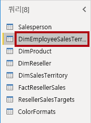

2. **쿼리 설정** 창에서 쿼리 이름을 **SalespersonRegion** 으로 바꿉니다.

3. 마지막 열 2개를 제거하기 위해 먼저 **DimEmployee** 열 머리글을 선택합니다.

4. **Ctrl** 키를 누른 상태에서 **DimSalesTerritory** 열 머리글을 선택합니다.

5. 선택한 열 헤더 중 하나를 마우스 오른쪽 단추로 클릭한 다음 컨텍스트 메뉴에서 **열 제거** 를 선택합니다.

    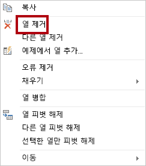

6. 상태 표시줄에서 쿼리에 두 개의 열과 39개의 행이 있는지 확인합니다.

    

### <a name="task-4-configure-the-product-query"></a>**작업 4: Product 쿼리 구성**

이 작업에서는 **Product** 쿼리를 구성합니다.

*중요: 자세한 지침이 이미 제공된 경우 랩 단계에서는 이제 더 간결한 지침이 제공됩니다. 자세한 지침이 필요한 경우 이전 작업의 단계를 다시 참조하세요.*

1. **DimProduct** 쿼리를 선택합니다.

    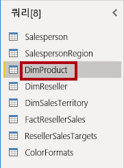

2. 쿼리 이름을 **Product** 로 바꿉니다.

3. **FinishedGoodsFlag** 열을 찾은 다음 열을 필터링하여 완제품인 제품을 검색합니다(예: TRUE).

4. 다음을 제외한 모든 열을 제거합니다.

    - ProductKey

    - EnglishProductName

    - StandardCost

    - Color

    - DimProductSubcategory

5. **DimProductSubcategory** 열은 관련 테이블을 나타냅니다(**값** 링크가 포함됨).

6. 열 이름 오른쪽에 있는 **DimProductSubcategory** 열 헤더에서 확장 단추를 클릭합니다.

    

7. **(모든 열 선택)** 항목을 선택 취소하여 모든 열을 선택 취소합니다.

8. **EnglishProductSubcategoryName** 및 **DimProductCategory** 열을 선택하세요.

    

    두 열을 선택하면 변환이 **DimProductSubcategory** 테이블에 대한 조인에 적용되어 두 열이 포함됩니다. **DimProductCategory** 열은 데이터 원본의 또 다른 관련 테이블입니다.

9. **원래 열 이름을 접두사로 사용** 확인란을 선택 취소합니다.

    

    쿼리 열 이름은 언제나 고유해야 합니다. 이 체크박스를 선택한 상태로 유지하면 각 열의 이름에 확장된 열 이름이 접두사로 추가됩니다(이 경우 **DimProductSubcategory**). 선택한 열 이름이 **제품** 쿼리의 열 이름과 충돌하지 않음이 확인되었으므로 옵션은 선택 취소되어 있습니다.

10. **확인** 을 클릭합니다.

    

11. 변환 결과로 두 개의 열이 추가되고 두 **DimProductSubcategory** 열이 제거된 것을 알 수 있습니다.

12. **DimProductCategory** 열을 확장하고 수강생들에게 **EnglishProductCategoryName** 열만 설명합니다.

13. 다음 네 가지 열의 이름을 바꿉니다.

    - **EnglishProductName** 을 **Product** 로

    - **StandardCost** 를 **Standard Cost** 로(공백 포함)

    - **EnglishProductSubcategoryName** 을 **Subcategory** 로

    - **EnglishProductCategoryName** 을 **Category** 로

14. 상태 표시줄에서 쿼리에 열이 6개, 행이 397개 있는지 확인합니다.

    

### <a name="task-5-configure-the-reseller-query"></a>**작업 5: Reseller 쿼리 구성**

이 작업에서는 **Reseller** 쿼리를 구성합니다.

1. **DimReseller** 쿼리를 선택합니다.

    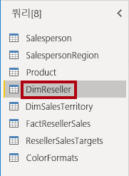

2. 쿼리 이름을 **Reseller** 로 바꿉니다.

3. 다음을 제외한 모든 열을 제거합니다.

    - ResellerKey

    - BusinessType

    - ResellerName

    - DimGeography

4. **DimGeography** 열을 확장하고 다음 세 개의 열만 포함합니다.

    - City

    - StateProvinceName

    - EnglishCountryRegionName

    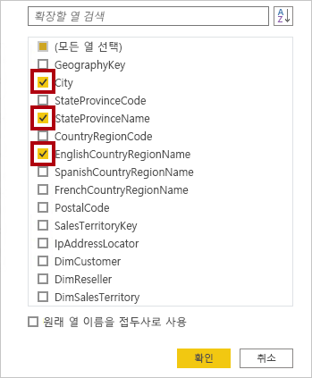

5. **비즈니스 유형** 열 머리글에서 아래쪽 화살표를 클릭한 다음 고유 열 값을 검토하여 'warehouse'의 오타를 확인합니다.

    

  

6. **비즈니스 유형** 열 헤더를 마우스 오른쪽 단추로 클릭한 다음 **값 바꾸기** 를 선택합니다.

    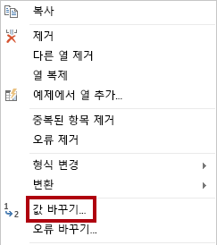

7. **값 바꾸기** 창에서 다음 값을 구성합니다.

    - **찾을 값** 상자에 **Ware House** 를 입력

    - **다음으로 변경** 상자에 **Warehouse** 를 입력

    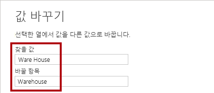

8. **확인** 을 클릭합니다.

    

9. 다음 네 가지 열의 이름을 바꿉니다.

    - **BusinessType** 을 **Business Type** 으로(공백 포함)

    - **ResellerName** 을 **Reseller** 로

    - **StateProvinceName** 을 **State-Province** 로

    - **EnglishCountryRegionName** 을 **Country-Region** 으로

10. 상태 표시줄에서 쿼리에 6개의 열과 701개의 행이 있는지 확인합니다.

    

### <a name="task-6-configure-the-region-query"></a>**작업 6: Region 쿼리 구성**

이 작업에서는 **Region** 쿼리를 구성합니다.

1. **DimSalesTerritory** 쿼리를 선택합니다.

    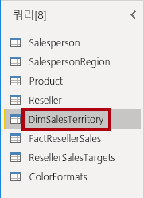

2. 쿼리 이름을 **Region** 으로 바꿉니다.

3. 값 0(영)을 제거하려면 **SalesTerritoryAlternateKey** 열에 필터를 적용합니다.

    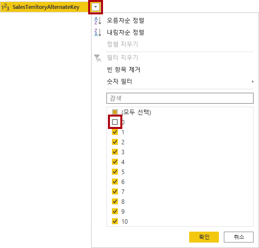

4. 다음을 제외한 모든 열을 제거합니다.

    - SalesTerritoryKey

    - SalesTerritoryRegion

    - SalesTerritoryCountry

    - SalesTerritoryGroup

5. 다음 세 가지 열의 이름을 바꿉니다.

    - **SalesTerritoryRegion** 을 **Region** 으로

    - **SalesTerritoryCountry** 를 **Country** 로

    - **SalesTerritoryGroup** 을 **Group** 으로

6. 상태 표시줄에서 쿼리에 열이 4개, 행이 10개 있는지 확인합니다.

    

### <a name="task-7-configure-the-sales-query"></a>**작업 7: Sales 쿼리 구성**

이 작업에서는 **Sales** 쿼리를 구성합니다.

1. **FactResellerSales** 쿼리를 선택합니다.

    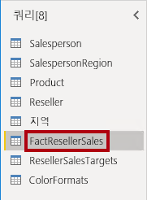

2. 쿼리 이름을 **Sales** 로 바꿉니다.

3. 다음을 제외한 모든 열을 제거합니다.

    - SalesOrderNumber

    - OrderDate

    - ProductKey

    - ResellerKey

    - EmployeeKey

    - SalesTerritoryKey

    - OrderQuantity

    - UnitPrice

    - TotalProductCost

    - SalesAmount

    - DimProduct

    **Power BI Desktop에서 데이터 준비** 랩에서는 소수의 **FactResellerSales** 행에 **TotalProductCost** 값이 없었습니다. **DimProduct** 열은 제품 표준 비용 열을 검색하여 누락된 값을 쉽게 수정할 수 있도록 포함된 것입니다.

4. **DimProduct** 열을 확장한 다음 모든 열을 선택 취소하고 **StandardCost** 열만 포함합니다.

5. 사용자 지정 열을 만들려면 **일반** 그룹 내의 **열 추가** 리본 탭에서 **사용자 지정 열** 을 클릭합니다.

    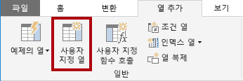

6. **새 열 이름** 상자의 **사용자 지정 열** 창에서 텍스트를 **비용** 으로 바꿉니다.

    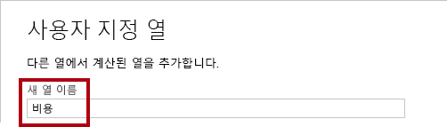

7. **사용자 지정 열 수식** 상자에서 다음 식을 등호 뒤에 입력합니다.

8. 편의상 **D:\PL300\Labs\02-load-data-with-power-query-in-power-bi-desktop\Assets\Snippets.txt** 파일에서 식을 복사할 수 있습니다.


   **파워 쿼리**
   ```
   if [TotalProductCost] = null then [OrderQuantity] * [StandardCost] else [TotalProductCost]
   ```


이 식은 **TotalProductCost** 값 누락 여부를 확인합니다. 누락된 경우 **OrderQuantity** 값을 **StandardCost** 값으로 곱하여 값을 생성하며 그렇지 않으면 기존 **TotalProductCost** 값을 사용합니다.

9. **확인** 을 클릭합니다.

    

10. 다음 두 열을 제거합니다.

    - TotalProductCost

    - StandardCost

11. 다음 세 가지 열의 이름을 바꿉니다.

    - **OrderQuantity** 를 **Quantity** 로

    - **UnitPrice** 를 **Unit Price** 로(공백 포함)

    - **SalesAmount** 를 **Sales** 로

12. 열 데이터 형식을 수정하려면 열 이름 왼쪽에 있는 **수량** 열 헤더에서 **1.2** 아이콘을 클릭한 다음 **정수** 를 선택합니다.

    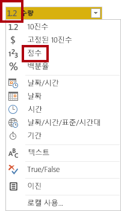

    올바른 데이터 형식 구성은 대단히 중요합니다. 또한 열에 숫자 값이 있으며 수학적 계산을 수행할 예정이라면 반드시 올바른 형식을 선택해야 합니다.

13. 다음 세 개의 열 데이터 형식을 **고정 10진수** 로 수정합니다.

    - Unit Price

    - 매출

    - 비용

    

    고정 10진수 데이터 형식은 값을 전체 정밀도로 저장하기 때문에 10진수보다 저장 공간이 더 필요합니다. 재무 관련 값이나 (환율 같은) 비율에는 반드시 고정 10진수 형식을 사용해야 합니다.

14. 상태 표시줄에서 쿼리에 열이 10개, 행이 999개 이상 있는지 확인합니다.

    

    *쿼리별 미리 보기 데이터에는 행이 1,000개까지 로드됩니다.*

### <a name="task-8-configure-the-targets-query"></a>**작업 8: Targets 쿼리 구성**

이 작업에서는 **Targets** 쿼리를 구성합니다.

1. **ResellerSalesTargets** 쿼리를 선택합니다.

    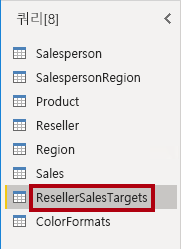

2. 쿼리 이름을 **Targets** 로 바꿉니다.

3. 12개월 열(**M01**-**M12**)을 피벗 해제하기 위해 먼저 **연도** 및 **EmployeeID** 열 머리글을 다중 선택합니다.

    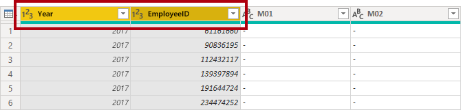

4. 선택한 열 헤더 중 하나를 마우스 오른쪽 단추로 클릭한 다음 컨텍스트 메뉴에서 **다른 열 피벗 해제** 를 선택합니다.

    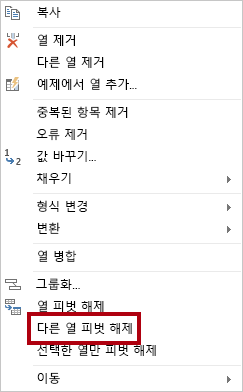

5. 열 이름이 이제 **특성** 열에 나타나고 값이 **값** 열에 나타납니다.

6. **값** 열에 필터를 적용하여 하이픈(-) 값을 제거합니다.

    *원본 CSV 파일에서 하이픈 문자를 사용하여 영(0)을 나타내는 것을 기억하실 것입니다.*

7. 다음 두 열의 이름을 바꿉니다.

    - **특성** 에서 **MonthNumber** 로(두 단어 사이에 공백 없음. 추후 제거 예정)

    - **Value** 를 **Target** 으로

    이제 변환을 적용하여 날짜 열을 생성합니다. 날짜는 **Year** 및 **MonthNumber** 열에서 파생됩니다. **예제의 열** 기능을 사용하여 열을 만들게 됩니다.

8. **MonthNumber** 열 값을 준비하려면 **MonthNumber** 열 헤더를 마우스 오른쪽 단추로 클릭한 다음 **값 바꾸기** 를 선택합니다.

    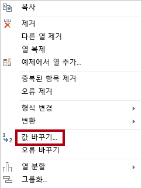

9. **값 바꾸기** 창의 **찾을 값** 상자에서 **M** 을 입력합니다.

    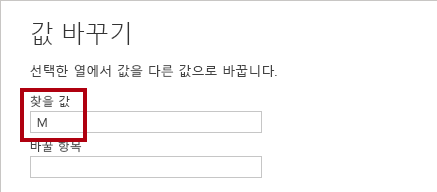

10. **확인** 을 클릭합니다.

11. **MonthNumber** 열 데이터 형식을 **정수** 로 수정합니다.

    

12. **일반** 그룹 내부의 **열 추가** 리본 탭에서 **예제에서 열 생성** 아이콘을 클릭합니다.

    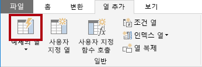

13. 첫 번째 행은 **2017** 년, 월 번호 **7** 입니다.

14. **Column1** 열의 첫 번째 표 셀에서 **7/1/2017** 을 입력한 다음 **Enter** 를 누릅니다.

    가상 머신은 미국 지역 설정을 사용하므로 이 날짜는 실제로 2017년 7월 1일입니다.

15. 그리드 셀이 예측된 값으로 업데이트됩니다.

    이 기능은 **연도** 및 **MonthNumber** 열의 값을 결합하고 있음을 정확하게 예측했습니다.

16. 쿼리 그리드 위에 표시되는 수식에도 주목하세요.

    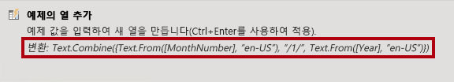

17. 새 열의 이름을 바꾸려면 **병합** 열 머리글을 두 번 클릭합니다.

18. 열 이름을 **TargetMonth** 로 바꿉니다.

    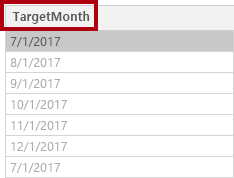

19. 새 열을 추가하려면 **확인** 을 클릭합니다.

    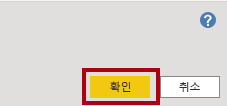

20. 다음 열을 제거합니다.

    - Year

    - MonthNumber

21. 다음 열 데이터 형식을 수정합니다.

    - **Target** 을 고정 10진수로

    - **TargetMonth** 를 날짜로

22. **Target** 값을 1000으로 곱하려면 **Target** 열 헤더를 선택한 다음 **숫자 열** 그룹 내부의 **변환** 리본 탭에서 **표준** 을 클릭한 다음 **곱하기** 를 선택합니다.

    *목표 값이 수천 단위로 저장된 것을 기억하실 수 있습니다.*

    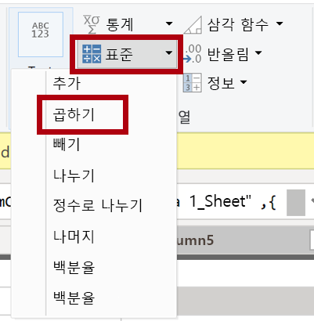

23. **곱하기** 창의 **값** 상자에 **1000** 을 입력합니다.

    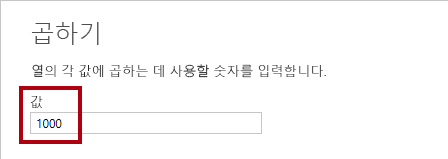

24. **확인** 을 클릭합니다.

    

25. 상태 표시줄에서 쿼리에 세 개의 열과 809개의 행이 있는지 확인합니다.

    

### <a name="task-9-configure-the-colorformats-query"></a>**작업 9: ColorFormats 쿼리 구성**

이 작업에서는 **ColorFormats** 쿼리를 구성합니다.

1. **ColorFormats** 쿼리를 선택합니다.

    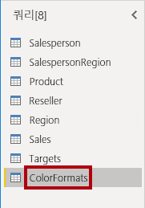

2. 첫 번째 행에 열 이름이 포함되어 있습니다.

3. **변환** 그룹 내의 **홈** 리본 탭에서 **첫 행을 머리글로 사용** 을 클릭합니다.

    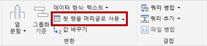

4. 상태 표시줄에서 쿼리에 세 개의 열과 10개의 행이 있는지 확인합니다.

    

### <a name="task-10-update-the-product-query"></a>**작업 10: Product 쿼리 업데이트**

이 작업에서는 **ColorFormats** 쿼리를 병합하여 **Product** 쿼리를 업데이트합니다.

1. **Product** 쿼리를 선택합니다.

    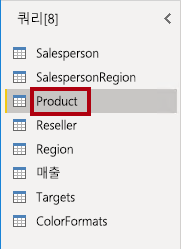

2. **ColorFormats** 쿼리를 병합하려면 **홈** 리본 탭에서 **결합** 아래쪽 화살표와 **쿼리 병합** 을 차례로 클릭합니다.

    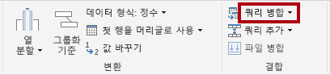

    쿼리를 병합하면 데이터를 통합할 수 있는데, 이 경우에는 다양한 데이터 원본(SQL Server 및 CSV 파일)의 데이터를 통합할 수 있습니다.

3. **제품** 쿼리 표의 **병합** 창에서 **색상** 열 헤더를 선택합니다.

    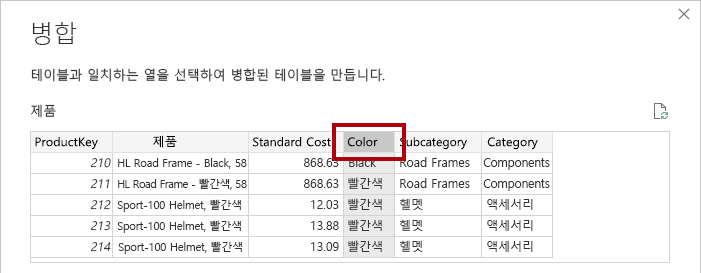

4. **제품** 쿼리 표 아래의 드롭다운 목록에서 **ColorFormats** 쿼리를 선택합니다.

    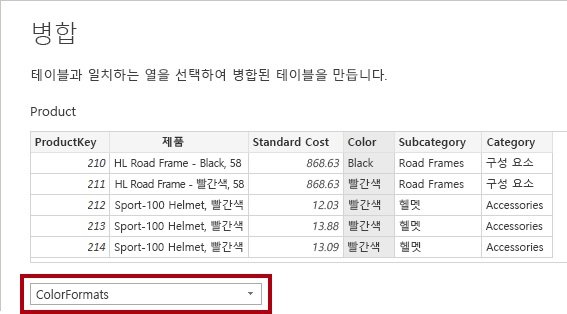

5. **ColorFormats** 쿼리 표에서 **색상** 열 헤더를 선택합니다.

6. **개인 정보 수준** 창이 열리면 해당 드롭다운 목록에서 두 데이터 원본 각각에 대해 **조직** 을 선택합니다.

    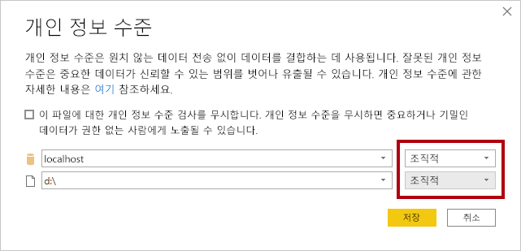

    데이터 원본의 개인 정보 수준을 구성하여 원본 간의 데이터 공유 여부를 정할 수 있습니다. 필요하다면 각 데이터 원본을 **조직** 으로 설정하여 데이터를 공유할 수 있게 합니다. 개인 데이터 원본은 다른 데이터 원본과 공유할 수 없습니다. 하지만 프라이빗 데이터를 공유할 수 없다는 뜻은 아닙니다. 파워 쿼리 엔진이 원본 간에 데이터를 공유할 수 없다는 뜻입니다.

7. **저장** 을 클릭합니다.

    

8. **병합** 창에서 기본 **조인 종류** 를 사용합니다. 왼쪽 우선 외부 선택 항목을 유지하고 **확인** 을 클릭합니다.

    

9. 다음 두 개의 열을 포함하도록 **ColorFormats** 열을 확장합니다.

    - 배경색 형식

    - 글꼴 색 형식

    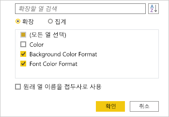

10. 상태 표시줄에서 쿼리에 이제 8개의 열과 397개의 행이 있는지 확인합니다.

    

### <a name="task-11-update-the-colorformats-query"></a>**작업 11: ColorFormats 쿼리 업데이트**

이 작업에서는 **ColorFormats** 를 업데이트하여 로드를 비활성화합니다.

1. **ColorFormats** 쿼리를 선택합니다.

    

2. **쿼리 설정** 창에서 **모든 속성** 링크를 클릭합니다.

    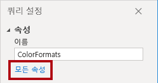

3. **쿼리 속성** 창에서 **보고하기 위해 로드 실행** 확인란을 선택 취소합니다.

    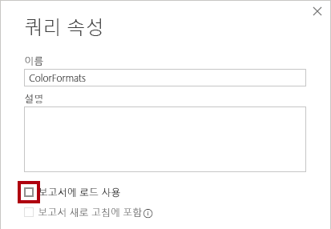

    로드를 비활성화하면 데이터 모델에 테이블로 로드되지 않습니다. 쿼리가 데이터 모델로의 로드가 활성화된 Product 쿼리와 병합되었기 때문에 이 작업을 수행해야 합니다.

4. **확인** 을 클릭합니다.

    

### <a name="task-12-finish-up"></a>**작업 12: 완료**

이 작업에서는 랩을 완료합니다.

1. 다음과 같이 이름이 올바르게 지정된 쿼리 8개가 있는지 확인합니다.

    - Salesperson

    - SalespersonRegion

    - Product

    - Reseller

    - Region

    - 매출

    - 대상

    - ColorFormats(데이터 모델에 로드되지 않음)

2. 데이터 모델을 로드하기 위해 **파일** Backstage 보기에서 **닫기 및 적용** 을 선택합니다.

    

    *이제 로드를 활성화한 모든 쿼리가 데이터 모델에 로드됩니다.*

3. **필드** 창(오른쪽에 위치)에서 데이터 모델에 로드된 7개의 테이블을 확인합니다.

    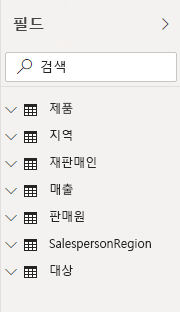

4. Power BI Desktop 파일을 저장합니다.

5. 다음 랩을 시작하려는 경우 Power BI Desktop을 열어 둡니다.

    **Power BI Desktop에서 데이터 모델링** 랩에서 데이터 모델 테이블과 관계를 구성합니다.
