---
lab:
  title: Power BI Desktop에서 보고서 디자인, 1부
  module: Module 7 - Create Reports
ms.openlocfilehash: 426892501790aaecbe21ed2e7f9161c4490c9e3b
ms.sourcegitcommit: 9ea1e7e21b9b3c718030c94b1693d153a2010ec7
ms.translationtype: HT
ms.contentlocale: ko-KR
ms.lasthandoff: 06/29/2022
ms.locfileid: "146650219"
---
# **Power BI Desktop에서 보고서 디자인, 1부**

**이 랩을 완료하는 데 걸리는 예상 완료 시간은 45분입니다.**

이 랩에서는 세 페이지로 구성된 보고서를 만듭니다. 그런 다음, Power BI에 게시하면 보고서를 열고 상호 작용할 수 있습니다.

이 랩에서는 다음 작업을 수행하는 방법을 알아봅니다.

- 보고서 디자인

- 시각적 개체 필드 및 서식 속성 구성

### **랩 사례**

이 랩은 데이터 준비부터 보고서 및 대시보드로 게시에 이르기까지 전체 사례로 고안된 랩 시리즈 중 하나입니다. 어떤 순서로든 랩을 완료할 수 있습니다. 그러나 여러 랩을 진행하려는 경우 다음 순서를 따르는 것이 좋습니다.

1. Power BI Desktop에서 데이터 준비

2. Power BI Desktop에서 데이터 로드

3. Power BI Desktop에서 데이터 모델링

5. Power BI Desktop에서 DAX 계산 만들기, 1부

6. Power BI Desktop에서 DAX 계산 만들기, 2부

7. **Power BI Desktop에서 보고서 디자인, 1부**

8. Power BI Desktop에서 보고서 디자인, 2부

9. Power BI 대시보드 만들기

10. Power BI Desktop에서 데이터 분석 수행

11. 행 수준 보안 적용

## **연습 1: 보고서 만들기**

이 연습에서는 **판매 보고서** 라는 세 페이지로 구성된 보고서를 만듭니다.

### **작업 1: 시작하기 – 로그인**

이 작업에서는 Power BI에 로그인하여 랩용 환경을 설정합니다.

*중요: 이미 Power BI에 로그인한 경우 다음 작업부터 진행하세요.*

1. 작업 표시줄에서 Microsoft Edge를 열려면 Microsoft Edge 프로그램 바로 가기를 클릭합니다.

    

1. Microsoft Edge 브라우저 창에서 **https://powerbi.microsoft.com** 으로 이동합니다.

    *팁: Microsoft Edge 즐겨찾기 표시줄에서 Power BI 서비스 즐겨찾기를 사용할 수도 있습니다.*

1. **로그인** 오른쪽 상단 모서리에 위치)을 클릭합니다.

    

1. 제공된 계정 세부 정보를 입력합니다(**리소스** 확인).

1. 암호를 업데이트할지 묻는 프롬프트가 표시되면 제공된 암호를 다시 입력하고 새 암호를 입력한 후 확인합니다.

    *중요: 새 암호를 기록해야 합니다.*

1. 로그인 프로세스를 완료합니다.

1. Microsoft Edge에서 로그인 상태를 유지하라는 메시지가 표시되면 **예** 를 클릭합니다.

1. Microsoft Edge 브라우저 창을 열어 둡니다.

### **작업 2: 시작 – 지도 및 등치 지역도 시각적 개체 사용 설정**

이 작업에서는 Power BI 관리 포털에서 통합 설정을 업데이트하여 랩 환경에서 지도 및 등치 지역도 시각적 개체를 사용하도록 설정합니다. 

1. Power BI 관리 포털을 열려면 브라우저의 오른쪽 위에서 **설정** 아이콘을 클릭합니다.

    

1. **관리 포털** 을 선택합니다.

    

1. 페이지를 아래로 스크롤하여 통합 설정으로 이동합니다. 화살표를 클릭하여 지도 및 등치 지역도 시각적 개체 옵션을 확장합니다.

    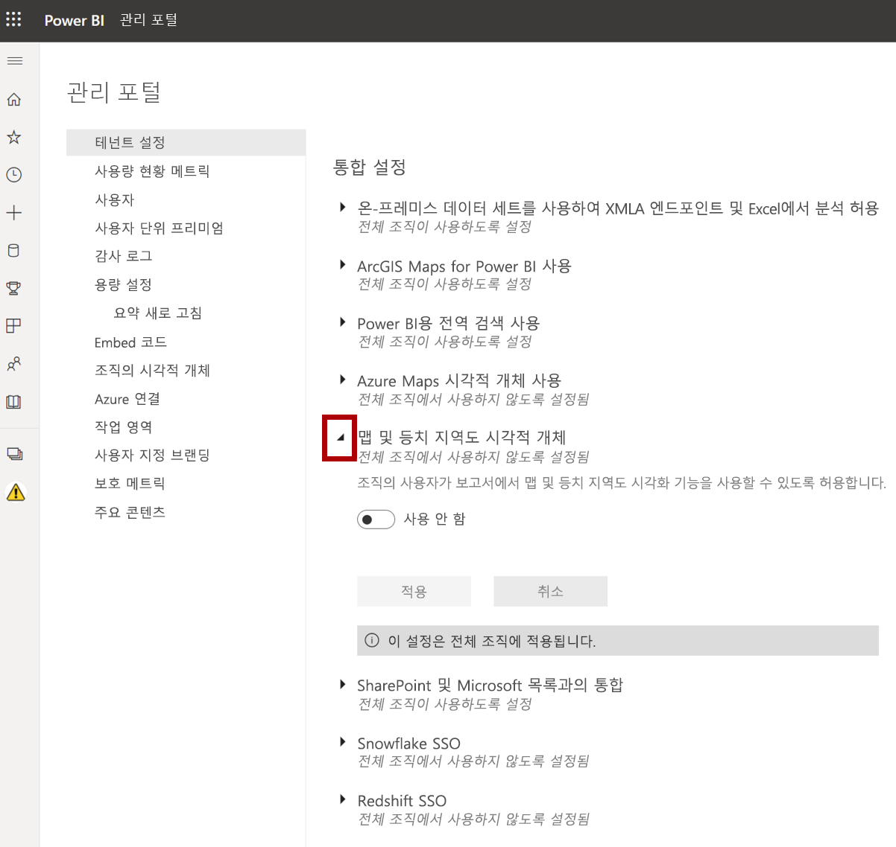

1. 지도 및 등치 지역도 시각적 개체 옵션을 **사용** 으로 설정합니다.

1. **적용** 을 클릭하여 변경 내용을 적용합니다. 

    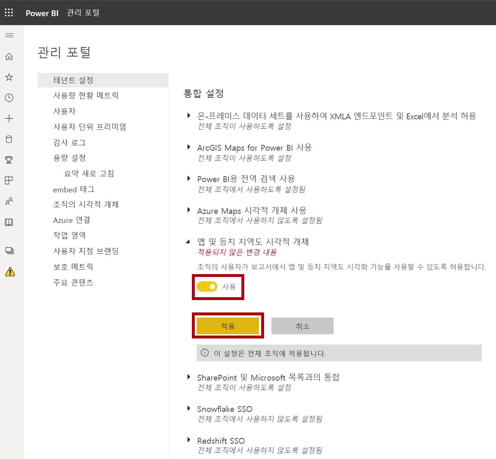

1. 테넌트 설정 변경 내용이 다음 15분 내에 적용될 것임을 알리는 메시지가 브라우저의 오른쪽 위에 표시됩니다. 

    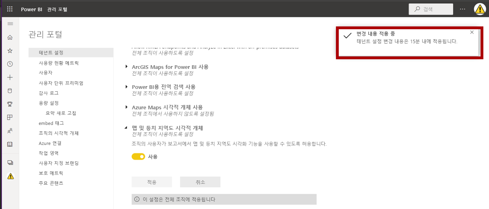

1. Microsoft Edge 브라우저 창을 열어 둡니다.

### **작업 3: 시작 - 보고서 열기**

이 작업에서는 시작 보고서를 열어 랩용 환경을 설정합니다.

*중요: 이전 랩에서 계속 진행해 온 경우(그리고 해당 랩을 성공적으로 완료한 경우) 이 작업을 완료하지 마세요. 대신, 다음 작업부터 진행하세요.*

1. Power BI Desktop을 열려면 작업 표시줄에서 Microsoft Power BI Desktop 바로 가기를 클릭합니다.

    

2. 시작 창을 닫으려면 창 왼쪽 위의 **X** 를 클릭합니다.

    

3. Power BI 서비스에 로그인하려면 오른쪽 위에 있는 **로그인** 을 클릭합니다.

    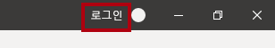

4. Power BI 서비스 로그인하는 데 사용한 것과 동일한 계정을 사용하여 로그인 프로세스를 완료합니다.

5. 시작 Power BI Desktop 파일을 열려면 **파일** 리본 탭을 클릭하여 Backstage 뷰를 엽니다.

6. **보고서 열기** 를 선택합니다.

    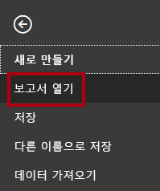

7. **보고서 찾아보기** 를 클릭합니다.

    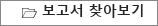

8. **열기** 창에서 **D:\PL300\Labs\06-design-report-in-power-bi-desktop\Starter** 폴더로 이동합니다.

9. **판매 분석** 파일을 선택합니다.

10. **열기** 를 클릭합니다.

    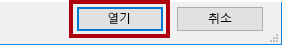

11. 열려 있는 정보 창을 모두 닫습니다.

12. 파일 복사본을 만들려면 **파일** 리본 탭을 클릭하여 Backstage 뷰를 엽니다.

13. **다른 이름으로 저장** 을 선택합니다.

    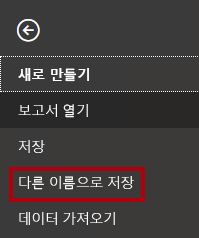

14. 변경 내용을 적용하라는 메시지가 표시되면 **적용** 을 클릭합니다.

    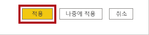

15. **다른 이름으로 저장** 창에서 **D:\PL300\MySolution** 폴더로 이동합니다.

16. **저장** 을 클릭합니다.

    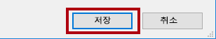

### **작업 4: 페이지 디자인 1**

이 작업에서는 첫 번째 보고서 페이지를 디자인합니다. 디자인을 완료하면 페이지는 다음과 같은 모습이 됩니다.

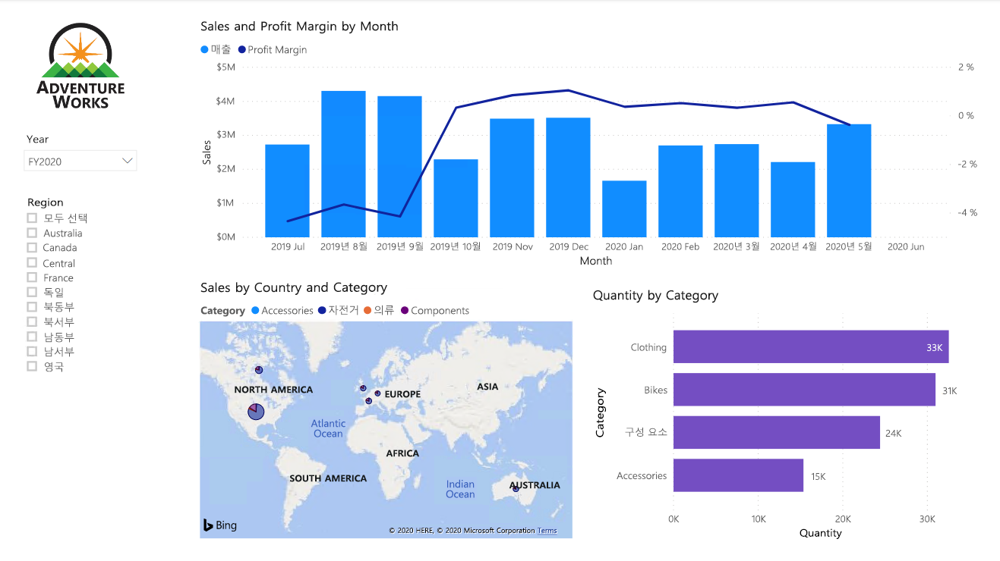

1. Power BI Desktop에서 페이지의 이름을 바꾸려면 왼쪽 하단에서 **1페이지** 를 마우스 오른쪽 단추로 클릭한 다음 **이름 바꾸기** 를 선택합니다.

    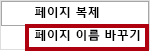

    *팁: 페이지 이름을 두 번 클릭하여 이름을 바꿀 수도 있습니다.*

2. 페이지 이름을 **개요** 로 바꾼 다음, **Enter** 키를 누릅니다.

    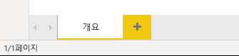

3. 이미지를 추가하려면 **삽입** 리본 탭의 **요소** 그룹 안에서 **이미지** 를 클릭합니다.

    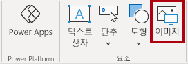

4. **열기** 창에서 **D:\PL300\Resources** 폴더로 이동합니다.

5. **AdventureWorksLogo.jpg** 파일을 선택한 다음, **열기** 를 클릭합니다.

    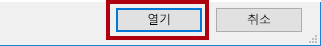

6. 이미지를 끌어 왼쪽 위에 놓고 안내선 표식도 끌어 크기를 조정합니다.

    

7. 슬라이서를 추가하려면 먼저 보고서 페이지의 빈 영역을 클릭하여 이미지를 선택 취소합니다.
8. **필드** 창에서 **날짜 \| 연도** 필드(계층의 **연도** 수준 아님)를 선택합니다.
    
    랩에서는 약식 표기법을 사용하여 필드를 참조합니다. 다음과 같이 표시됩니다. **날짜 \| 연도**. 이 예에서 **날짜** 는 테이블 이름이고 **연도** 는 필드 이름입니다.

9. 연도 값 테이블이 보고서 페이지에 추가된 것을 볼 수 있습니다.

10. 시각적 개체를 테이블에서 슬라이서로 변환하려면 **시각화** 창에서 **슬라이서** 를 선택합니다.

    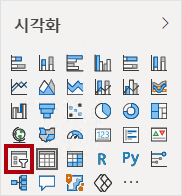

11. 슬라이서를 목록에서 드롭다운으로 변환하려면 슬라이서 오른쪽 위에 있는 아래쪽 화살표를 클릭한 다음, **드롭다운** 을 선택합니다.

    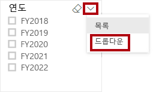

12. 너비가 이미지 너비와 같아지도록 슬라이서 크기를 조정하여 이미지 아래에 오도록 배치합니다.

    

13. **년** 슬라이서에서 드롭다운 목록을 열고 **FY2020** 을 선택한 다음 드롭다운 목록을 축소합니다.

    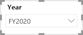

    보고서 페이지는 이제 **FY2020** 년을 기준으로 필터링됩니다.

14. 보고서 페이지의 빈 영역을 클릭하여 슬라이서를 선택 취소합니다.

15. **지역 \| 지역** 필드(계층의 **지역** 수준 아님)를 기준으로 두 번째 슬라이서를 만듭니다.

16. 슬라이서를 목록으로 유지하고 크기를 조정한 다음 **년** 슬라이서 아래에 배치합니다.

    

21. 보고서 페이지의 빈 영역을 클릭하여 슬라이서를 선택 취소합니다.

22. 페이지에 차트를 추가하려면 **시각화** 창에서 **꺾은선형 및 누적 세로 막대형 차트** 시각적 개체 유형을 클릭합니다.

    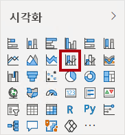

23. 보고서 페이지의 전체 너비를 채우도록 시각적 개체의 크기를 조정한 다음 로고 오른쪽에 배치합니다.

    

24. 다음 필드를 시각적 개체에 끌어서 놓습니다.

    - 날짜 \| 월

    - 판매 \| 판매

25. 시각적 개체 필드 창(**필드** 창이 아니며 **시각화** 창 아래에 있음)에서 필드가 **x-축** 및 **열 y-축** 웰/영역에 할당되었는지 확인합니다.

    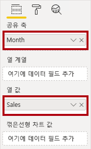

    필드를 시각적 개체로 드래그하면 기본 웰/영역에 추가됩니다. 정밀도를 위해 필드를 웰/영역으로 직접 끌어올 수 있습니다. 다음 작업에서 이와 같이 필드를 끌어올 것입니다.

26. **필드** 창에서 **판매 \| 이익률** 필드를 **꺾은선형 y-축** 웰/영역으로 끌어 옵니다.

    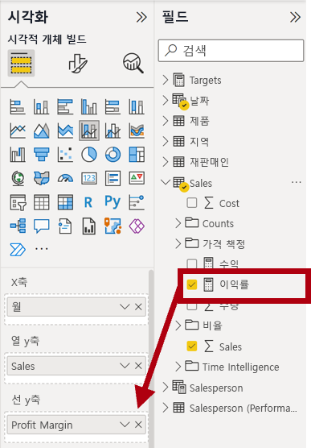

27. 시각적 개체에는 11개월만 있습니다.

    2020년 6월의 마지막 달에는 아직 판매량이 없습니다. 기본적으로 시각적 개체는 판매량이 비어 있는 월을 제거했습니다. 이제 모든 월을 표시하도록 시각적 개체를 구성합니다.

28. 시각적 개체 필드 창의 **x-축** 웰/영역에서 **월** 필드에 대해 아래쪽 화살표를 클릭한 후 **데이터 없이 항목 표시** 를 선택합니다.

    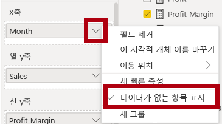

29. 이제 **2020년 6월** 이 표시됩니다.

30. 보고서 페이지의 빈 영역을 클릭하여 차트를 선택 취소합니다.

31. 페이지에 차트를 추가하려면 **시각화** 창에서 **맵** 시각적 개체 유형을 클릭합니다.

    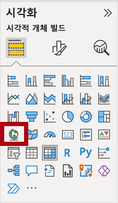

32. 위에 있는 차트의 너비 절반을 채우도록 시각적 개체의 크기를 조정한 다음 세로 막대형 차트/꺾은선형 차트 아래에 배치합니다.

    

33. 다음 필드를 시각적 개체 웰/영역에 추가합니다.

    - 위치: **지역 \| 국가**

    - 범례: **제품 \|범주**

    - 크기: **판매 \| 판매**

34. 보고서 페이지의 빈 영역을 클릭하여 차트를 선택 취소합니다.

35. 페이지에 차트를 추가하려면 **시각화** 창에서 **누적 가로 막대형 차트** 시각적 개체 유형을 클릭합니다.

    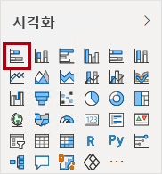

36. 나머지 보고서 페이지 공간을 채우도록 시각적 개체의 크기를 조정하여 배치합니다.

    

37. 다음 필드를 시각적 개체 웰/영역에 추가합니다.

    - 축: **제품 \|범주**

    - 값: **판매 \| 수량**

38. 시각적 개체의 서식을 지정하려면 **형식** 창을 엽니다.

    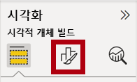

39. **막대** 와 **색** 그룹을 차례로 확장한 후 **기본 색** 속성을 적절한 색(세로 막대형 차트/꺾은선형 차트를 보완하는 색)으로 설정합니다.

40. **데이터 레이블** 속성을 **켜짐** 으로 설정합니다.

    

41. Power BI Desktop 파일을 저장합니다.

    *이제 첫 번째 페이지의 디자인이 완료되었습니다.*

### **작업 5: 페이지 디자인 2**

이 작업에서는 두 번째 보고서 페이지를 디자인합니다. 디자인을 완료하면 페이지는 다음과 같은 모습이 됩니다.

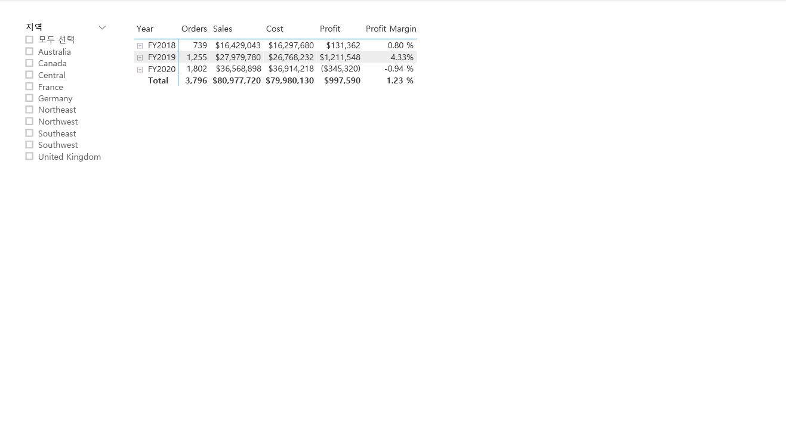

*중요: 랩에서 자세한 지침을 제공하기 때문에 랩 단계에서는 간결한 지침을 제공합니다. 자세한 지침이 필요한 경우 이 랩의 다른 작업을 참조하세요.*

1. 새 페이지를 만들려면 왼쪽 아래에서 더하기 아이콘을 클릭합니다.

    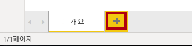

2. 페이지의 이름을 **수익** 으로 바꿉니다.

    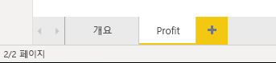

  

3. **지역 \| 지역** 필드에 따라 슬라이서를 추가합니다.

4. **서식** 창을 사용하여 (**선택** 그룹의) “모두 선택” 옵션을 사용하도록 설정합니다.

5. 높이가 보고서 높이의 절반 정도가 되도록 시각적 개체의 크기를 조정한 다음 보고서 페이지 왼쪽에 배치합니다.

    

6. 행렬 시각적 개체를 추가한 다음 보고서 페이지의 나머지 공간을 채우도록 크기를 조정하여 배치합니다.

    

7. **날짜 \| 회계** 계층을 **행** 웰/영역 행렬에 추가합니다.

    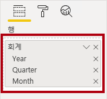

8. 다음 5개의 매출 테이블 필드를 **값** 웰/영역에 추가합니다.

    - 주문(**개수** 폴더)

    - 매출

    - 비용

    - 수익

    - 이익률

    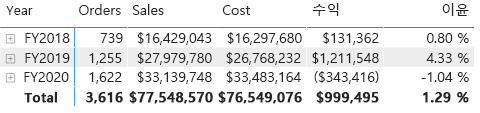

9. **필터** 창(**시각화** 창 왼쪽에 위치)에서 **이 페이지의 필터** 웰/영역을 잘 확인하세요(아래로 스크롤해야 할 수 있음).

    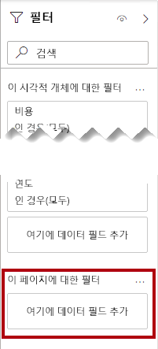

10. **필드** 창에서 **제품 \| 범주** 필드를 **이 페이지의 필터** 웰/영역으로 끌어옵니다.

11. 필터 카드 내에서 오른쪽 위에 있는 화살표를 클릭하여 카드를 축소합니다.

    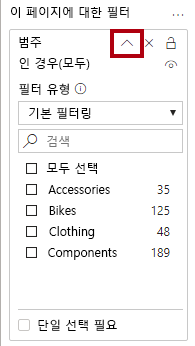

    **필터** 창에 추가된 필드는 슬라이서와 동일한 결과를 얻을 수 있습니다. 한 가지 차이점은 보고서 페이지의 공간을 차지하지 않는다는 것입니다. 또 다른 차이점은 더 정교한 필터링 요구 사항에 맞게 구성할 수 있다는 것입니다.

12. 다음 각 **제품** 테이블 필드를 **이 페이지의 필터** 웰/영역에 추가하여 **범주** 카드 바로 아래에 각각 축소합니다.

    - 하위 범주

    - 제품

    - 색

    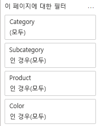

13. Power BI Desktop 파일을 저장합니다.

    *이제 두 번째 페이지의 디자인이 완료되었습니다.*

### **작업 6: 페이지 디자인 3**

이 작업에서는 세 번째(마지막) 보고서 페이지를 디자인합니다. 디자인을 완료하면 페이지는 다음과 같은 모습이 됩니다.

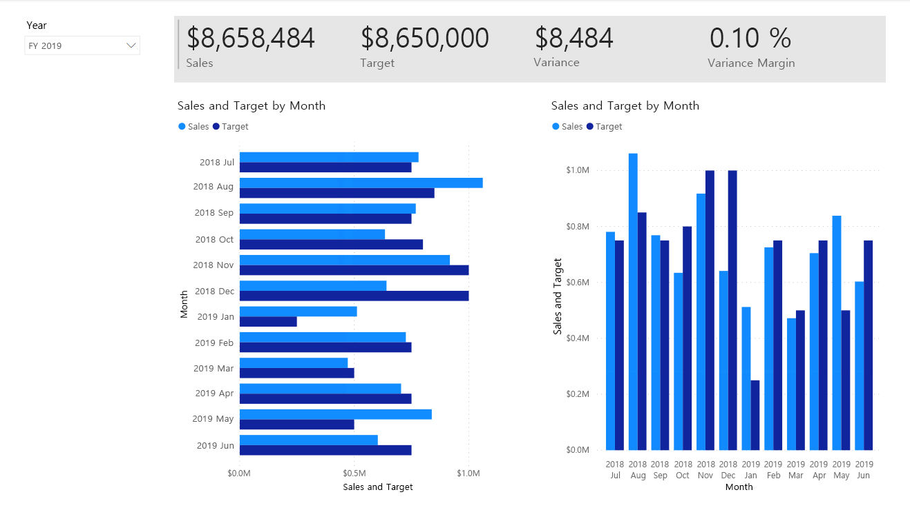

1. 새 페이지를 만든 다음, **내 실적** 으로 이름을 바꿉니다.

1. 행 수준 보안 필터의 성능을 시뮬레이션하려면 **영업 직원(성과) \| 영업 직원** 필드를 필터 창의 페이지 수준 필터로 끌어옵니다.
    
    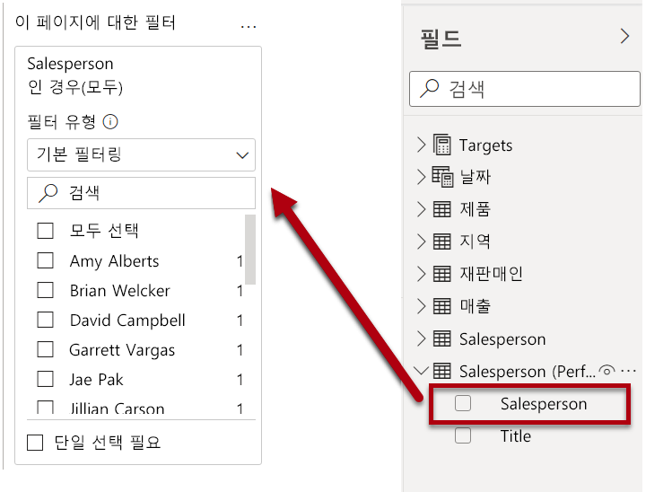 

1. **Michael Blythe** 를 선택합니다. 이제 **내 실적** 보고서 페이지의 데이터가 Michael Blythe의 데이터만 표시하도록 필터링됩니다.

1. **날짜 \| 연도** 필드를 기준으로 드롭다운 슬라이서를 추가한 다음, 페이지 왼쪽 위 모서리에 표시되도록 크기를 조정하고 위치를 변경합니다.

    

1. 슬라이서에서 **FY2019** 를 기준으로 필터링하도록 페이지를 설정합니다.

    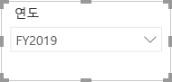

1. **다중 행 카드** 시각적 개체를 추가한 다음, 이 시각적 개체가 슬라이서 오른쪽에 배치되어 페이지의 나머지 너비를 채우도록 크기 및 위치를 조정합니다.

    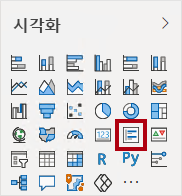

    

1. 시각적 개체에 다음 4개의 필드를 추가합니다.

    - 판매 \| 판매

    - 목표 \| 목표

    - 목표 \| 분산

    - 목표 \| 분산 여백

1. 시각적 개체의 형식을 지정합니다.

    - **설명선 값** 그룹에서 **텍스트 크기** 속성을 **28pt** 로 늘립니다.

    - **배경** 그룹에서 **색** 을 연한 회색으로 설정합니다.

    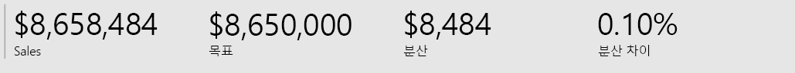

1. **묶인 막대형 차트** 시각적 개체를 추가한 다음 크기를 조정하고 배치하여 다중 행 카드 시각적 개체 아래에 배치하고 페이지의 나머지 높이와 다중 행 카드 시각적 개체 너비의 절반을 채웁니다.

    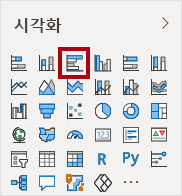

    

1. 다음 필드를 시각적 개체 웰/영역에 추가합니다.

    - 축: **날짜 \| 월**

    - 값: **판매 \| 판매** 및 **목표 \| 목표**

    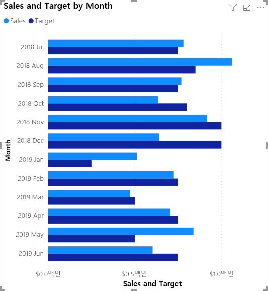

1. 시각적 개체의 복사본을 만들려면 **Ctrl+C** 를 누른 다음, **Ctrl+V** 를 누릅니다.

1. 새 시각적 개체를 원래 시각적 개체 오른쪽에 배치합니다.

    

1. 시각화 유형을 수정 하려면 **시각화** 창에서 **묶은 세로 막대형 차트** 를 선택합니다.

    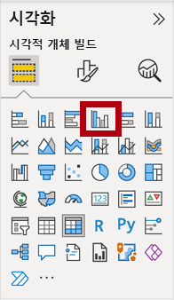

    이제 동일한 데이터가 두 가지 다른 시각화 유형으로 표현되는 것을 볼 수 있습니다. 이 방식은 효율적인 보고서 레이아웃 사용 방식이 아닙니다. 하지만 **Power BI Desktop에서 보고서 디자인, 2부** 랩에서 시각적 개체를 겹쳐 표시하는 방식으로 보고서 레이아웃을 개선할 것입니다. 단추를 페이지에 추가하면 보고서 사용자가 두 시각적 개체 중 표시할 시각적 개체를 결정할 수 있습니다.

    *이제 세 번째이자 마지막 페이지의 디자인이 완료되었습니다.*

### **작업 7: 보고서 게시**

이 작업에서는 보고서를 게시합니다.

1. **Overview** 페이지를 선택합니다.

2. Power BI Desktop 파일을 저장합니다.

3. **홈** 리본 탭의 **공유** 그룹 내에서 **게시** 를 클릭합니다.

    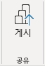

4. **Power BI에 게시** 창에서 **내 작업 영역** 이 선택된 것을 확인할 수 있습니다.

5. 보고서를 게시하려면 **선택** 을 클릭합니다.

    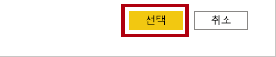

6. 게시가 성공하면 **확인** 을 클릭합니다.

    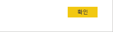

7. Power BI Desktop을 열어둡니다.

    *다음 연습에서 Power BI 서비스에서 보고서를 살펴봅니다.*

## **연습 2: 보고서 살펴보기**

이 연습에서는 Power BI에 게시된 보고서를 살펴봅니다.

### **작업 1: 보고서 살펴보기**

이 작업에서는 Power BI에 게시된 보고서를 살펴봅니다.

1. Microsoft Edge 브라우저 창의 Power BI 서비스 내 **탐색** 창(왼쪽에 위치, 축소 가능함)에서 **내 작업 영역** 을 확장합니다.

    

2. 작업 영역의 내용을 검토하여 **판매 분석** 보고서와 데이터 세트를 확인합니다.

    *Power BI Desktop 파일을 게시할 때 데이터 모델이 데이터 세트로 게시되었습니다.*

    표시되지 않는 경우 **F5** 키를 눌러 브라우저를 다시 로드하고 작업 영역을 다시 확장합니다.

    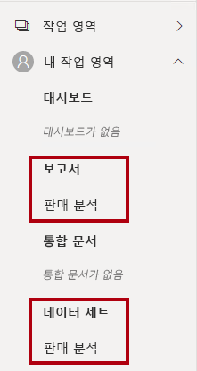

3. 보고서를 열려면 **판매 분석** 보고서를 클릭합니다.

4. 왼쪽의 **페이지** 창에서 **개요** 페이지를 선택합니다. 

5. **지역** 슬라이서에서 **Ctrl** 키를 누르면 여러 지역을 선택합니다.

6. 세로 막대형/꺾은선형 차트에서 월 열을 선택하여 페이지를 교차 필터링합니다.

7. **Ctrl** 키를 누른 채로 추가 월을 선택합니다.

    *기본적으로 교차 필터링은 페이지의 다른 모든 시각적 개체를 필터링합니다.*

8. 가로 막대형 차트가 필터링되고 강조 표시되며, 필터링된 월을 나타내는 가로 막대가 굵게 표시됩니다.

9. 막대형 차트 시각적 개체 위를 커서로 가리킨 다음 오른쪽 위에 있는 필터 아이콘 위를 커서로 가리킵니다.

    

    *필터 아이콘을 사용하면 다른 시각적 개체의 슬라이서 및 교차 필터를 포함하여 시각적 개체에 적용되는 모든 필터를 이해할 수 있습니다.*

10. 막대 위로 커서를 가져간 후 도구 설명 정보를 확인합니다.

11. 교차 필터를 실행 취소하려면 세로 막대형/꺾은선형 차트에서 시각적 개체의 빈 영역을 클릭합니다.

12. 맵 시각적 개체 위를 커서로 가리킨 다음 오른쪽 위에 있는 **포커스 모드** 아이콘을 클릭합니다.

    

    *포커스 모드에서 시각적 개체가 전체 페이지 크기로 확대됩니다.*

13. 막대형 차트의 다른 세그먼트 위를 커서로 가리켜 도구 설명을 표시합니다.

14. 보고서 페이지로 돌아가려면 왼쪽 위에서 **보고서로 돌아가기** 를 클릭합니다.

    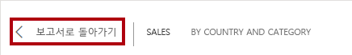

15. 맵 시각적 개체 위를 다시 커서로 가리킨 후 오른쪽 위에 있는 줄임표(...)를 클릭하고 메뉴 옵션을 살펴봅니다.

    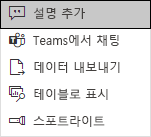

16. **Teams에서 채팅** 을 제외한 각 옵션을 사용해 보세요.

17. 왼쪽의 **페이지** 창에서 **수익** 페이지를 선택합니다.

    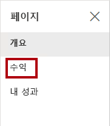

18. **지역** 슬라이서는 **개요** 페이지의 **지역** 슬라이서와는 다음 선택 옵션을 포함합니다.

    슬라이서가 동기화되지 않았습니다. **Power BI Desktop에서 보고서 디자인, 2부** 랩에서 페이지 간에 동기화할 수 있도록 보고서 디자인을 수정합니다.

19. 오른쪽에 있는 **필터** 창에서 필터 카드를 확장하고 일부 필터를 적용합니다.

    **필터** 창을 사용하면 페이지에 표시될 수 있는 것보다 더 많은 필터를 슬라이서로 정의할 수 있습니다.

20. 행렬 시각적 개체에서 더하기(+) 단추를 사용하여 **회계** 계층 구조로 드릴다운합니다.

21. **내 실적** 페이지를 선택합니다.

    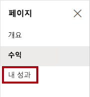

22. 메뉴 모음의 오른쪽 위에서 **보기** 를 클릭하고 **전체 화면** 을 선택합니다.

    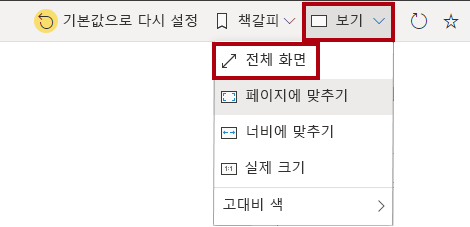

23. 슬라이서를 수정하여 페이지와 상호 작용하고 페이지를 교차 필터링합니다.

24. 창 아래에서 페이지를 변경하거나, 페이지 간을 앞뒤로 이동하거나, 전체 화면 모드를 종료하는 명령을 확인합니다.

25. 왼쪽 아이콘을 클릭하여 전체 화면 모드를 종료합니다.

    

### **작업 2: 완료**

이 작업에서는 랩을 완료합니다.

1. 작업 영역으로 돌아오려면 창 웹 페이지에 가로로 표시된 배너에서 **내 작업 영역** 을 클릭합니다.

    

2. Microsoft Edge 브라우저 창을 열어 둡니다.

    **Power BI Desktop에서 보고서 디자인, 2부** 랩에서 고급 기능을 사용해 보고서 디자인을 향상합니다.
