---
lab:
  title: Power BI에서의 데이터 분석 수행
  module: 8 - Identify Patterns and Trends
---

# **Power BI에서의 데이터 분석 수행**

**이 랩을 완료하는 데 걸리는 예상 완료 시간은 45분입니다.**

이 랩에서는 **판매 탐색** 보고서를 만듭니다.

이 랩에서는 다음 작업을 수행하는 방법을 알아봅니다.

- 애니메이션 분산형 차트 만들기

- 시각적 개체를 사용한 값 예측

### **랩 사례**

이 랩은 데이터 준비부터 보고서 및 대시보드로 게시에 이르기까지 전체 사례로 고안된 랩 시리즈 중 하나입니다. 어떤 순서로든 랩을 완료할 수 있습니다. 그러나 여러 랩을 진행하려는 경우 다음 순서를 따르는 것이 좋습니다.

1. Power BI Desktop에서 데이터 준비

2. Power BI Desktop에서 데이터 로드

3. Power BI Desktop에서 데이터 모델링

5. Power BI Desktop에서 DAX 계산 만들기 1부

6. Power BI Desktop에서 DAX 계산 만들기, 2부

7. Power BI Desktop에서 보고서 디자인, 1부

8. Power BI Desktop에서 보고서 디자인, 2부

8. **Power BI에서의 데이터 분석 수행**

9. Power BI 대시보드 만들기

11. 행 수준 보안 적용

## **연습 1: 보고서 만들기**

이 연습에서는 **판매 탐색** 보고서를 만듭니다.

### **작업 1: 시작하기 – 로그인**

이 작업에서는 Power BI에 로그인하여 랩용 환경을 설정합니다.

*중요: 이전 랩에서 Power BI에 이미 로그인했다면 다음 작업부터 진행하세요.*

1. 작업 표시줄에서 Microsoft Edge를 열려면 Microsoft Edge 프로그램 바로 가기를 클릭합니다.

    

1. Microsoft Edge 브라우저 창에서 **https://powerbi.microsoft.com**으로 이동합니다.

    *팁: Microsoft Edge 즐겨찾기 표시줄에서 Power BI 서비스 즐겨찾기를 사용할 수도 있습니다.*

1. **로그인** 오른쪽 상단 모서리에 위치)을 클릭합니다.

    

1. 제공된 계정 정보를 입력합니다.

1. 암호를 업데이트할지 묻는 프롬프트가 표시되면 제공된 암호를 다시 입력하고 새 암호를 입력한 후 확인합니다.

    *중요: 새 암호를 기록해야 합니다.*

1. 로그인 프로세스를 완료합니다.

1. Microsoft Edge에서 로그인 상태를 유지하라는 메시지가 표시되면 **예**를 클릭합니다.

1. Microsoft Edge 브라우저 창의 Power BI 서비스 **탐색** 창에서 **내 작업 영역**을 확장합니다.

    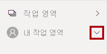

1. Microsoft Edge 브라우저 창을 열어 둡니다.

### **작업 2: 시작하기 – 데이터 세트 만들기**

이 작업에서는 데이터 세트를 만들어 랩용 환경을 설정합니다.

*중요: **Power BI 대시보드 만들기** 랩에서 데이터 세트를 이미 게시했다면 다음 작업부터 진행하세요.*

1. Microsoft Edge 브라우저 창의 Power BI 서비스 내 **탐색** 창 아래쪽에서 **데이터 가져오기**를 클릭합니다.

    

2. **파일** 타일에서 **가져오기**를 클릭합니다.

    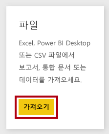

3. **파일 찾기** 타일을 클릭합니다.

    

4. **열기** 창에서 **D:\PL300\Labs\08-perform-data-analysis-in-power-bi-desktop\Starter** 폴더로 이동합니다.

5. **Sales Analysis.pbix** 파일을 선택한 다음 **열기**를 클릭합니다.

6. 데이터 세트를 바꾸라는 메시지가 표시되면 **바꾸기**를 클릭합니다.

### **작업 3: 보고서 만들기**

이 작업에서는 **판매 탐색** 보고서를 만듭니다.

1. Power BI Desktop을 열려면 작업 표시줄에서 Microsoft Power BI Desktop 바로 가기를 클릭합니다.

    *중요: 이전 랩에서 Power BI Desktop을 열어 둔 경우 해당 인스턴스를 닫습니다.*

    

2. 시작 창을 닫으려면 창 왼쪽 위의 **X**를 클릭합니다.

    

3. Power BI Desktop이 Power BI 서비스에 로그인되어 있지 않으면 오른쪽 위에 있는 **로그인**을 클릭합니다.

    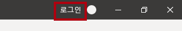

4. Power BI 서비스 로그인하는 데 사용한 것과 동일한 계정을 사용하여 로그인 프로세스를 완료합니다.

5. 파일을 저장하려면 **파일** 리본 탭을 클릭하여 Backstage 뷰를 엽니다.

6. **저장**을 선택합니다.

    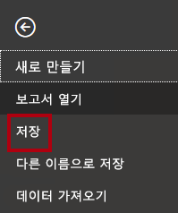

7. **다른 이름으로 저장** 창에서 **D:\PL300\MySolution** 폴더로 이동합니다.

8. **파일 이름** 상자에 **판매 탐색**을 입력하고 **저장**을 클릭합니다.

    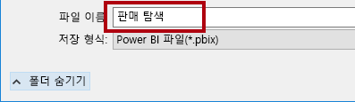

9. **판매 분석** 데이터 세트에 대한 라이브 연결을 만들려면 **홈** 리본 탭의 **데이터** 그룹 내부에서 **Power BI 데이터 세트**를 클릭합니다.

    

10. **보고서를 만들 데이터 세트 선택** 창에서 **판매 보고서** 데이터 세트를 선택합니다.

11. **만들기**를 클릭합니다.

    

12. Power BI Desktop 파일을 저장합니다.

    이제 2개의 새 보고서 페이지를 만들고 각 페이지에서 다른 시각적 개체를 사용하여 데이터를 분석하고 탐색할 수 있습니다.

## **연습 2: 분산형 차트 만들기**

이 연습에서는 애니메이션화할 수 있는 분산 차트를 만듭니다.

### **작업 1: 애니메이션 분산형 차트 만들기**

이 작업에서는 애니메이션화할 수 있는 분산 차트를 만듭니다.

1. **페이지 1**의 이름을 **분산형 차트**로 변경합니다.

    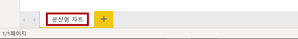

2. 보고서 페이지에 **분산형 차트** 시각적 개체를 추가한 다음 전체 페이지를 채우도록 크기를 조정하여 배치합니다.

    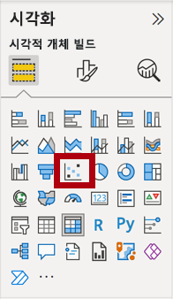

    

3. 다음 필드를 시각적 개체 웰/영역에 추가합니다.

    랩에서는 약식 표기법을 사용하여 필드를 참조합니다. 다음과 같이 표시됩니다. **재판매인** **\|** **비즈니스 유형**. 이 예에서 **Reseller**는 테이블 이름이고 **Business Type**은 필드 이름입니다.

    

    - X축: **판매 \| 판매** 

    - Y축: **판매 \| 이익률**

    - 범례: **재판매인 \| 비즈니스 유형**

    - 크기: **판매 \| 수량**

    - Play Axis: **날짜 \| 분기**

    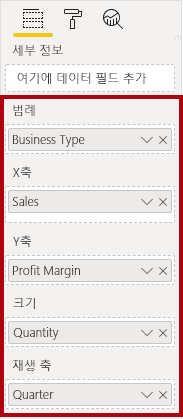

    필드가 **재생 축** 웰/영역에 추가되면 차트를 애니메이션화할 수 있습니다.

4. **필터** 창에서 **이 페이지의 필터** 웰/영역에 **제품 \| 범주** 필드를 추가합니다.

5. 필터 카드에서 **자전거**를 기준으로 필터링합니다.

    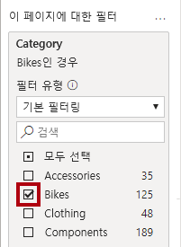

6. 차트에 애니메이션을 적용하려면 왼쪽 아래 모서리에서 **재생**을 클릭합니다.

    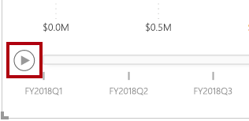

7. **FY2018 Q1**부터 **FY2020 Q4**까지의 전체 애니메이션 주기를 봅니다.

    분산형 차트에서는 측정값을 동시에 해석할 수 있습니다. 여기에서는 주문 수량, 판매 수익, 이익률을 동시에 해석할 수 있습니다.

    각 거품형은 재판매인 비즈니스 유형을 나타냅니다. 거품형 크기는 증가 또는 감소한 주문 수량을 반영하여 변경됩니다. 수평 이동은 판매 수익의 증가/감소를 나타내며 수직 이동은 수익성의 증가/감소를 나타냅니다.

8. 애니메이션이 중지되면 거품형 중 하나를 클릭하여 시간에 따른 추적을 표시합니다.

9. 해당 시점에서 재판매인 유형에 대한 측정값을 설명하는 도구 설명을 표시하려면 거품형 위에 커서를 놓습니다.

10. **필터** 창에서 **의류**만을 기준으로 필터링하면 매우 다른 결과가 생성되는 것을 확인할 수 있습니다.

11. Power BI Desktop 파일을 저장합니다.

## **연습 3: 예측 만들기**

이 연습에서는 향후 판매 수익을 결정할 예측을 만듭니다.

### **작업 1: 예측 만들기**

이 작업에서는 향후 판매 수익을 결정할 예측을 만듭니다.

1. 새 페이지를 추가하고 페이지 이름을 **예측**으로 변경합니다.

    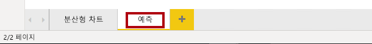

2. 보고서 페이지에 **꺾은선형 차트** 시각적 개체를 추가한 다음 전체 페이지를 채우도록 크기를 조정하여 배치합니다.

    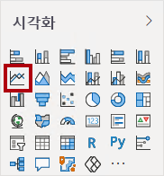

    

  

3. 다음 필드를 시각적 개체 웰/영역에 추가합니다.

    - X축: **날짜 \| 날짜**

    - Y축: **판매 \| 판매** 

    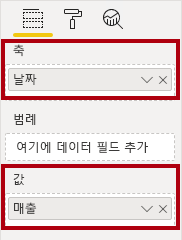

4. **필터** 창에서 **이 페이지의 필터** 웰/영역에 **날짜 \| 연도** 필드를 추가합니다.

5. 필터 카드에서 2년을 기준으로 필터링합니다. **FY2019** 및 **FY2020**.

    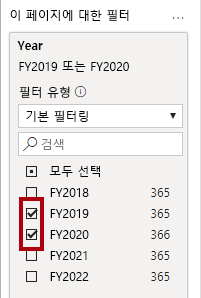

    *시간대에 따라 예측하는 경우 정확하고 안정적인 예측을 생성하려면 적어도 두 개의 주기(연도)의 데이터가 필요합니다.*

  

6. **이 페이지의 필터** 웰/영역에 **제품 \| 범주** 필드도 추가한 다음, **자전거**를 기준으로 필터링합니다.

    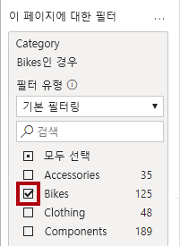

7. 예측을 추가하려면 **시각화** 창 아래에서 **Analytics** 창을 선택합니다.

    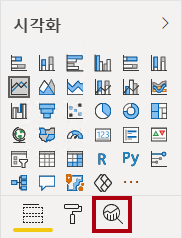

8. **예측** 섹션을 확장합니다.

    **예측** 섹션을 사용할 수 없는 경우 시각적 개체를 올바르게 구성하지 않았기 때문일 수 있습니다. 예측은 두 가지 조건이 충족되는 경우에만 사용할 수 있습니다. 축에는 날짜 형식의 단일 필드가 있고 값 필드가 하나만 있어야 합니다.

9. **예측** 옵션을 **켜기**로 설정합니다.

    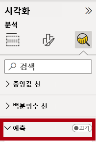

10. 다음 예측 속성을 구성합니다.

    - 단위: Months

    - 예측 범위: 1개월

    - 계절성: 365
    
    - 신뢰도 간격: 80%

11. **적용**을 클릭합니다.

    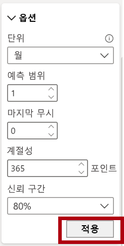

12. 줄 시각적 개체에서 예측은 기록 데이터를 벗어나 1개월이 연장된 것을 알 수 있습니다.

    회색 영역은 신뢰도를 나타냅니다. 신뢰도 영역이 넓을수록 예측 안정성이 낮아지므로 정확성이 떨어집니다.

    주기의 길이(여기에서는 연간)를 알고 있으면 계절성 지점을 입력해야 합니다. 매주(7) 또는 매월(30)일 수도 있습니다.

13. **필터** 창에서 **의류**만을 기준으로 필터링하면 다른 결과가 생성되는 것을 확인할 수 있습니다.

14. Power BI Desktop 파일을 저장합니다.

### **작업 2: 완료**

이 작업에서는 랩을 완료합니다.

1. **분산형 차트** 페이지를 선택합니다.

2. Power BI Desktop 파일을 저장합니다.

3. **내 작업 영역**에 파일을 게시하려면 **홈** 리본 탭에서 **공유** 그룹 내의 **게시**와 **선택**을 차례로 클릭하여 게시합니다.

    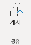

4.  Power BI Desktop을 닫습니다.
