---
lab:
  title: Power BI 대시보드 만들기
  module: 11 - Create Dashboards
---

# **Power BI 대시보드 만들기**

**이 랩을 완료하는 데 걸리는 예상 완료 시간은 45분입니다.**

이 랩에서는 **판매 모니터링** 대시보드를 만듭니다.

이 랩에서는 다음 작업을 수행하는 방법을 알아봅니다.

- 대시보드에 시각적 개체 고정

- 질문 및 답변을 사용하여 대시보드 타일 만들기

### **랩 사례**

이 랩은 데이터 준비부터 보고서 및 대시보드로 게시에 이르기까지 전체 사례로 고안된 랩 시리즈 중 하나입니다. 어떤 순서로든 랩을 완료할 수 있습니다. 그러나 여러 랩을 진행하려는 경우 다음 순서를 따르는 것이 좋습니다.

1. Power BI Desktop에서 데이터 준비

2. Power BI Desktop에서 데이터 로드

3. Power BI Desktop에서 데이터 모델링

4. Power BI Desktop에서 DAX 계산 만들기 1부

5. Power BI Desktop에서 DAX 계산 만들기, 2부

6. Power BI Desktop에서 보고서 디자인, 1부

7. Power BI Desktop에서 보고서 디자인, 2부

8. AI 시각적 개체를 사용하여 데이터 분석

9. **Power BI 대시보드 만들기**

10. 행 수준 보안 적용

## **연습 1: 대시보드 만들기**

이 연습에서는 **판매 모니터링** 대시보드를 만듭니다. 완료된 대시보드는 다음과 같이 표시됩니다.

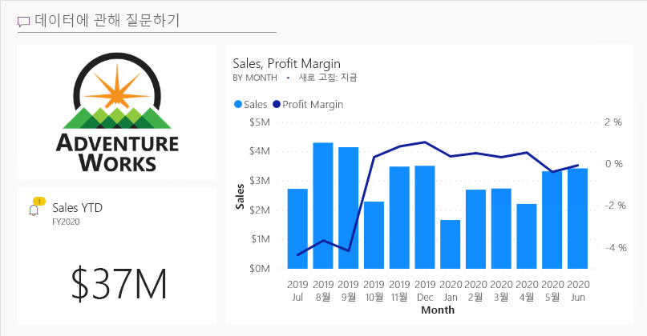

### **작업 1: 시작하기 – 로그인**

이 작업에서는 Power BI에 로그인하여 랩용 환경을 설정합니다.

*중요: 이전 랩에서 Power BI에 이미 로그인했다면 다음 작업부터 진행하세요.*

1. 작업 표시줄에서 Microsoft Edge를 열려면 Microsoft Edge 프로그램 바로 가기를 클릭합니다.

    

2. Microsoft Edge 브라우저 창에서 **https://powerbi.microsoft.com**으로 이동합니다.

    *팁: Microsoft Edge 즐겨찾기 표시줄에서 Power BI 서비스 즐겨찾기를 사용할 수도 있습니다.*

3. **로그인** 오른쪽 상단 모서리에 위치)을 클릭합니다.

    

4. 제공된 계정 정보를 입력합니다.

5. 암호를 업데이트할지 묻는 프롬프트가 표시되면 제공된 암호를 다시 입력하고 새 암호를 입력한 후 확인합니다.

    *중요: 새 암호를 기록해야 합니다.*

6. 로그인 프로세스를 완료합니다.

7. Microsoft Edge에서 로그인 상태를 유지하라는 메시지가 표시되면 **예**를 클릭합니다.

8. Microsoft Edge 브라우저 창의 Power BI 서비스 **탐색** 창에서 **내 작업 영역**을 확장합니다.

    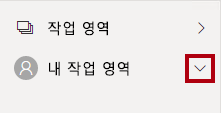

9. Microsoft Edge 브라우저 창을 열어 둡니다.

### **작업 2: 시작하기 – 보고서 열기**

이 작업에서는 시작 보고서를 열어 랩용 환경을 설정합니다.

*중요: 이전 랩에서 계속 진행해 온 경우(그리고 해당 랩을 성공적으로 완료한 경우) 이 작업을 완료하지 마세요. 대신, 다음 작업부터 진행하세요.*

1. Power BI Desktop을 열려면 작업 표시줄에서 Microsoft Power BI Desktop 바로 가기를 클릭합니다.

    

2. 시작 창을 닫으려면 창 왼쪽 위의 **X**를 클릭합니다.

    

3. Power BI Desktop이 Power BI 서비스에 로그인되어 있지 않으면 오른쪽 위에 있는 **로그인**을 클릭합니다.

    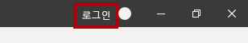

4. Power BI 서비스 로그인하는 데 사용한 것과 동일한 계정을 사용하여 로그인 프로세스를 완료합니다.

5. 시작 Power BI Desktop 파일을 열려면 **파일** 리본 탭을 클릭하여 Backstage 뷰를 엽니다.

6. **보고서 열기**를 선택합니다.

    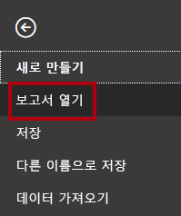

7. **보고서 찾아보기**를 클릭합니다.

    

8. **열기** 창에서 **D:\PL300\Labs\09-create-power-bi-dashboard\Starter** 폴더로 이동합니다.

9. **판매 분석** 파일을 선택합니다.

10. **열기**를 클릭합니다.

    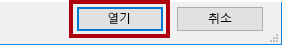

11. 열려 있는 정보 창을 모두 닫습니다.

12. 파일 복사본을 만들려면 **파일** 리본 탭을 클릭하여 Backstage 뷰를 엽니다.

13. **다른 이름으로 저장**을 선택합니다.

    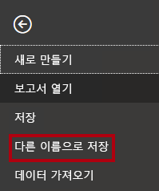

14. 변경 내용을 적용하라는 메시지가 표시되면 **적용**을 클릭합니다.

    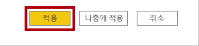

15. **다른 이름으로 저장** 창에서 **D:\PL300\MySolution** 폴더로 이동합니다.

16. **저장**을 클릭합니다.

    

### **작업 3: 시작 – 보고서 게시**

이 작업에서는 데이터 세트를 만들어 랩용 환경을 설정합니다.

*중요: **Power BI Desktop에서 보고서 디자인, 2부** 랩에서 보고서를 이미 게시했다면 다음 작업부터 진행하세요.*

1. Microsoft Edge 브라우저 창의 Power BI 서비스 내 **탐색** 창 아래쪽에서 **데이터 가져오기**를 클릭합니다.

    

2. **파일** 타일에서 **가져오기**를 클릭합니다.

    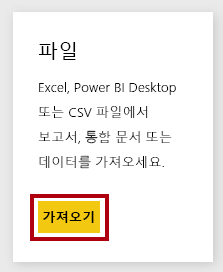

3. **파일 찾기** 타일을 클릭합니다.

    

4. **열기** 창에서 **D:\PL300\Labs\08-create-power-bi-dashboard\Solution** 폴더로 이동합니다.

5. **Sales Analysis.pbix** 파일을 선택한 다음 **열기**를 클릭합니다.

6. 데이터 세트를 바꾸라는 메시지가 표시되면 **바꾸기**를 클릭합니다.

### **작업 4: 대시보드 만들기**

이 작업에서는 **판매 모니터링** 대시보드를 만듭니다. 보고서의 시각적 개체를 고정하고 이미지 데이터 URI를 기준으로 타일을 추가한 다음 Q&A를 사용하여 타일을 만듭니다.

1. Microsoft Edge 브라우저 창의 Power BI 서비스에서 **판매 분석** 보고서를 엽니다.

2. **개요** 페이지에서 **연도** 슬라이서를 **FY2020**으로 설정합니다.

    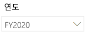

3. **지역** 슬라이서를 **모두 선택**으로 설정합니다.

    ‘시각적 개체를 대시보드에 고정하면 시각적 개체가 현재 필터 컨텍스트를 사용합니다. 고정되고 나면 필터 컨텍스트를 변경할 수 없습니다. 시간 기반 필터의 경우 상대 날짜 슬라이서를 사용하는 것이 좋습니다(또는 상대 시간 기반 질문을 사용하는 질문 및 답변).

4. 대시보드를 만들고 시각적 개체를 고정하려면 **Sales and Profit Margin by Month**(세로 막대형/꺾은선형) 시각적 개체 위로 커서를 가져갑니다.

5. 오른쪽 아래 모서리에 있는 압핀을 클릭합니다.

    

6. **대시보드에 고정** 창에서 **대시보드 이름** 상자에 **Sales Monitoring**을 입력합니다.

    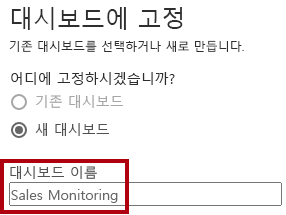

7. **고정**을 클릭합니다.

    

8. **탐색** 창을 연 다음, **내 작업 영역**을 선택하고 **판매 모니터링** 대시보드를 엽니다.

    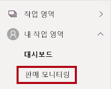

9. 대시보드에는 단일 타일이 있습니다.

    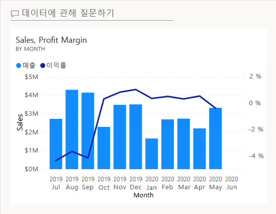

10. 질문을 기반으로 타일을 추가하려면 대시보드의 왼쪽 위에서 **데이터에 대해 질문하기**를 클릭합니다.

    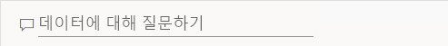

    질문 및 답변 기능을 사용하여 질문을 할 수 있으며 Power BI가 시각적 개체로 응답합니다.

11. Q&A 상자 아래 파란색 상자에서 제안된 질문 중 하나를 클릭합니다.

12. 응답을 검토합니다.

13. 질문 및 답변 상자에서 모든 텍스트를 제거합니다.

14. 질문 및 답변 상자에 다음을 입력합니다. **Sales YTD**

    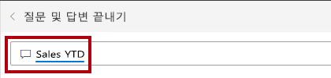

15. **(Blank)** 응답을 확인합니다.

    

    **Power BI Desktop에서 DAX 계산 만들기, 2부** 랩에서 **Sales YTD** 측정을 추가한 것을 기억하실 것입니다. 이 측정은 시간 인텔리전스 식이므로 결과를 생성하려면 **날짜** 테이블의 필터가 필요합니다.

16. **in year FY2020**으로 질문을 확장합니다.

    

17. 이제 응답으로 **$33M**이 표시됩니다.

    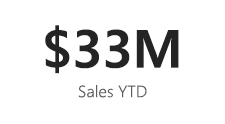

18. 대시보드에 응답을 고정하려면 오른쪽 위에서 **시각적 개체 고정**을 클릭합니다.

    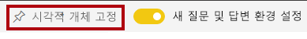

19. 타일을 대시보드에 고정하라는 메시지가 표시되면 **고정**을 클릭합니다.

    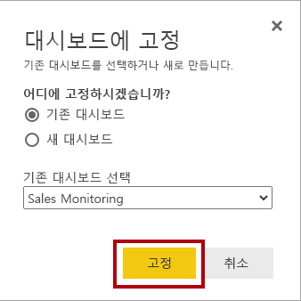

20. 대시보드로 돌아가려면 왼쪽 위에 있는 **Q&amp;A 종료**를 클릭합니다.

    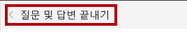

21. 회사 로고를 추가하려면 메뉴 모음에서 **편집**을 클릭한 다음 **타일 추가**를 선택합니다.

    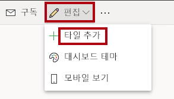

    *이 기술을 사용하여 대시보드 타일을 추가하면 웹 콘텐츠, 이미지, 서식 있는 텍스트 상자, 동영상(YouTube 또는 Vimeo 링크)을 비롯한 미디어로 대시보드를 꾸밀 수 있습니다.*

22. **타일 추가** 창(오른쪽에 위치)에서 **이미지** 타일을 선택합니다.

    

23. **다음**을 클릭합니다.

    

24. **이미지 타일 추가** 창의 **URL** 상자에 **D:\PL300\Resources\AdventureWorksLogo_DataURL.txt** 파일에 있는 전체 URL을 입력합니다.

    *URL을 사용하여 이미지를 포함하거나 콘텐츠 인라인을 포함하는 데이터 URL을 사용할 수 있습니다.*

25. 창 아래쪽에서 **적용**을 클릭합니다.

    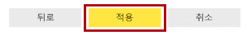

26. 로고 타일의 크기를 조정하려면 오른쪽 아래 모서리를 끌고 타일 크기를 1개 단위(너비) x 2개 단위(높이)로 조정합니다.

    타일 크기는 사각형 도형으로 제한됩니다. 크기는 사각형 도형의 배수로만 조정할 수 있습니다.

27. 로고가 왼쪽 위에 표시되고 그 아래에 **Sales YTD** 타일이 표시되고 오른쪽에 **Sales, Profit Margin** 타일이 표시되도록 타일을 구성합니다.

    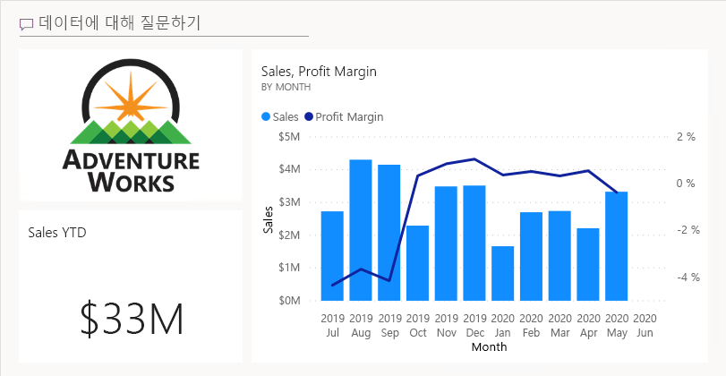

### **작업 5: 타일 세부 정보 편집**

이 작업에서는 두 타일의 세부 정보를 편집합니다.

1. 커서로 **Sales YTD** 타일을 가리킨 다음, 타일 오른쪽 위에 있는 줄임표를 클릭하고, **세부 정보 편집**을 선택합니다.

    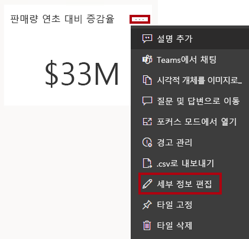

2. 오른쪽에 있는 **타일 세부 정보** 창에서 **부제목** 상자에 **FY2020**을 입력합니다.

    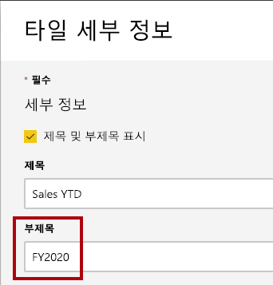

3. **적용**을 클릭합니다.

    

4. **Sales YTD** 타일에 부제목이 표시됩니다.

    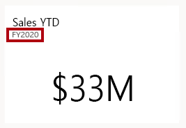

5. **Sales, Profit Margin** 타일의 타일 세부 정보를 편집합니다.

6. **타일 세부 정보** 창의 **기능** 섹션에서 **마지막으로 새로 고친 시간 표시**를 선택합니다.

    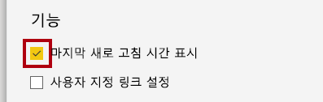

7. **적용**을 클릭합니다.

    

8. 타일은 마지막 새로 고침 시간(Power BI Desktop에서 데이터 모델을 로드한 시간)을 설명합니다.

    다음 연습에서는 데이터 세트를 새로 고칩니다. 일반적으로 예약된 새로 고침을 사용하여 이 작업을 수행하며, 이 경우 Power BI는 SQL Server 데이터베이스에 연결하는 데 게이트웨이를 사용할 수 있습니다. 그러나 교실 설정의 제약 조건으로 인해 게이트웨이가 없습니다. 따라서 Power BI Desktop을 열고, 수동 데이터 새로 고침을 수행하고, 작업 영역에 파일을 업로드합니다.

## **연습 2: 데이터 세트 새로 고침**

이 연습에서는 먼저 2020년 6월의 판매 주문 데이터를 **AdventureWorksDW2020** 데이터베이스에 로드합니다. 그런 다음 Power BI Desktop 파일을 열고 데이터를 새로 고친 다음 작업 영역에 파일을 업로드합니다.

### **작업 1: 랩 데이터베이스 업데이트**

이 작업에서는 PowerShell 스크립트를 실행하여 **AdventureWorksDW2020** 데이터베이스의 데이터를 업데이트합니다.

1. 파일 탐색기의 **D:\PL300\Setup** 폴더 내부에서 **UpdateDatabase-2-AddSales.ps1** 파일을 마우스 오른쪽 단추로 클릭한 다음, **PowerShell에서 실행**을 선택합니다.

    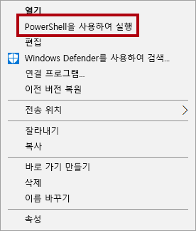

2. 실행 정책을 변경할지 묻는 프롬프트가 표시되면 **A** 키를 누릅니다.

3. PowerShell을 닫으려면 아무 키나 누르라는 메시지가 표시되면 **Enter** 키를 다시 누릅니다.

    이제 **AdventureWorksDW2020** 데이터베이스에 2020년 6월 판매 주문이 포함되어 있습니다.

### **작업 2: Power BI Desktop 파일 새로 고침**

이 작업에서는 **판매 분석** Power BI Desktop 파일을 열고 데이터를 새로 고친 다음 파일을 **판매 분석** 작업 영역에 업로드합니다.

1. Power BI Desktop 파일의 **필드** 창에서 **Sales** 테이블을 오른쪽 단추로 클릭한 다음 **데이터 새로 고침**을 선택합니다.

    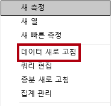

2. 새로 고침이 완료되면 Power BI Desktop 파일을 저장합니다.

3. 작업 영역에 파일을 게시하려면 **홈** 리본 탭에서 **공유** 그룹 내의 **게시**를 클릭하고 **선택**을 클릭하여 게시합니다.

    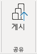

4. 데이터 세트를 바꿀지 묻는 메시지가 표시되면 **바꾸기**를 클릭합니다.

    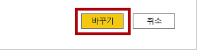

    ‘이제 Power BI 서비스의 데이터 세트에 2020년 6월 판매 데이터가 포함됩니다.’

5. Power BI Desktop을 닫습니다.

## **연습 3: 대시보드 검토**

이 연습에서는 대시보드를 검토하여 업데이트된 판매를 확인합니다.

### **작업 1: 대시보드 검토**

이 작업에서는 대시보드를 검토하여 업데이트된 판매를 확인합니다.

1. Microsoft Edge 브라우저 창의 Power BI 서비스에서 **Sales Monitoring** 대시보드를 검토합니다.

2. **Sales, Profit Margin** 타일의 부제목에서 **이제** 데이터가 새로 고쳐졌습니다.

3. 또한 이제 **2020년 6월**에 해당하는 열이 있습니다.

    2020년 6월 데이터가 표시되지 않으면 **F5** 키를 눌러 웹 브라우저를 다시 로드해야 할 수도 있습니다.

    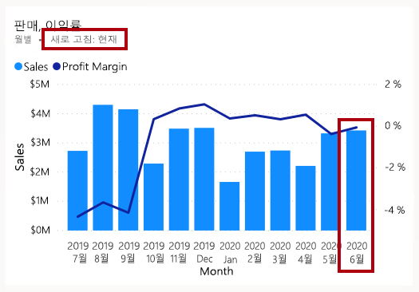

    

4. 창을 닫으려면 **닫기**를 클릭합니다.
