---
lab:
  title: 행 수준 보안 적용
  module: Module 13 - Row-Level Security
---

# **행 수준 보안 적용**

**이 랩을 완료하는 데 걸리는 예상 완료 시간은 45분입니다.**

이 랩에서는 **Salesperson** 테이블과 **Sales** 테이블 간에 다대다 관계를 만듭니다. 또한 판매원이 할당된 지역에 대한 판매 데이터만 분석할 수 있도록 행 수준 보안을 적용합니다.

이 랩에서는 다음 작업을 수행하는 방법을 알아봅니다.

- 다대다 관계 구성

- 행 수준 보안 적용

### **랩 사례**

이 랩은 데이터 준비부터 보고서 및 대시보드로 게시에 이르기까지 전체 사례로 고안된 랩 시리즈 중 하나입니다. 어떤 순서로든 랩을 완료할 수 있습니다. 그러나 여러 랩을 진행하려는 경우 처음 10개 랩은 다음 순서를 따르는 것이 좋습니다.

1. Power BI Desktop에서 데이터 준비

2. Power BI Desktop에서 데이터 로드

3. Power BI Desktop에서 데이터 모델링

5. Power BI Desktop에서 DAX 계산 만들기 1부

6. Power BI Desktop에서 DAX 계산 만들기, 2부

7. Power BI Desktop에서 보고서 디자인, 1부

8. Power BI Desktop에서 보고서 디자인, 2부

9. Power BI 대시보드 만들기

10. Power BI Desktop에서 데이터 분석 수행

11. **행 수준 보안 적용**

## **연습 1: 행 수준 보안 적용**

이 연습에서는 영업 직원이 할당된 지역에 대한 판매량만 볼 수 있도록 행 수준 보안을 적용합니다.

### **작업 1: 시작하기**

이 작업에서는 랩용 환경을 설정합니다.

*중요: 이전 랩에서 계속 진행해 온 경우(그리고 해당 랩을 성공적으로 완료한 경우) 이 작업을 완료하지 마세요. 대신, 다음 작업부터 진행하세요.*

1. Power BI Desktop을 열려면 작업 표시줄에서 Microsoft Power BI Desktop 바로 가기를 클릭합니다.

    

1. 시작 창을 닫으려면 창 왼쪽 위의 **X**를 클릭합니다.

    

1. 시작 Power BI Desktop 파일을 열려면 **파일** 리본 탭을 클릭하여 Backstage 뷰를 엽니다.

1. **보고서 열기**를 선택합니다.

    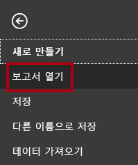

1. **보고서 찾아보기**를 클릭합니다.

    

1. **열기** 창에서 **D:\PL300\Labs\12-row-level-security\Starter** 폴더로 이동합니다.

1. **판매 분석** 파일을 선택합니다.

1. **열기**를 클릭합니다.

    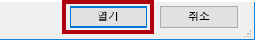

1. 열려 있는 정보 창을 모두 닫습니다.

1. 파일 복사본을 만들려면 **파일** 리본 탭을 클릭하여 Backstage 뷰를 엽니다.

1. **다른 이름으로 저장**을 선택합니다.

    

1. 변경 내용을 적용하라는 메시지가 표시되면 **적용**을 클릭합니다.

    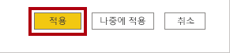

1. **다른 이름으로 저장** 창에서 **D:\PL300\MySolution** 폴더로 이동합니다.

1. **저장**을 클릭합니다.

    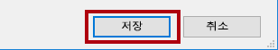

### **작업 2: 행 수준 보안 적용**

이 작업에서는 영업 직원이 할당된 지역에 대한 판매량만 볼 수 있도록 행 수준 보안을 적용합니다.

1. 데이터 뷰로 전환합니다.

    

2. **필드** 창에서 **Salesperson (Performance)** 테이블을 선택합니다.

3. 데이터를 검토하면 Michael Blythe(EmployeeKey 281)의 UPN 값이 **michael-blythe@adventureworks.com** 임을 확인할 수 있습니다.

    *Michael Blythe는 미국 북동부, 미국 중부, 미국 남동부의 세 가지 판매 지역에 할당되었습니다.*

4. 보고서 뷰로 전환합니다.

5. **보안** 그룹 내부의 **모델링** 리본 탭에서 **역할 관리**를 클릭합니다.

    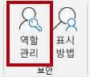

6. **역할 관리** 창에서 **만들기**를 클릭합니다.

    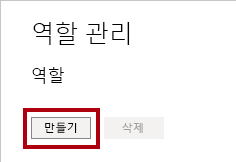

7. 상자에서 선택한 텍스트를 역할 이름인**Salespeople**으로 바꿉니다. 그 다음 **입력**을 누릅니다.

    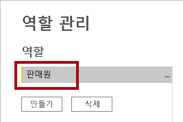

8. 필터를 할당하려면 **영업 직원(성과)** 테이블에서 줄임표(...) 문자를 클릭한 다음 **필터 추가 \| [UPN]** 을 선택합니다.

    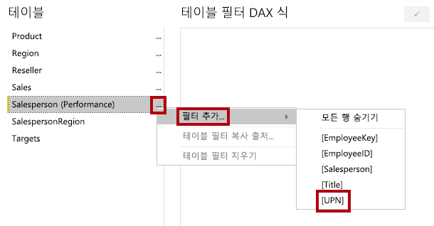

9. **Table Filter DAX Expression** 상자에서 **"값"** 을 **USERPRINCIPALNAME()** 으로 바꿔 식을 수정합니다.

    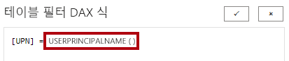

    USERPRINCIPALNAME()은 인증된 사용자의 이름을 반환하는 DAX(Data Analysis Expressions) 함수입니다. 즉, **영업 직원(성과)** 테이블이 모델을 쿼리하는 사용자의 UPN(사용자 계정 이름)을 기준으로 필터링됩니다.

10. **저장**을 클릭합니다.

    

11. 보안 역할을 테스트하려면 **보안** 그룹 내부의 **모델링** 리본 탭에서 **View As**를 클릭합니다.

    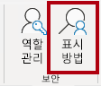

12. **역할로 보기** 창에서 **다른 사용자** 항목을 선택하고 해당하는 상자에 **michael-blythe@adventureworks.com** 을 입력합니다.

13. **Salespeople** 역할을 확인합니다.

    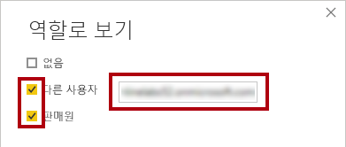

    이렇게 구성하면 **영업 직원** 역할을 사용하고 Michael Blythe의 이름으로 사용자를 가장하게 됩니다.

14. **확인**을 클릭합니다.

    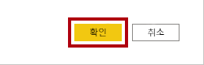

15. 보고서 페이지 위의 노란색 배너에서 테스트 보안 컨텍스트를 설명하는 것을 볼 수 있습니다.

    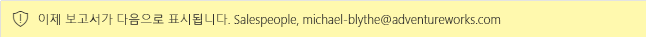

16. 테이블 시각적 개체에는 영업 직원 **Michael Blythe**만 나열됩니다.

    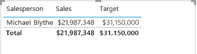

17. 테스트를 중지하려면 노란색 배너 오른쪽에서 **보기 중지**를 클릭합니다.

    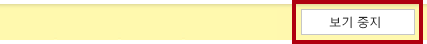

    Power BI Desktop 파일이 Power BI 서비스에 게시될 경우에는 게시 후 작업을 완료하여 보안 주체를 **영업 직원** 역할에 매핑해야 합니다. 이 랩에서는 해당 작업을 수행하지 않습니다.

18. 역할을 삭제하려면 **모델링** 리본 탭의 **보안** 그룹 내에서 **역할 관리**를 클릭합니다.

    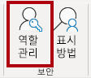

19. **역할 관리** 창에서 **삭제**를 클릭합니다.

    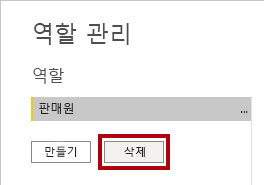

20. 삭제를 확인하라는 메시지가 표시되면, **예, 삭제합니다.** 를 클릭합니다.

21. **저장**을 클릭합니다.

    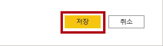

### **작업 2: 완료**

이 작업에서는 랩을 완료합니다.

1. Power BI Desktop 파일을 저장합니다.
