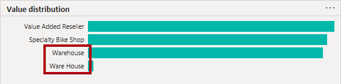
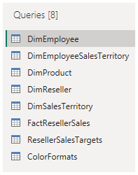

---
lab:
  title: Power BI에서 데이터 가져오기
  module: Get data in Power BI
---

# Power BI에서 데이터 가져오기

## 랩 사례

이 랩은 Power BI Desktop 애플리케이션을 소개하고 데이터에 연결하는 방법과 데이터 미리 보기 기술을 사용하여 원본 데이터의 특성과 품질을 이해하는 방법을 소개하도록 설계되었습니다.

이 랩에서는 다음 사항들을 수행하는 방법에 대해 알아봅니다.

- Power BI Desktop을 엽니다.
- 다양한 데이터 원본에 연결
- Power Query를 사용하여 원본 데이터 미리 보기를 수행하세요.
- Power Query에서 데이터 프로파일링 기능을 사용하세요.

**이 랩은 약 30분 정도 소요됩니다.**

## Power BI Desktop 시작

이 연습을 완료하려면 먼저 웹 브라우저를 열고 다음 URL을 입력하여 zip 폴더를 다운로드합니다.

`https://github.com/MicrosoftLearning/PL-300-Microsoft-Power-BI-Data-Analyst/raw/Main/Allfiles/Labs/01-get-data-in-power-bi/01-get-data.zip`

폴더를**C:\Users\Student\Downloads\01-get-data** 폴더로 추출합니다.

**01-스타터-영업 분석.pbix** 파일을 엽니다.

- 시작 파일은 랩을 완료하는 데 도움이 되도록 특별히 구성되었습니다. 시작 파일에서는 다음 보고서 수준 설정이 사용하지 않도록 설정되었습니다.

  - 데이터 로드 > 첫 번째 로드 시 데이터 원본에서 관계 가져오기
  - 데이터 로드 > 데이터 로드 후 새 관계 자동 검색

## SQL Server에서 데이터 가져오기

이 작업에서는 SQL Server 데이터베이스에 연결하고 Power Query에서 쿼리를 만드는 테이블을 가져오는 방법을 설명합니다.

1. **홈** 리본 탭의**데이터** 그룹 내에서**SQL Server**를 선택합니다.

     

1. **SQL Server 데이터베이스** 창의**서버** 상자에**localhost**를 입력하고**데이터베이스**를 비워 둔 다음**확인**을 선택합니다.

    > ***참고**: 이 랩에서는**localhost**를 사용하여 SQL Server 데이터베이스에 연결합니다. 이 방법은 랩에 적합하지만, 실제 솔루션의 모범 사례로는 간주되지 않습니다.*

1. 자격 증명을 입력하라는 메시지가 표시되면**Windows > 내 현재 자격 증명 사용**을 선택한 다음**연결**를 선택합니다.

1. 암호화된 연결을 설정할 수 없다는 경고가 표시되면**확인**을 선택합니다.

1. **탐색기** 창에서**AdventureWorksDW2020** 데이터베이스를 확장합니다.

    > ***참고**:**AdventureWorksDW2020** 데이터베이스는**AdventureWorksDW2017** 샘플 데이터베이스를 기반으로 합니다. 그 내용은 과정 랩의 학습 목표를 지원하도록 수정되었습니다.*

1. **DimEmployee** 테이블을 선택하고 테이블 데이터의 미리 보기를 확인합니다.

     

    > ***참고**: 미리 보기 데이터를 사용하면 열과 행 샘플을 볼 수 있습니다.*

1. 이름 옆에 있는**확인란을 선택**하여 다음 테이블을 선택합니다.

    - DimEmployee
    - DimEmployeeSalesTerritory
    - DimProduct
    - DimReseller
    - DimSalesTerritory
    - FactResellerSales

1. **데이터 변환**을 선택하여 이 작업을 완료하면 Power Query 편집기가 열립니다. 다음 작업을 위해 이 작업을 열어 두세요.

이제 SQL Server 데이터베이스에서 6개의 테이블에 연결했습니다.

## Power Query 편집기에서 데이터 미리 보기

이 작업에서는 Power Query 편집기를 소개하고 이를 통해 데이터를 검토하고 프로파일링할 수 있습니다. 이는 나중에 데이터를 정리하고 변환하는 방법을 결정하는 데 도움이 됩니다. 또한 "Dim" 접두사가 붙은 차원 테이블과 "Fact" 접두사가 붙은 팩트 테이블을 모두 검토합니다.

1. 왼쪽의**Power Query 편집기** 창에**쿼리** 창이 표시됩니다. **쿼리** 창에는 선택한 각 테이블에 대한 쿼리가 하나 있습니다.

     

1. **DimEmployee** 쿼리를 선택합니다.

    > *SQL Server 데이터베이스의**DimEmployee** 테이블에는 각 직원에 대해 하나의 행이 저장됩니다. 이 테이블의 행 하위 집합은 영업 직원을 나타내며, 이는 사용자가 개발할 모델과 관련됩니다.*

1. 상태 표시줄의 왼쪽 하단에는 일부 테이블 통계가 제공됩니다. 테이블에는 33개의 열과 296개의 행이 있습니다.

     

1. 데이터 미리 보기 창에서 가로로 스크롤하여 모든 열을 검토합니다. 마지막 5개의 열에는**테이블** 또는**값** 링크가 포함되어 있습니다.

    > *이러한 5개의 열은 데이터베이스에 있는 다른 테이블과의 관계를 나타냅니다. 이 열들은 테이블을 서로 결합하는 데 사용할 수 있습니다. 나중에**Power BI Desktop에서 변환된 데이터 로드** 랩에서 이러한 테이블을 조인하게 됩니다.*

1. 열 품질을 평가하려면**데이터 미리 보기** 그룹 안에 있는**보기**  리본 탭에서**열 품질**을 체크합니다. 열 품질 기능을 사용하면 열에서 발견된 유효한 값, 오류 또는 빈 값의 비율을 쉽게 확인할 수 있습니다.

     

1. **Position** 열에는 94%의 빈(null) 행이 있습니다.

     

1. 열 분포를 평가하려면**보기** 리본 탭의**데이터 미리 보기** 그룹 내에서**열 분포**를 선택합니다.

1. **위치** 열을 다시 검토하고 4개의 Distinct 값과 하나의 고유 값이 있는지 확인합니다.

1. **EmployeeKey** 열에 대한 열 분포를 검토합니다. 여기에는 296개의 Distinct 값과 296개의 고유 값이 있습니다.

     

    > ***참고**: Distinct 개수와 고유 개수가 동일할 때 이는 해당 열에 고유 값들이 포함되어 있음을 의미합니다. 모델링 시에는 일부 모델 테이블에 고유한 열을 포함해야 합니다. 이러한 고유 열을 사용하여 일대다 관계를 만들 수 있으며**Power BI Desktop의 데이터 모델링** 랩에서 수행합니다.*

1. **쿼리** 창에서**DimProduct** 쿼리를 선택합니다.

    > ***DimProduct** 테이블에는 회사에서 판매하는 제품당 하나의 행이 포함되어 있습니다.*

1. **쿼리** 창에서**DimReseller** 쿼리를 선택합니다.

    > ***DimReseller** 테이블에는 재판매인당 하나의 행이 포함되어 있습니다. 재판매인은 Adventure Works에 제품을 판매 및 배포하거나 부가가치 서비스를 제공합니다.*

1. 열 값을 보려면**보기** 리본 탭의**데이터 미리 보기** 그룹 내에서**열 프로필**을 선택합니다.

1. **BusinessType** 열 머리글을 선택하고 데이터 미리 보기 창 아래에 새 창이 있는지 확인합니다. 데이터 미리 보기 창에서 열 통계 및 값 분포를 검토합니다.

    > *데이터 품질 문제 확인: 웨어하우스에는 2개의 레이블(**Warehouse** 및 철자가 잘못된**Ware House**)이 있습니다.*

     

1. **Ware House** 표시줄 위에 커서를 놓은 다음, 이 값을 가진 5개의 행이 있는지 확인합니다.

1. **쿼리** 창에서**DimEmployeeSalesTerritory** 쿼리를 선택합니다.  

    > ***DimSalesTerritory** 테이블에는**본사**를 포함해 판매 지역당 하나의 행이 포함되어 있습니다. 하나의 국가에 여러 지역이 할당되며, 여러 국가가 그룹에 할당됩니다.**Power BI Desktop에서 데이터 모델링** 랩에서 지역, 국가 또는 그룹 수준에서 분석을 지원하는 계층 구조를 만듭니다.*

1. **쿼리** 창에서**FactResellerSales** 쿼리를 선택합니다.

    > ***FactResellerSales** 테이블에는 판매 주문 라인당 하나의 행이 포함됩니다. 하나의 판매 주문에는 하나 이상의 항목이 포함됩니다.*

1. **TotalProductCost** 열의 열 품질을 검토하고 행의 8%가 비어 있는지 확인합니다.

    > ***TotalProductCost**열 값이 없는 것은 데이터 품질 문제에 속합니다.*

## CSV 파일에서 데이터 가져오기

이 작업에서는 CSV 파일을 기반으로 새 쿼리를 만듭니다.

1. 새 쿼리를 추가하려면**Power Query 편집기** 창에서**홈** 리본 탭의**새 쿼리** 그룹 내부에서**새 원본** 아래쪽 화살표를 선택한 다음,**텍스트/CSV**를 선택합니다.

1. 이전에 추출한**Downloads > 01-get-data** 폴더로 이동하여**ResellerSalesTargets.csv** 파일을 선택합니다. **열기**를 선택합니다.

1. **ResellerSalesTargets.csv** 창에서 미리 보기 데이터를 검토합니다. **확인**을 선택합니다.

1. **쿼리** 창에**ResellerSalesTargets** 쿼리가 추가된 것을 확인합니다.

    > ***ResellerSalesTargets** CSV 파일에는 매년 영업 직원당 하나의 행이 포함됩니다. 각 행은 12개의 월별 목표 판매량(천 단위로 표시)을 기록합니다. Adventure Works 회사의 회계 연도가 7월 1일에 시작됩니다.*

1. 빈 값이 포함된 열이 없습니다.  월별 목표 판매량이 누락된 경우 열에 하이픈이 대신 표시됩니다.

1. 열 이름 왼쪽에 있는 각 열 머리글의 아이콘을 검토합니다. 아이콘은 열 데이터 형식을 나타냅니다. **123**은 정수이며**ABC**는 텍스트입니다.

     

1. 단계를 반복하여**ColorFormats.csv** 파일을 기반으로 쿼리를 만듭니다.

    > ***ColorFormats** CSV 파일에는 제품 색상당 한 개의 행이 포함됩니다. 각 행은 배경 및 글꼴 색상의 서식을 지정하는 16진수 코드를 기록합니다.*

이제**ResellerSalesTargets** and**ColorFormats**라는 두 개의 새로운 쿼리가 생겼습니다.

 

## 랩 완료

이 랩에서는 필요하지 않지만, Power BI 보고서를 저장하도록 선택할 수 있습니다. 다음 연습에서는 미리 만들어진 시작 파일을 사용합니다.

1. 왼쪽 위 모서리에 있는 **"파일"** 메뉴로 이동하여 **"다른 이름으로 저장"** 을 선택합니다. 
1. **이 디바이스 찾아보기**를 선택합니다.
1. 파일을 저장할 폴더를 선택하고 설명이 포함된 이름을 지정합니다. 
1. **저장** 버튼을 선택하여 보고서를 .pbix 파일로 저장합니다. 
1. 보류 중인 쿼리 변경 내용을 적용하라는 대화 상자가 나타나면**적용**을 선택합니다.
1. Power BI Desktop을 닫습니다.