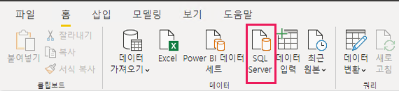
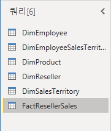
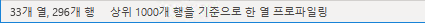
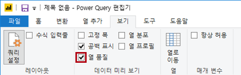
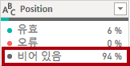
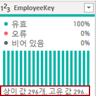
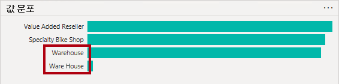
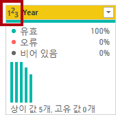
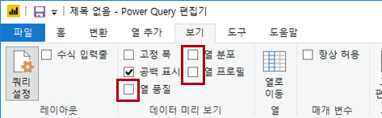

---
lab:
  title: Power BI Desktop에서 데이터 가져오기
  module: Get Data in Power BI
---

# Power BI Desktop에서 데이터 가져오기

## **랩 사례**

이 랩에서는 Power BI Desktop 애플리케이션과 데이터에 연결하는 방법 및 데이터 미리 보기 기술을 사용하여 원본 데이터의 특성과 품질을 이해하는 방법을 소개합니다. 학습 목표는 다음과 같습니다.

- Power BI Desktop 열기
- 다른 데이터 원본에 연결
- Power Query 사용하여 원본 데이터 미리 보기
- Power Query 데이터 프로파일링 기능 사용

**이 랩에는 약 30분이 소요됩니다.**

## **Power BI Desktop 시작**

이 작업에서는 시작 Power BI(.pbix) 파일을 열어 시작합니다. 시작 파일에는 데이터가 포함되지 않지만 랩을 완료하는 데 도움이 되도록 특별히 구성되었습니다. 시작 파일에서 다음 보고서 수준 설정을 사용하지 않도록 설정했습니다.

- 데이터 로드 > 처음 로드할 때 데이터 원본에서 관계 가져오기
- 데이터 로드 > 데이터가 로드된 후 새 관계 자동 검색

*참고: 이러한 두 옵션을 사용하도록 설정하면 데이터 모델을 개발할 때 유용할 수 있지만 랩 환경을 지원하기 위해 이전에 사용하지 않도록 설정했습니다. **Power BI Desktop 데이터 로드 랩에서** 관계를 만들 때 각 관계를 추가하는 이유를 알아봅니다.*

1. Power BI Desktop을 엽니다.

    

    *팁: 기본적으로 시작 대화 상자가 Power BI Desktop 앞에 열립니다. 로그인을 선택한 다음 팝업을 닫을 수 있습니다.*

1. 시작 Power BI Desktop 파일을 열려면 **파일 > 보고서 열기 > 보고서 찾아보기를** 선택합니다.

1. **열기** 창에서 **D:\PL300\Labs\01-prepare-data-with-power-query-in-power-bi-desktop\Starter 폴더로** 이동합니다.

1. **판매 분석** 파일을 선택합니다.

1. 다른 이름으로 **저장** 을 사용하여 파일의 복사본을 **D:\PL300\MySolution** 폴더에 저장합니다.

## **SQL Server 데이터 가져오기**

이 작업은 Power Query 쿼리를 만드는 SQL Server 데이터베이스에 연결하고 테이블을 가져오는 방법을 설명합니다.

1. **홈** 리본 탭의 **데이터** 그룹 내에서 **SQL Server**를 선택합니다.

     

1. **SQL Server 데이터베이스** 창의 **서버** 상자에 **localhost**를 입력한 다음 **확인을** 선택합니다.

    *참고: 이 랩에서는 게이트웨이 데이터 원본이 localhost를 resolve 수 없으므로 **localhost**를 사용하여 SQL Server 데이터베이스**에** 연결합니다. 사용자 고유의 솔루션을 만들 때 권장되는 방법은 아닙니다.*

1. 자격 증명을 묻는 메시지가 표시되면 **SQL Server 데이터베이스** 창에서 **현재 자격 증명 사용을** **선택한 다음 연결을** 선택합니다.

1. **탐색기** 창의 왼쪽에서 **AdventureWorksDW2020** 데이터베이스를 확장합니다.

    *참고: **AdventureWorksDW2020** 데이터베이스는 **AdventureWorksDW2017** 샘플 데이터베이스를 기반으로 합니다. 과정 랩의 학습 목표를 지원하도록 수정되었습니다.*

1. **DimEmployee** 테이블을 선택하지만 검사 않습니다.

     

1. 오른쪽 창에 테이블 데이터의 미리 보기가 있습니다. 미리 보기 데이터를 사용하면 열과 행 샘플을 볼 수 있습니다.

1. 쿼리를 만들려면 다음 6개의 테이블 옆에 있는 체크박스를 선택합니다.

    - DimEmployee
    - DimEmployeeSalesTerritory
    - DimProduct
    - DimReseller
    - DimSalesTerritory
    - FactResellerSales

1. **Power Query 편집기 열리는 데이터 변환**을 클릭하여 이 작업을 완료합니다.
    1. *이 랩은 데이터에 연결하고 프로파일을 만들기 위한 것이지만 **데이터를 변환**하지는 않습니다.*

## **Power Query 편집기 데이터 미리 보기**

이 작업은 Power Query 편집기 도입하고 데이터를 검토하고 프로파일을 작성할 수 있도록 합니다. 이렇게 하면 나중에 데이터를 클린 변환하는 방법을 결정할 수 있습니다.

1. 왼쪽의 **Power Query 편집기** 창에 **쿼리** 창이 표시됩니다. **쿼리** 창에는 선택한 각 테이블에 대한 쿼리가 하나 있습니다.

     

1. 첫 번째 쿼리인 **DimEmployee**를 선택합니다.

    *SQL Server 데이터베이스의 **DimEmployee** 테이블은 각 직원에 대해 하나의 행을 저장합니다. 이 테이블의 행 하위 집합은 개발하려는 모델과 관련된 영업 사원을 나타냅니다.*

1. 상태 막대의 왼쪽 아래 모서리에 일부 테이블 통계가 제공됩니다. 테이블에는 33개의 열과 296개의 행이 있습니다.

     

1. 데이터 미리 보기 창에서 가로로 스크롤하여 모든 열을 검토합니다. 마지막 5개의 열에는 **테이블** 또는 **값** 링크가 포함되어 있습니다.

    *이러한 5개 열은 데이터베이스의 다른 테이블과의 관계를 나타냅니다. 테이블을 함께 조인하는 데 사용할 수 있습니다. Power BI Desktop 랩의 **데이터 로드에서** 테이블을 조인합니다.*

1. 열 품질을 평가하려면 **데이터 미리 보기** 그룹 안에 있는 **보기**  리본 탭에서 **열 품질**을 체크합니다. 열 품질 기능을 사용하면 열에서 발견된 유효한 값, 오류 또는 빈 값의 비율을 쉽게 확인할 수 있습니다.

     

1. **Position** 열에는 94% 빈(null) 행이 있습니다.

     

1. 열 분포를 평가하려면 **보기** 리본 탭의 **데이터 미리 보기** 그룹 내에서 **열 분포**를 선택합니다.

1. **위치** 열을 다시 검토하고 4개의 Distinct 값과 하나의 고유 값이 있는지 확인합니다.

1. **EmployeeKey** 열에 대한 열 분포를 검토합니다. 296개의 고유 값과 296개의 고유 값이 있습니다.

    *고유 개수와 고유 개수가 같으면 열에 고유한 값이 포함되어 있음을 의미합니다. 모델링할 때 일부 모델 테이블에는 고유한 열이 있어야 합니다. 이러한 고유한 열을 사용하여 일대다 관계를 만들 수 있으며, 이 관계는 Power BI Desktop 랩의 **모델 데이터에서** 수행할 수 있습니다.*

     

1. **쿼리** 창에서 **DimEmployeeSalesTerritory** 쿼리를 선택합니다.

    ***DimEmployeeSalesTerritory** 테이블은 각 직원 및 관리하는 영업 지역별로 하나의 행을 저장합니다. 테이블은 여러 지역을 단일 직원과 연결하도록 지원합니다. 일부 직원은 하나, 두 개 또는 더 많은 지역을 관리합니다. 이 데이터를 모델링할 때 다대다 관계를 정의해야 합니다.*

1. **쿼리** 창에서 **DimProduct** 쿼리를 선택합니다. **DimProduct** 테이블에는 회사에서 판매하는 제품당 하나의 행이 포함되어 있습니다.

1. 마지막 열을 표시하려면 가로로 스크롤합니다. **DimProductSubcategory** 열을 확인하세요.

    ***Power BI Desktop 랩의 데이터 로드에서** 이 쿼리에 변환을 추가하면 **DimProductSubcategory** 열을 사용하여 테이블을 조인합니다.*

1. **쿼리** 창에서 **DimReseller** 쿼리를 선택합니다.

    ***DimReseller** 테이블에는 재판매인당 하나의 행이 포함됩니다. 재판매인은 Adventure Works 제품에 판매, 배포 또는 가치를 더합니다.*

1. 열 값을 보려면 **보기** 리본 탭의 **데이터 미리 보기** 그룹 내에서 **열 프로필**을 선택합니다.

1. **BusinessType** 열 머리글을 선택하고 데이터 미리 보기 창 아래에 있는 새 창을 확인합니다.

1. 데이터 미리 보기 창에서 열 통계 및 값 분포를 검토합니다.

    *데이터 품질 문제를 확인합니다. 웨어하우스에는 두 개의 레이블(**웨어하우스** 및 철자가 틀린 **Ware House**)이 있습니다.*

     

1. **Ware House** 표시줄 위에 커서를 놓은 다음, 이 값을 가진 5개의 행이 있는지 확인합니다.

    *변환을 적용하여 Power BI Desktop 랩의 **데이터 로드에서** 이러한 5개 행의 레이블을 다시 지정합니다.*

1. **쿼리** 창에서 **DimEmployeeSalesTerritory** 쿼리를 선택합니다.  

    ***DimSalesTerritory** 테이블에는 **회사 본사**(본사)를 포함하여 판매 지역당 하나의 행이 포함됩니다. 지역은 국가에 할당되고 국가는 그룹에 할당됩니다. Power BI Desktop 랩의 **모델 데이터에서** 지역, 국가 또는 그룹 수준에서 분석을 지원하는 계층 구조를 만듭니다.*

1. **쿼리** 창에서 **FactResellerSales** 쿼리를 선택합니다.

    ***FactResellerSales** 테이블에는 판매 주문 라인당 하나의 행이 포함됩니다. 판매 주문에는 하나 이상의 품목이 포함됩니다.*

1. **TotalProductCost** 열의 열 품질을 검토하고 행의 8%가 비어 있는지 확인합니다.

    ***TotalProductCost** 열 값이 누락된 것은 데이터 품질 문제입니다. 이 문제를 해결하기 위해 **Power BI Desktop 랩에서** 관련 **DimProduct** 테이블에 저장된 제품 표준 비용을 사용하여 누락된 값을 채우기 위해 변환을 적용합니다.*

## **CSV 파일에서 데이터 가져오기**

이 작업에서는 CSV 파일을 기반으로 새 쿼리를 만듭니다.

1. 새 쿼리를 추가하려면 **Power Query 편집기** 창에서 **홈** 리본 탭의 **새 쿼리** 그룹 내부에서 **새 원본** 아래쪽 화살표를 선택한 다음, **텍스트/CSV**를 선택합니다.

1. **열기** 창에서 **D:\PL300\Resources** 폴더로 이동하고 **ResellerSalesTargets.csv** 파일을 선택합니다. **열기**를 선택합니다.

1. **ResellerSalesTargets.csv** 창에서 미리 보기 데이터를 검토합니다. **확인**을 선택합니다.

1. **쿼리** 창에 **ResellerSalesTargets** 쿼리가 추가된 것을 확인합니다.

    ***ResellerSalesTargets** CSV 파일에는 영업 사원당 연간 한 행이 포함됩니다. 각 행은 월별 판매 목표 12개(수천 개 표시)를 기록합니다. Adventure Works 회사의 영업 연도는 7월 1일에 시작됩니다.*

1. 빈 값이 포함된 열이 없습니다.  월별 목표 판매량이 없을 때에는 그 대신 하이픈 문자가 저장됩니다.

1. 열 이름 왼쪽에 있는 각 열 머리글의 아이콘을 검토합니다. 아이콘은 열 데이터 형식을 나타냅니다. **123**은 정수이며 **ABC**는 텍스트입니다.

     

1. 단계를 반복하여 **D:\PL300\Resources\ColorFormats.csv** 파일을 기반으로 쿼리를 만듭니다.

    ***ColorFormats** CSV 파일에는 제품 색당 하나의 행이 포함되어 있습니다. 각 행은 HEX 코드를 기록하여 배경색과 글꼴 색의 서식을 지정합니다.*

*이제 **ResellerSalesTargets** 및 **ColorFormats**의 두 개의 새 쿼리가 있어야 합니다.*

 

### **완료**

이번 작업에서는 랩을 마무리합니다.

1. **보기** 리본 탭의 **데이터 미리 보기** 그룹 내부에서 이 랩의 앞부분에서 사용하도록 설정한 다음 세 가지 데이터 미리 보기 옵션을 선택 취소합니다.

    - 열 품질
    - 열 분포
    - 열 프로필

     

1. Power BI Desktop 파일을 **저장**합니다. 보류 중인 변경 내용을 적용하라는 메시지가 표시되면 **나중에 적용**을 선택합니다.

    *팁: 쿼리를 적용하면 해당 데이터가 데이터 모델에 로드됩니다. 먼저 적용해야 하는 많은 변환이 있으므로 그렇게 할 준비가 되지 않았습니다.*
