---
lab:
  title: Power BI Desktop에서 변환된 데이터 로드
  module: 'Clean, Transform, and Load Data in Power BI'
---

# Power BI Desktop에서 변환된 데이터 로드

## 랩 사례

이 랩에서는 데이터 정리 및 변환 기술을 사용하여 데이터 모델 셰이핑을 시작합니다. 그런 다음에는 쿼리를 적용하여 각 항목을 데이터 모델에 테이블로 로드합니다.

이 랩에서는 다음 작업을 수행하는 방법을 알아봅니다.

- 다양한 변환 적용
- 데이터 모델에 쿼리 로드

**이 랩은 약 45분 정도 소요됩니다.**

## 시작하기

이 연습을 완료하려면 먼저 웹 브라우저를 열고 다음 URL을 입력하여 zip 폴더를 다운로드합니다.

`https://github.com/MicrosoftLearning/PL-300-Microsoft-Power-BI-Data-Analyst/raw/Main/Allfiles/Labs/02-load-data-with-power-query-in-power-bi-desktop/02-load-data.zip`

**C:\Users\Student\Downloads\02-load-data** 폴더로 폴더를 추출합니다.

**02-스타터-영업 분석.pbix** 파일을 엽니다.

> ***참고**: **취소**를 선택하여 로그인을 해제할 수 있습니다. 다른 정보 창을 모두 닫습니다. 변경 사항을 적용하라는 메시지가 표시되면 **나중에 적용**을 선택합니다.*

## Salesperson 쿼리 구성

이 작업에서는 Power Query 편집기 사용하여 **Salesperson** 쿼리를 구성합니다.

> ***중요**: 열 이름을 바꿀 때는 반드시 설명을 정확하게 따라야 합니다.*

1. **Power Query 편집기** 창을 열려면 **홈** 리본 탭의 **쿼리** 그룹 내에서 **데이터 변환** 아이콘을 선택합니다.

    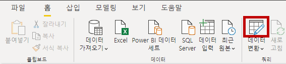

1. **파워 쿼리 편집기** 창의 **쿼리** 창에서 **DimEmployee** 쿼리를 선택합니다.

    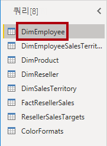

    > **참고:** 연결 방법을 지정하라는 경고 메시지가 표시되면 **자격 증명 편집**을 선택하고 현재 자격 증명을 사용하여 연결한 다음 **확인**을 선택하여 암호화되지 않은 연결을 사용합니다.
 
1. 쿼리 이름을 바꾸려면 (오른쪽에 있는) **쿼리 설정** 창의 **이름** 상자에서 텍스트를 **Salesperson**으로 바꾸고 **Enter**키를 누릅니다. 그런 다음 **쿼리** 창에서 이름이 업데이트되었는지 확인합니다.

    > *쿼리 이름으로 모델 테이블 이름이 결정됩니다. 간결하면서도 익숙한 이름을 짓는 것이 좋습니다.*

1. 특정 열을 찾으려면 **홈** 리본 탭에서 **열 관리**와 **열 선택** 아래쪽 화살표를 차례로 선택한 다음 **열로 이동**을 선택합니다.

    > *열로 이동은 열이 많이 있을 때 유용한 기능입니다. 그렇지 않으면 가로로 스크롤하여 열을 찾을 수 있습니다.*

    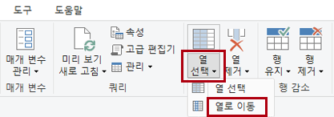

1. **열로 이동** 창에서 열 이름을 기준으로 목록을 정렬하기 위해 **AZ** 정렬 단추를 선택하고 **이름**과 **SalesPersonFlag**를 선택합니다. **확인**을 클릭합니다.

    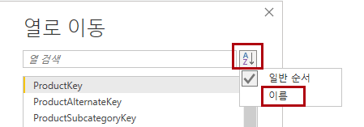

1. **SalesPersonFlag** 열을 찾은 다음 열을 필터링하여 Salespeople(즉, **TRUE**)만 선택하고 **OK**를 클릭합니다.

1. **쿼리 설정** 창의 **적용된 단계** 목록에 **필터링된 행** 단계가 추가됩니다.

    > *변환을 생성할 때마다 또 하나의 단계 논리가 생성됩니다. 단계를 편집하거나 삭제할 수 있습니다. 쿼리 변환 단계에서의 쿼리 결과를 미리 보는 단계를 선택할 수도 있습니다.*

    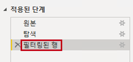

1. 열을 제거하려면 **홈** 리본 탭에서 **열 병합** 그룹을 선택하고 **열 선택** 아이콘을 선택합니다.

1. **열 선택** 창에서 모든 열을 선택 취소하려면 **(모든 열 선택)** 항목을 선택 취소합니다.

1. 다음 6개 열을 선택하여 열을 포함합니다.

    - EmployeeKey
    - EmployeeNationalIDAlternateKey
    - FirstName
    - LastName
    - Title
    - EmailAddress

1. **적용된 단계** 목록에서 다른 쿼리 단계가 추가됩니다.

    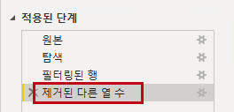

1. 단일 이름 열을 만들려면 먼저 **FirstName** 열 머리글을 선택합니다. **Ctrl** 키를 누른 상태에서 **LastName** 열을 선택합니다.

    

1. 선택한 열 헤더 중 하나를 마우스 오른쪽 단추로 클릭한 다음 컨텍스트 메뉴에서 **열 병합**을 선택합니다.

    > 대부분의 일반적인 변환은 열 머리글을 마우스 오른쪽 단추로 클릭한 다음, 컨텍스트 메뉴에서 선택하면 적용할 수 있습니다. 하지만 리본에서 더 많은 변환을 사용할 수 있습니다.

1. **열 병합** 창의 **구분 기호** 드롭다운 목록에서 **공백을**선택합니다.

1. **새 열 이름** 상자에서 텍스트를 **Salesperson**으로 바꿉니다.

1. **EmployeeNationalIDAlternateKey** 열의 이름을 바꾸려면 **EmployeeNationalIDAlternateKey** 열 머리글을 두 번 클릭하고 텍스트를 **EmployeeID**로 바꾼 다음 **Enter** 키를 누릅니다.

1. 이전 단계를 사용하여 **EmailAddress** 열의 이름을 **UPN**으로 변경합니다.

    > *UPN은 User Principal Name(사용자 계정 이름)의 약자입니다.*

**왼쪽 하단의 상태 표시줄에서 쿼리에 5개의 열과 18개의 행이 있는지 확인합니다.**

## **SalespersonRegion 쿼리 구성**

이번 작업에서는 **SalespersonRegion** 쿼리를 구성합니다.

1. **쿼리** 창에서 **DimEmployeeSalesTerritory** 쿼리를 선택합니다.

1. **쿼리 설정** 창에서 쿼리 이름을 **SalespersonRegion**으로 바꿉니다.

1. 마지막 열 2개를 제거하기 위해 먼저 **DimEmployee** 열 머리글을 선택합니다.

1. **Ctrl** 키를 누른 상태에서 **DimSalesTerritory** 열 머리글을 선택합니다.

1. 선택한 열 헤더 중 하나를 마우스 오른쪽 단추로 클릭한 다음 컨텍스트 메뉴에서 **열 제거**를 선택합니다.

**상태 표시줄에서 쿼리에 열 2개와 행 39개가 있는지 확인합니다.**

## 제품 쿼리 구성

이번 작업에서는 **Product** 쿼리를 구성합니다.

> ***중요**: 자세한 지침이 제공되기 때문에 랩 단계에서는 간결한 지침을 제공합니다. 자세한 지침이 필요한 경우 이전 작업의 단계를 다시 참조하세요.*

1. **DimProduct** 쿼리를 선택하고 쿼리 이름을 **Product**로 바꿉니다.

1. **FinishedGoodsFlag** 열의 위치를 찾은 다음, 열을 필터링하여 완제품인(즉 TRUE인) 제품을 검색합니다.

1. 다음을 **제외한** 모든 열을 제거합니다.

    - ProductKey
    - EnglishProductName
    - StandardCost
    - Color
    - DimProductSubcategory

1. **DimProductSubcategory** 열은 관련 테이블을 나타냅니다(**값** 링크가 포함됨).

1. **DimProductSubcategory** 열 머리글의 열 이름 오른쪽에 있는 확장 단추를 선택합니다.

    

1. 열의 전체 목록을 참조한 다음 **모든 열 선택** 상자를 선택하여 모든 열의 선택을 취소합니다.

1. **EnglishProductSubcategoryName**과 **DimProductCategory**를 선택하고 **원래 열 이름을 접두사로 사용** 확인란을 선택 취소한 후 **OK**를 선택합니다.

    > 두 열을 선택하면 변환이 **DimProductSubcategory** 테이블에 대한 조인에 적용되어 두 열이 포함됩니다. **DimProductCategory** 열은 데이터 원본의 또 다른 관련 테이블입니다.

    > 쿼리 열 이름은 언제나 고유해야 합니다. 이 체크박스를 선택한 상태로 유지하면 각 열의 이름에 확장된 열 이름이 접두사로 추가됩니다(이 경우 **DimProductSubcategory**). 선택한 열 이름이 **제품** 쿼리의 열 이름과 충돌하지 않음이 확인되었으므로 옵션은 선택 취소했습니다.

1. 변환 결과로 두 개의 열이 추가되고 두 **DimProductSubcategory** 열이 제거된 것을 알 수 있습니다.

1. **DimProductCategory** 열을 확장하고 수강생들에게 **EnglishProductCategoryName** 열만 설명합니다.

1. 다음 네 가지 열의 이름을 바꿉니다.

    - **EnglishProductName**을 **Product**로
    - **StandardCost**를 **Standard Cost**로(공백 포함)
    - **EnglishProductSubcategoryName**을 **Subcategory**로
    - **EnglishProductCategoryName**을 **Category**로

**상태 표시줄에서 쿼리에 열 6개와 행 397개가 있는지 확인합니다.**

## Reseller 쿼리 구성

이 작업에서는 **Reseller** 쿼리를 구성합니다.

1. **DimReseller** 쿼리를 선택하고 이름을 **Reseller**로 바꿉니다.

1. 다음을 **제외한** 모든 열을 제거합니다.

    - ResellerKey
    - BusinessType
    - ResellerName
    - DimGeography

1. **DimGeography** 열을 확장하고 다음 **세 개의 열만** 포함합니다.

    - City
    - StateProvinceName
    - EnglishCountryRegionName

1. **Business Type** 열 머리글에서 아래쪽 화살표를 선택한 다음 고유한 열 값을 검토하고 **Warehouse**와 **Ware House** 두 값을 모두 확인합니다.

1. **비즈니스 유형** 열 헤더를 마우스 오른쪽 단추로 클릭한 다음 **값 바꾸기**를 선택합니다.

1. **값 바꾸기** 창에서 다음 값을 구성합니다.

    - **찾을 값** 상자에 **Ware House**를 입력
    - **바꿀 항목** 상자에 **Warehouse**를 입력

    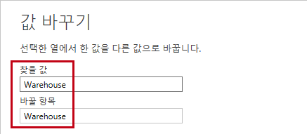

1. 다음 네 가지 열의 이름을 바꿉니다.

    - **BusinessType**을 **Business Type**으로(공백 포함)
    - **ResellerName**을 **Reseller**로
    - **StateProvinceName**을 **State-Province**로
    - **EnglishCountryRegionName**을 **Country-Region**으로

**상태 표시줄에서 쿼리에 열 6개와 행 701개가 있는지 확인합니다.**

## Region 쿼리 구성

이번 작업에서는 **Region** 쿼리를 구성합니다.

1. **DimSalesTerritory** 쿼리를 선택하고 쿼리 이름을 **Region**으로 바꿉니다.

1. 값 0(영)을 제거하려면 **SalesTerritoryAlternateKey** 열에 필터를 적용합니다.

    > *이렇게 하면 한 행이 제거됩니다.*

1. 다음을 **제외한** 모든 열을 제거합니다.

    - SalesTerritoryKey
    - SalesTerritoryRegion
    - SalesTerritoryCountry
    - SalesTerritoryGroup

1. 다음 세 가지 열의 이름을 바꿉니다.

    - **SalesTerritoryRegion**을 **Region**으로
    - **SalesTerritoryCountry**를 **Country**로
    - **SalesTerritoryGroup**을 **Group**으로

**상태 표시줄에서 쿼리에 열 4개와 행 10개가 있는지 확인합니다.**

## Sales 쿼리 구성

이 작업에서는 **Sales** 쿼리를 구성합니다.

1. **FactResellerSales** 쿼리를 선택하고 이름을 **Sales**로 바꿉니다.

1. 다음을 **제외한** 모든 열을 제거합니다.

    - SalesOrderNumber
    - OrderDate
    - ProductKey
    - ResellerKey
    - EmployeeKey
    - SalesTerritoryKey
    - OrderQuantity
    - UnitPrice
    - TotalProductCost
    - SalesAmount
    - DimProduct

    > ***참고**: **파워 BI Desktop에서 데이터 준비** 랩에서는 **FactResellerSales** 행의 일부에 **TotalProductCost** 값이 없었습니다. **DimProduct** 열은 제품 표준 비용 열을 검색하여 누락된 값을 쉽게 수정할 수 있도록 포함된 것입니다.*

1. **DimProduct** 열을 확장한 다음 모든 열을 선택 취소하고 **StandardCost** 열만 포함합니다.

1. 사용자 지정 열을 만들려면 **열 추가** 리본 탭의 **일반** 그룹에서 **사용자 지정 열**을 선택합니다.

    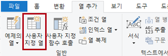

1. **새 열 이름** 상자의 **사용자 지정 열** 창에서 텍스트를 **Cost**으로 바꿉니다.

1. **사용자 지정 열 수식** 상자에 다음 식을(등호 기호 뒤에) 입력한 다음 새 열을 저장합니다.

   ` if [TotalProductCost] = null then [OrderQuantity] * [StandardCost] else [TotalProductCost] `

    > ***참고**: 02-load-data 폴더에 있는 **Snippets.txt** 파일에서 표현식을 복사할 수 있습니다*.

    > *이 식은 **TotalProductCost** 값 누락 여부를 확인합니다. 값이 누락되었다면 **OrderQuantity** 값과 **StandardCost** 값을 곱한 값을 생성합니다. 누락되지 않았다면 기존 **TotalProductCost** 값을 사용합니다.*

1. 다음 두 열을 제거합니다.

    - TotalProductCost
    - StandardCost

1. 다음 세 가지 열의 이름을 바꿉니다.

    - **OrderQuantity**를 **Quantity**로
    - **UnitPrice**를 **Unit Price**로(공백 포함)
    - **SalesAmount**를 **Sales**로

1. 열 데이터 형식을 수정하려면 열 이름 왼쪽에 있는 **수량** 열 머리글에서 **1.2** 아이콘을 선택한 다음, **정수**를 선택합니다.

    > 올바른 데이터 형식 구성은 대단히 중요합니다. 또한 열에 숫자 값이 있으며 수학적 계산을 수행할 예정이라면 반드시 올바른 형식을 선택해야 합니다.

    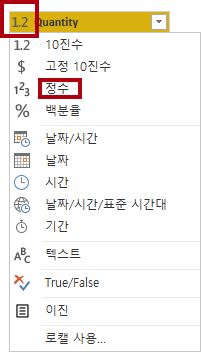

1. 다음 세 개의 열 데이터 형식을 **고정 10진수**로 수정합니다.

    > *고정된 10진수 데이터 형식은 19자리를 허용하며, 반올림 오류를 방지하기 위해 더 높은 정밀도를 허용합니다. 재무 관련 값이나 (환율 같은) 비율에는 반드시 고정 10진수 형식을 사용해야 합니다.*

    - Unit Price
    - Sales
    - 비용

**상태 표시줄에서 쿼리에 열이 10개, 행이 999개 이상 있는지 확인합니다.** *쿼리별 미리 보기 데이터에는 행이 1,000개까지 로드됩니다.*

## Targets 쿼리 구성

이번 작업에서는 **Targets** 쿼리를 구성합니다.

1. **ResellerSalesTargets** 쿼리를 선택하고 이름을 **Targets**로 바꿉니다.

    > **참고:** 연결 방법을 지정하라는 경고 메시지가 표시되면 **자격 증명 편집**을 선택하고 익명 액세스를 사용합니다.

1. 12개월 열(**M01**-**M12**)을 피벗 해제하기 위해 먼저 **연도** 및 **EmployeeID** 열 머리글을 다중 선택합니다.

1. 선택한 열 헤더 중 하나를 마우스 오른쪽 단추로 클릭한 다음 컨텍스트 메뉴에서 **다른 열 피벗 해제**를 선택합니다.

1. 열 이름이 이제 **특성** 열에 나타나고 값이 **값** 열에 나타납니다.

1. **값** 열에 필터를 적용하여 하이픈(-) 값을 제거합니다.

    > *원본 CSV 파일에서 하이픈 문자를 사용하여 영(0)을 나타내는 것을 기억하실 것입니다.*

1. 다음 두 열의 이름을 바꿉니다.

    - **MonthNumber**에 대한 **특성**(공백 없음)
    - **Value**를 **Target**으로

1. **MonthNumber** 열 값을 준비하려면 **MonthNumber** 열 헤더를 마우스 오른쪽 단추로 클릭한 다음 **값 바꾸기**를 선택합니다.

    > 이제 변환을 적용하여 날짜 열을 생성합니다. 날짜는 **Year** 및 **MonthNumber** 열에서 파생됩니다. **예제의 열** 기능을 사용하여 열을 만들게 됩니다.

1. **값 바꾸기** 창의 **찾을 값** 상자에 **M**을 입력하고 **바꾸기**를 비워 둡니다.

1. **MonthNumber** 열 데이터 형식을 **정수**로 수정합니다.

1. **열 추가** 리본 탭의 **일반** 그룹에서 **예제의 열** 아이콘을 선택합니다.

    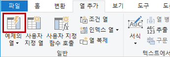

1. 첫 번째 행은 **2017**년, 월 번호 **7**입니다.

1. **Column1** 열의 첫 번째 표 셀에서 **7/1/2017**을 입력한 다음 **Enter**키를 누릅니다.

    > ***참고**: 가상 머신은 미국 지역 설정을 사용하므로 이 날짜는 실제로 2017년 7월 1일입니다. 다른 지역 설정에는 날짜 전에 **0**이 필요할 수 있습니다.*

1. 그리드 셀이 예측된 값으로 업데이트됩니다.

    > *이 기능은 **Year** 열과 **MonthNumber** 열의 값을 결합한다고 정확히 예측합니다.*

1. 쿼리 그리드 위에 표시되는 수식에도 주목하세요.

    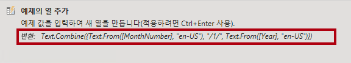

1. 새 열의 이름을 바꾸려면 **Merged** 열 머리글을 두 번 클릭하고 열 이름을 **TargetMonth**로 바꿉니다.

1. 다음 열을 제거합니다.

    - Year
    - MonthNumber

1. 다음 열 데이터 형식을 수정합니다.

    - **Target**을 고정 10진수로
    - **TargetMonth**를 날짜로

1. **대상** 값에 1,000을 곱하기 위해 **대상** 열 머리글을 선택한 다음, **변환** 리본 탭의 **열 숫자** 그룹에서 **표준**을 선택하고 **곱하기**를 선택합니다.

    > *목표 값이 수천 단위로 저장된 것을 기억하실 수 있습니다.*

    

1. **곱하기** 창의 **값** 상자에 **1000**을 입력하고 **OK**를 선택합니다.

**상태 표시줄에서 쿼리에 열 3개와 행 809개가 있는지 확인합니다.**

## ColorFormats 쿼리 구성

이번 작업에서는 **ColorFormats** 쿼리를 구성합니다.

1. **ColorFormats** 쿼리를 선택하고 첫 번째 행에 열 이름이 포함되어 있음을 확인합니다.

1. **홈** 리본 탭의 **변환** 그룹에서 **첫 번째 행을 머리글로 사용**을 선택합니다.

    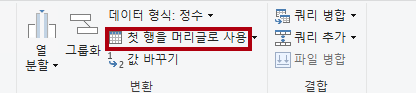

**상태 표시줄에서 쿼리에 열 3개와 행 10개가 있는지 확인합니다.**

## 제품 쿼리 업데이트

이번 작업에서는 **ColorFormats** 쿼리를 병합하여 **Product** 쿼리를 업데이트합니다.

1. **Product** 쿼리를 선택합니다.

1. **ColorFormats** 쿼리를 병합하려면 **홈** 리본 탭에서 **결합** 아래쪽 화살표와 **쿼리 병합**을 차례로 선택합니다.

    > 쿼리를 병합하면 데이터를 통합할 수 있는데, 이 경우에는 다양한 데이터 원본(SQL Server 및 CSV 파일)의 데이터를 통합할 수 있습니다.

    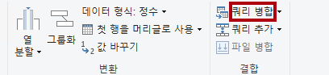

1. **제품** 쿼리 표의 **병합** 창에서 **Color** 열 헤더를 선택합니다.

    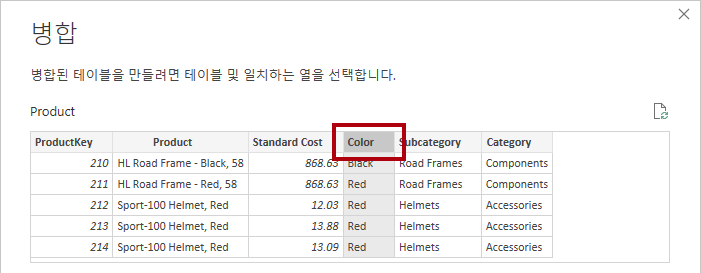

1. **제품** 쿼리 표 아래의 드롭다운 목록에서 **ColorFormats** 쿼리를 선택합니다.

    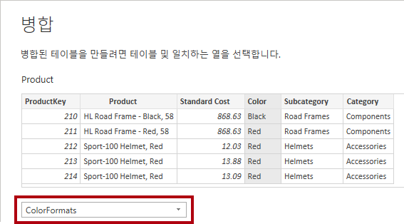

1. **ColorFormats** 쿼리 표에서 **Color** 열 헤더를 선택합니다.

1. 두 데이터 원본 각각에 대응하는 드롭다운 목록에서 **개인 정보 수준** 창이 열리면 **조직**을 선택한 다음 **저장**을 선택합니다.

    > *데이터 원본의 개인 정보 수준을 구성하여 원본 간의 데이터 공유 여부를 정할 수 있습니다. 필요하다면 각 데이터 원본을 **조직**으로 설정하여 데이터를 공유할 수 있게 합니다. 비공개 데이터 원본은 다른 데이터 원본과 공유할 수 없습니다. 하지만 개인 데이터를 공유할 수 없다는 뜻은 아닙니다. 파워 쿼리 엔진이 원본 간에 데이터를 공유할 수 없다는 뜻입니다.*

    

1. **병합** 창에서 기본 **조인 종류**를 사용합니다. 왼쪽 우선 외부 선택 항목을 유지하고 **OK**를 선택합니다.

1. 다음 두 개의 열을 포함하도록 **ColorFormats** 열을 확장합니다.

    - Background Color Format
    - 글꼴 색 형식

**상태 표시줄에서 쿼리에 열 8개와 행 397개가 있는지 확인합니다.**

## ColorFormats 쿼리 업데이트

이번 작업에서는 **ColorFormats**를 업데이트하여 로드를 비활성화합니다.

1. **ColorFormats** 쿼리를 선택합니다.

1. **쿼리 설정** 창에서 **모든 속성** 링크를 선택합니다.

    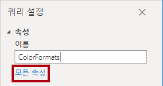

1. **보고서에** 로드 **사용 확인란을 실행** 선택 취소합니다.

    > *로드를 비활성화하면 데이터 모델에 테이블로 로드되지 않습니다. 쿼리가 데이터 모델로의 로드가 활성화된 **Product** 쿼리와 병합되었기 때문에 이 작업을 수행해야 합니다.*

    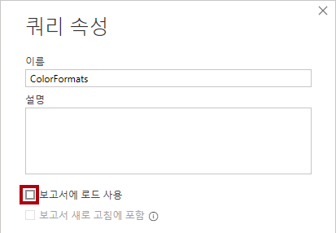

### 최종 제품 검토

1. Power Query 편집기에 다음과 같이 올바르게 명명된 **8개의 쿼리**가 있는지 확인합니다.

    - Salesperson
    - SalespersonRegion
    - Product
    - Reseller
    - Region
    - Sales
    - 대상
    - ColorFormats(데이터 모델에 로드되지 않음)

1. **닫기 &amp; 적용**을 선택하여 모델에 데이터를 로드하고 Power Query 편집기 창을 닫습니다.

    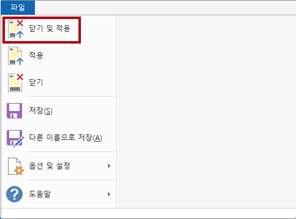

1. 이제 오른쪽에 필터, 시각화 및 데이터 창이 있는 캔버스를 Power BI Desktop에서 볼 수 있습니다. 데이터 창에서 데이터 모델에 로드된 **7개의 테이블**을 확인합니다.

    

## 랩 완료
