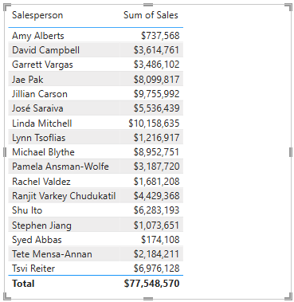
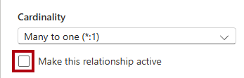

---
lab:
  title: Power BI 의미 체계 모델 구성
  module: Configure a semantic model in Power BI
---

# Power BI 의미 체계 모델 구성

## 랩 사례

이 랩에서는 데이터 모델 개발을 시작합니다. 테이블 간의 관계를 만든 후 테이블 및 열 속성을 구성하여 데이터 모델의 친숙성과 유용성을 향상하는 과정을 거칩니다. 또한 계층 구조와 빠른 측정을 만듭니다.

이 랩에서는 다음 사항들을 수행하는 방법에 대해 알아봅니다.

- 모델 관계 만들기
- 테이블 및 열 속성을 구성합니다.
- 계층 구조를 만듭니다.
- 빠른 측정값을 만듭니다.
- 다 대 다 관계를 구성하세요.

**이 랩은 약 45분 정도 소요됩니다.**

## 시작하기

이 연습을 완료하려면 먼저 웹 브라우저를 열고 다음 URL을 입력하여 zip 파일을 다운로드합니다.

`https://github.com/MicrosoftLearning/PL-300-Microsoft-Power-BI-Data-Analyst/raw/Main/Allfiles/Labs/03-configure-semantic-model/03-model-data.zip`

파일을 **C:\Users\Student\Downloads\03-model-data** 폴더에 추출합니다.

**03-스타터-영업 분석.pbix** 파일을 엽니다.

> _**참고**: 파일이 로드되면 로그인 대화 상자가 표시될 수 있습니다. **취소**를 선택하여 로그인 대화 상자를 닫습니다. 다른 정보 창을 모두 닫습니다. 변경 내용을 적용하라는 프롬프트가 표시되면 **나중에 적용**을 선택하세요._

## 모델 관계 만들기

이 작업에서는 모델 관계를 만듭니다. 이 파일은 테이블 간의 관계를 식별하지 않도록 구성되었습니다. 이는 기본 설정은 아니지만 모델에 대한 올바른 관계를 만드는 추가 작업을 방지하기 위해 권장됩니다.

> 랩에서는 약식 표기법을 사용하여 필드를 참조합니다. `Product | Category`과 같이 표시됩니다. 이 예시에서 `Product`는 테이블 이름이고 `Category`는 필드 이름입니다.

1. Power BI Desktop에서 모든 테이블 필드를 보려면 **데이터** 창에서 빈 영역을 마우스 오른쪽 단추로 클릭한 다음, **모두 확장**을 선택합니다.

1. 테이블 시각적 개체를 만들려면 **데이터** 창의 `Product` 테이블 내부에서 `Category` 필드를 확인합니다.

1. 테이블에 다른 열을 추가하려면 **데이터** 창에서 `Sales | Sales` 필드를 확인합니다.

1. 테이블 시각적 개체에 4개의 제품 범주가 나열되며 각 범주의 판매 금액이 동일하고 합계에의 금액도 동일한 것을 볼 수 있습니다.

    

    > _문제는 이 테이블이 서로 다른 테이블에서 가져온 필드를 기반으로 한다는 점입니다. 각 제품 범주에 해당 범주에 대한 판매량이 표시되어야 합니다. 그러나 이러한 테이블 간에 모델 관계가 없기 때문에 `Sales` 테이블이 필터링되지 않습니다. 이제 관계를 추가하여 테이블 간에 필터를 전파합니다._

1. 모델 디자이너로 전환하려면 왼쪽에서 **모델 뷰** 아이콘을 선택하세요.

    

1. **홈** 리본에서 **관계 관리**를 선택하세요.

    

1. **관계 관리** 창에서 관계가 아직 정의되지 않은 것을 볼 수 있습니다.

1. 새 관계를 만들려면 **+ 새 관계**를 선택하세요.

1. `Product` 테이블에서 `Sales` 테이블로의 관계를 구성하려면 **원본 테이블** 드롭다운 목록에서 `Product` 테이블을 선택하고 **대상 테이블** 드롭다운 목록에서 `Sales` 테이블을 선택합니다.

    

1. 다음 속성이 자동으로 구성되었음을 알 수 있습니다.

    - **각 테이블의 ProductKey 열이 선택되어 있습니다**. _열은 동일한 이름 및 데이터 형식을 공유하기 때문에 선택되었습니다. 실제 데이터에서 서로 다른 이름을 가진 일치하는 열을 찾아야 할 수도 있습니다._
    - **카디널리티 유형은 일대다(1:\*)** 입니다. _카디널리티는 자동으로 검색되었습니다. Power BI에서 `Product` 테이블의 `ProductKey` 열에 고유한 값이 포함된다는 것을 인식하기 때문입니다. 일대다 관계는 가장 일반적인 카디널리티이며, 이 랩에서 만드는 모든 관계가 이 유형입니다._
    - **교차 필터 방향 유형은 단일입니다.** _단일 필터 방향은 필터가 "일" 쪽에서 "다" 쪽으로 전파됨을 의미합니다. 이 경우 `Product` 테이블에 적용된 필터가 `Sales` 테이블에 전파되지만 반대 방향으로는 전파되지 않음을 의미합니다._
    - **이 관계 활성화가 선택되어 있습니다**. 활성 관계는 필터를 전파합니다. 필터가 전파되지 않도록 관계를 비활성으로 표시할 수 있습니다. 테이블 간에 여러 관계 경로가 있는 경우 비활성 관계가 있을 수 있습니다. 이 경우 모델 계산은 특수 함수를 사용하여 활성화할 수 있습니다.__

    

1. **저장**을 선택하고 **관계 관리** 창에서 새 관계가 나열되는지 확인한 다음 **닫기**를 선택합니다.

1. 모델 다이어그램에서 두 테이블 사이에 커넥터가 생긴 것을 확인하세요(관계를 더 명확하게 보려면 테이블의 위치를 변경하는 것이 좋습니다).

    

    > _다이어그램의 관계 선을 살펴보면 많은 관계 속성을 해석할 수 있습니다._
    >
    > - _카디널리티는 **1** 및 **(\*)** 지표로 표현됩니다._
    > - _필터 방향은 화살촉으로 표현됩니다._
    > - _실선은 활성 관계를 나타냅니다. 점선은 비활성 관계를 나타냅니다._
    >
    > 팁: 관계 위에 커서를 올려놓으면 관련 열이 강조 표시됩니다.

1. **보고서 뷰**로 전환한 다음, 각 제품 범주에 대해 서로 다른 값을 표시하도록 테이블 시각적 개체가 업데이트된 것을 확인하세요.

    > _`Product` 테이블에 적용된 필터가 이제 `Sales` 테이블로 전파됩니다._

    

## 추가 관계 만들기

관계를 만드는 더 쉬운 방법이 있습니다. 모델 다이어그램에서 열을 끌어서 놓아 새 관계를 만들 수 있습니다.

1. 다른 기술을 사용하여 새로운 관계를 만들려면 **모델 뷰**로 전환합니다.

1. `Reseller` 테이블에서 `ResellerKey` 열을 `Sales` 테이블의 `ResellerKey` 열로 끌어다 놓습니다.

    > _**중요**: 때로는 열을 끌 수 없는 경우가 있습니다. 이 상황이 발생하면 다른 열을 선택한 다음 다시 드래그하려는 열을 선택한 후에 다시 시도합니다. 다이어그램에 추가한 새 관계가 표시되는지 확인하세요._

    

1. **새 관계** 창에서 구성을 검토한 다음, **저장**을 선택합니다.

1. 새 기술을 사용하여 다음의 두 모델 관계를 만듭니다.

     - `Region | SalesTerritoryKey` - `Sales | SalesTerritoryKey`
     - `Salesperson | EmployeeKey` - `Sales | EmployeeKey`

1. 다이어그램에서 `Sales` 테이블이 다이어그램 가운데에 오고 관련 테이블이 근처에 정렬되어 있도록 테이블을 정렬합니다. 연결이 끊긴 테이블은 옆쪽에 배치합니다.

    

1. Power BI Desktop 파일을 저장합니다.

## Product 테이블 구성

이 작업에서는 계층 구조 및 표시 폴더를 사용하여 `Product` 테이블을 구성합니다.

1. **모델** 보기로 전환합니다.

1. 필요한 경우, **데이터** 창에서 `Product` 테이블을 확장하여 모든 필드를 표시합니다.

1. `Product` 테이블에서 `Category` 열을 마우스 오른쪽 단추로 클릭하고 **계층 구조 만들기**를 선택합니다.

    

1. **속성** 창의 **이름** 상자에서 값을 _제품_으로 바꿉니다.

    

1. 계층 구조에 수준을 추가하려면 **계층 구조** 드롭다운 목록에서 **하위 범주**를 선택한 다음, **제품**을 선택하고 **수준 변경 내용 적용**을 선택합니다.

    

1. **데이터** 창에서 `Products` 계층 구조를 확인하세요. 계층 수준을 표시하려면 계층 수준을 확장하세요.

    

1. 열을 표시 폴더로 구성하려면 **데이터** 창에서 먼저 `Background Color Format` 열을 선택하세요.

1. **Ctrl** 키를 누른 상태에서 `Font Color Format` 열을 선택합니다.

1. **속성** 창의 **표시 폴더** 상자에 _서식_을 입력합니다.

    

1. **데이터** 창에서 이제 두 개의 열이 폴더 안에 있는 것을 확인할 수 있습니다.

    

    > _표시 폴더는 특히 많은 필드로 구성된 테이블의 경우 테이블을 구성하는 좋은 방법입니다. 논리적 표현만 가능합니다._

## Region 테이블 구성

이 작업에서는 계층 구조와 업데이트된 카테고리로 `Region` 테이블을 구성합니다.

1. `Region` 테이블에서 다음과 같은 세 가지 수준으로 _지역_이라는 계층 구조를 만듭니다.

     - `Group`
     - `Country`
     - `Region`

1. `Country` 열을 선택하세요(`Country` 계층 구조 수준이 아님).

1. **속성** 창에서 **고급** 섹션(창 아래쪽에 위치)을 확장한 다음, **데이터 범주** 드롭다운 목록에서 **국가/지역**을 선택합니다.

    

    > 데이터 분류는 보고서 디자이너에게 힌트를 제공할 수 있습니다. 이 경우 열을 국가 또는 지역으로 분류하면 맵 시각화를 렌더링할 때 Power BI에 더 정확한 정보가 제공됩니다.

## Reseller 테이블 구성

이 작업에서는 계층 구조를 추가하고 데이터 카테고리를 업데이트하도록 `Reseller` 테이블을 구성합니다.

1. `Reseller` 테이블에서 다음과 같은 두 가지 수준으로 _재판매인_이라는 계층 구조를 만듭니다.

     - `Business Type`
     - `Reseller`

1. 다음 네 가지 수준으로 _Geography_라는 두 번째 계층 구조를 만듭니다.

     - `Country-Region`
     - `State-Province`
     - `City`
     - `Reseller`

1. 다음 열에 대해 데이터 범주(계층 구조 내부가 아님)를 설정합니다.

    - `Country-Region` ~ **국가/지역**
    - `State-Province` ~ **시/도 또는 시/군/구**
    - `City` ~ **도시**

## Sales 테이블 구성

이 작업에서는 업데이트된 설명, 서식, 요약을 사용하여 `Sales` 테이블을 구성합니다.

1. `Sales` 테이블에서 `Cost` 열을 선택하세요.

1. **속성** 창의 **설명** 상자에 _Based on standard cost_를 입력합니다.

    > _설명은 테이블, 열, 계층 구조 또는 측정값에 적용할 수 있습니다. **데이터** 창에서 보고서 작성자가 필드 위로 커서를 가져가면 도구 설명에 설명 텍스트가 표시됩니다._

1. `Quantity` 열을 선택하세요.

1. **속성** 창의 **서식** 섹션 내에서 **천 단위 구분 기호** 속성을 _예_로 전환합니다.

1. `Unit Price` 열을 선택하세요.

1. **속성** 창의 **서식** 섹션 내에서 **소수 자릿수** 속성을 _2_로 설정합니다.

1. **고급** 그룹(아래로 스크롤하여 찾아야 할 수도 있음)에 있는 **요약 기준** 드롭다운 목록에서 **평균**을 선택합니다.

    > 기본적으로 숫자 열은 값을 합산하여 요약합니다. 이 기본 동작은 요율을 나타내는 `Unit Price`와 같은 열에 적합하지 않습니다. 기본 요약을 평균으로 설정하면 의미 있는 결과가 생성됩니다.

## 속성 대량 업데이트

이 작업에서 단일 대량 업데이트를 사용하여 여러 열을 업데이트합니다. 대량 작업 방식으로 열을 숨기고 열 값의 서식을 지정합니다.

1. **데이터** 창(또는 모델 다이어그램)에서 `Product | ProductKey` 열을 선택합니다.

1. **Ctrl** 키를 누른 채로 다음 13개의 열을 선택합니다(여러 테이블에 분포됨).

     - `Region | SalesTerritoryKey`
     - `Reseller | ResellerKey`
     - `Sales | EmployeeKey`
     - `Sales | ProductKey`
     - `Sales | ResellerKey`
     - `Sales | SalesOrderNumber`
     - `Sales | SalesTerritoryKey`
     - `Salesperson | EmployeeID`
     - `Salesperson | EmployeeKey`
     - `Salesperson | UPN`
     - `SalespersonRegion | EmployeeKey`
     - `SalespersonRegion | SalesTerritoryKey`
     - `Targets | EmployeeID`

1. **속성** 창에서 **숨김** 속성을 _예_로 설정합니다.

    > _열은 관계에서 사용되거나 행 수준 보안 구성 또는 계산 논리에 사용되기 때문에 숨겨져 있습니다._
    >
    > _**Power BI Desktop에서 DAX 계산 만들기** 랩에서 계산에 `SalesOrderNumber` 열을 사용하게 됩니다._

1. 다음 세 개의 열을 다중 선택합니다.

     - `Product | Standard Cost`
     - `Sales | Cost`
     - `Sales | Sales`

1. **속성** 창의 **서식** 섹션 내에서 **소수 자릿수** 속성을 _0_(숫자 영)으로 설정합니다.

## 모델 인터페이스 살펴보기

이 작업에서는 **보고서 뷰**로 전환하고, 데이터 모델 인터페이스를 검토하고, 자동 날짜/시간 설정을 구성합니다.

1. **보고서** 보기로 전환합니다.

1. **데이터** 창에서 다음을 확인합니다.

     - 열, 계층 구조, 계층 수준이 보고서 시각적 개체를 구성하는 데 사용 가능한 필드입니다.
     - 보고서 작성과 관련된 필드만 표시됩니다.
     - 모든 필드가 숨겨져 있으므로 `SalespersonRegion` 테이블이 표시되지 않습니다.
     - `Region` 및 `Reseller` 테이블의 공간 필드에 공간 아이콘이 함께 표시됩니다.
     - 시그마 기호(Ʃ)로 표시된 필드는 기본적으로 요약됩니다.
     - `Sales | Cost` 필드 위에 커서를 올려 놓으면 도구 설명이 나타납니다.

1. `Sales | OrderDate` 필드를 확장하면 `Date Hierarchy`가 표시되는지 확인하세요. `Targets | TargetMonth` 필드는 비슷한 계층 구조를 제공합니다.

    

    > _**중요**: 이러한 계층 구조는 사용자가 만든 것이 아닙니다. 이는 기본 설정으로 자동 생성되었습니다. 그러나 문제가 있습니다. Adventure Works의 회계 연도는 매년 7월 1일에 시작되지만 그러나 이러한 자동 생성 날짜 계층 구조에서 날짜 계층 구조 연도는 매년 1월 1일에 시작됩니다._

1. 자동 날짜/시간 설정을 끄려면 **파일 > 옵션 및 설정 > 옵션**으로 이동하세요.

1. **옵션** 창의 **현재 파일** 섹션에서 **데이터 로드 > 시간 인텔리전스**로 이동한 다음, **자동 날짜/시간**의 선택을 취소합니다.

    

1. **데이터** 창에서 날짜 계층 구조를 더 이상 사용할 수 없습니다.

## 빠른 측정 만들기

이 작업에서는 수익과 이익률을 계산하는 두 개의 빠른 측을 만듭니다. 빠른 측정값에서 계산 수식이 자동으로 작성됩니다. 일반적인 단순 계산용으로 쉽고 빠르게 만들 수 있습니다.

1. **데이터** 창에서 `Sales` 테이블을 마우스 오른쪽 단추로 클릭한 다음, **새 빠른 측정**을 선택합니다.

    

1. **빠른 측정** 창의 **계산 선택** 드롭다운 목록에서 **수학 연산** 그룹에 있는 **뺄셈**을 선택합니다.

    

1. **데이터** 창에서 `Sales | Sales` 필드를 **기준값** 웰로 끌어다 놓습니다.

    

1. `Sales | Cost` 필드를 **뺄 값** 상자로 끌어다 놓습니다.  

    

1. **추가**를 선택합니다.

1. **데이터** 창의 `Sales` 테이블 내부에서 새 측정값을 확인하세요.

    > _측정값은 계산기 아이콘으로 표시됩니다._

    

1. 측정값의 이름을 바꾸려면 해당 항목을 마우스 오른쪽 단추로 클릭하고 **이름 바꾸기**를 선택한 다음, _이익_으로 이름을 바꿉니다.

    > _팁: 필드의 이름을 바꾸려면 필드를 두 번 클릭하거나 선택한 후 **F2** 키를 누릅니다._

1. `Sales` 테이블에서 다음 요구 사항에 따라 두 번째 빠른 측정을 추가합니다.

    > _**중요**: 빠른 측정을 만드는 옵션이 상황에 맞는 메뉴에 표시되지 않으면 **계산** 그룹 내부의 **홈** 리본에 있는 명령을 사용하세요.

    - **나누기** 수학 연산을 사용하세요.
    - **분자**를 `Sales | Profit` 필드로 설정합니다.
    - **분모**를 `Sales | Sales` 필드로 설정합니다.
    - 측정값의 이름을 _이익률_로 변경합니다.

1. `Profit Margin` 측정값이 선택되었는지 확인한 다음, **측정 도구** 상황별 리본에서 형식을 소수점 이하 두 자리까지 **백분율**로 설정합니다.

    

1. 두 가지 측정값을 테스트하려면 먼저 페이지에서 기존 테이블 시각적 개체를 선택합니다.

1. **데이터** 창에서 `Profit` 및 `Profit Margin` 측정값을 선택하여 테이블에 추가합니다.

    

1. 오른쪽 안내선을 선택한 후 끌어서 테이블 시각적 개체의 너비를 늘립니다.

    

1. 측정이 올바른 형식으로 합당한 결과를 산출하는지 확인합니다.

    

## 다대다 관계 만들기

이 작업에서는 `Salesperson` 테이블과 `Sales` 테이블 간에 다 대 다 관계를 만듭니다.

1. **보고서 뷰**에서 보고서 페이지의 빈 영역을 선택합니다.

1. 새 테이블 시각적 개체를 만들려면 **데이터** 창에서 다음 두 필드를 확인하세요.

     - `Salesperson | Salesperson`
     - `Sales | Sales`

    

    > _테이블의 시각적 개체에는 각 영업 직원이 달성한 판매량이 표시됩니다. 그러나 영업 직원과 판매 간에는 또 다른 관계가 있습니다. 일부 판매원은 한 개, 두 개 또는 그 이상의 판매 지역에 속합니다. 또한 판매 지역에는 여러 판매원이 할당될 수 있습니다._
    >
    > _실적 관리 측면에서 판매원의 판매량(할당된 지역을 기준으로 함)을 분석하고 판매 목표와 비교해야 합니다. 다음 연습에서 이 분석을 지원하는 관계를 만들 것입니다._

1. _Michael Blythe_는 약 900만 달러의 매출을 올렸습니다.

1. **모델 뷰**로 전환한 다음, `SalespersonRegion` 테이블을 끌어 `Region` 테이블과 `Salesperson` 테이블 사이에 배치합니다.

1. 끌어서 놓기 방식을 사용하여 다음 두 가지 모델 관계를 만듭니다.

    - `Salesperson | EmployeeKey` - `SalespersonRegion | EmployeeKey`
    - `Region | SalesTerritoryKey` - `SalespersonRegion | SalesTerritoryKey`

    > _`SalespersonRegion` 테이블은 브리징 테이블로 간주될 수 있습니다._

1. **보고서 뷰**로 전환하면 시각적 개체가 업데이트되지 않은 것을 볼 수 있습니다. 즉, Michael Blythe의 판매량이 변경되지 않았습니다.

1. **모델 뷰**로 다시 전환한 다음, `Salesperson` 테이블에서 관계 필터 지침(화살표)을 따릅니다.

    > _`Salesperson` 테이블이 `Sales` 테이블을 필터링한다고 생각해 보세요. `SalespersonRegion` 테이블도 필터링하지만 `Region` 테이블에 필터를 전파하여 계속 진행하지 않습니다(화살표가 잘못된 방향을 가리키고 있음)._

    

1. `Region` 테이블과 `SalespersonRegion` 테이블 간의 관계를 편집하려면 관계를 두 번 클릭합니다.

1. **관계 편집** 창의 **교차 필터 방향** 드롭다운 목록에서 _모두_를 선택합니다.

1. **보안 필터를 양방향으로 적용** 확인란을 선택합니다.

    

1. **저장**을 선택합니다.

1. 이제 관계에 이중 화살촉이 있는 것을 볼 수 있습니다.

    

1. **보고서 뷰**로 전환한 다음, 판매 값이 아직 변경되지 않은 것을 확인합니다.

    > _이제 문제는 `Salesperson` 테이블과 `Sales` 테이블 사이에 두 가지 필터 전파 경로가 있다는 사실과 관련이 있습니다. 이러한 모호성은 내부적으로 “최소 테이블 수” 평가를 기반으로 해결됩니다. 필터링을 명확하게 적용하려면 이러한 유형의 모호성이 있는 모델을 디자인해서는 안 됩니다. 이 문제는 이 랩의 뒷부분에서 일부분 해결되며, **Power BI Desktop에서 DAX 계산 만들기** 랩을 완료하면 모두 해결됩니다._

1. **모델** 보기로 전환합니다.

1. 브리징 테이블을 통해 필터 전파를 강제로 적용하려면 `Salesperson` 테이블과 `Sales` 테이블 간의 관계를 편집(두 번 클릭)합니다.

1. **관계 편집** 창에서 **이 관계를 활성으로 만들기** 확인란을 선택 취소합니다.

    

1. **저장**을 선택합니다.

    > _이제는 활성 경로로만 필터가 전파됩니다._

1. 모델 다이어그램에서 비활성 관계가 점선으로 표현되는 것을 볼 수 있습니다.

    

1. **보고서 뷰**로 전환하면 Michael Blythe의 판매량이 거의 2200만 달러가 된 것을 볼 수 있습니다.

1. 또한 각 영업 사원의 판매액(추가 된 경우)이 테이블 총액을 초과합니다.

     > _이 경우는 지역 판매 결과의 두 배, 세 배 등으로 계산되므로 일반적으로 다 대 다 관계입니다. 목록에 두 번째로 나온 영업 직원인 Brian Welcker를 보면, 판매 금액이 총 판매 금액과 같습니다. 맞는 결과입니다. Brian Welcker는 판매 담당 이사이고 그 판매량은 모든 지역의 판매량으로 측정되기 때문입니다._
     >
     > _다 대 다 관계가 작동하는 동안에는 이제 영업 직원이 달성한 판매량을 분석할 수 없습니다(관계가 비활성 상태이므로). **Power BI Desktop에서 DAX 계산 만들기** 랩에서 계산된 테이블을 도입하면 (성과 분석을 위해) 영업 직원에게 할당된 판매 지역의 판매량을 분석할 수 있는 관계를 다시 활성화할 수 있습니다._

1. **모델 뷰**로 전환한 다음 모델 다이어그램에서 `Salesperson` 테이블을 선택합니다.

1. **속성** 창의 **이름** 상자에서 텍스트를 _Salesperson(Performance)_ 으로 바꿉니다.

    > _이제 이름이 변경된 테이블은 할당된 판매 지역의 판매량을 기반으로 영업 사원의 실적을 보고하고 분석하는 데 사용됩니다._

## Targets 테이블 관계

이 작업에서는 `Targets` 테이블과의 관계를 만듭니다.

1. `Salesperson (Performance) | EmployeeID` 열과 `Targets | EmployeeID` 열에서 관계를 만듭니다.

1. **보고서 뷰**에서 `Targets | Target` 필드를 테이블 시각적 개체에 추가합니다.

1. 모든 열이 표시되도록 테이블 시각적 개체의 크기를 조정합니다.

    

 > _이제 판매와 목표를 시각화하는 것이 가능해졌습니다. 하지만 주의해야 할 부분이 두 가지 있습니다. 첫째, 기간을 기준으로 한 필터가 없으므로 목표(향후 목표 금액 포함)를 기준으로 한 필터도 없습니다. 둘째, 대상은 합산되지 않으므로 합계가 표시되어서는 안 됩니다. 목표는 시각적 개체의 서식을 지정하여 사용하지 않도록 설정하거나 계산 논리를 사용하여 제거할 수 있습니다._

1. Power BI Desktop 파일을 저장합니다.

## 랩 완료

이 랩에서는 필요하지 않지만, Power BI 보고서를 저장하도록 선택할 수 있습니다. 다음 연습에서는 미리 만들어진 시작 파일을 사용합니다.

1. 왼쪽 위 모서리에 있는 **"파일"** 메뉴로 이동하여 **"다른 이름으로 저장"** 을 선택합니다. 
1. **이 디바이스 찾아보기**를 선택합니다.
1. 파일을 저장할 폴더를 선택하고 설명이 포함된 이름을 지정합니다. 
1. **저장** 버튼을 선택하여 보고서를 .pbix 파일로 저장합니다. 
1. 보류 중인 쿼리 변경 내용을 적용하라는 대화 상자가 나타나면 **적용**을 선택합니다.
1. Power BI Desktop을 닫습니다.