---
lab:
  title: Power BI Desktop에서 DAX 계산 만들기
  module: Create Model Calculations using DAX in Power BI
---


# Power BI Desktop에서 DAX 계산 만들기

## **랩 사례**

이 랩에서는 DAX(Data Analysis Expressions)를 사용하여 계산된 테이블, 계산 열 및 단순 측정값을 만듭니다.

이 랩에서는 다음 작업을 수행하는 방법을 알아봅니다.

- 계산된 테이블 만들기
- 계산 열 만들기
- 측정값 만들기

**이 랩은 약 45분 정도 소요됩니다.**

## 시작하기

이 연습을 완료하려면 먼저 웹 브라우저를 열고 다음 URL을 입력하여 zip 폴더를 다운로드합니다.

`https://github.com/MicrosoftLearning/PL-300-Microsoft-Power-BI-Data-Analyst/raw/Main/Allfiles/Labs/04-create-dax-calculations-in-power-bi-desktop\04-intro-dax.zip`

**C:\Users\Student\Downloads\04-intro-dax** 폴더로 폴더를 추출합니다.

**04-스타터-영업 분석.pbix** 파일을 엽니다.

> ***참고**: **취소**를 선택하여 로그인을 해제할 수 있습니다. 다른 정보 창을 모두 닫습니다. 변경 사항을 적용하라는 메시지가 표시되면 **나중에 적용**을 선택합니다.*

## 영업 직원 계산 테이블 만들기

이 작업에서는 **Salesperson** 계산 테이블(**Sales**와 직접적인 관계)을 만듭니다.

{b>먼저 테이블 이름을 입력하고, 그 뒤에 등호 기호(=)를 입력한 다음, 테이블을 반환하는 DAX 수식을 입력하여 계산된 테이블을 만듭니다.<b} 테이블 이름이 데이터 모델에 이미 존재하면 안 됩니다.

{b>수식 입력줄은 유효한 DAX 수식을 입력하도록 지원합니다.<b} {b>자동 완성, Intellisense, 색 구분과 같은 기능을 포함하여 신속하고 정확하게 수식을 입력할 수 있습니다.<b}

1. Power BI Desktop 보고서 뷰의 **모델링** 리본에 있는 **계산** 그룹에서 **새 테이블**을 선택합니다.

     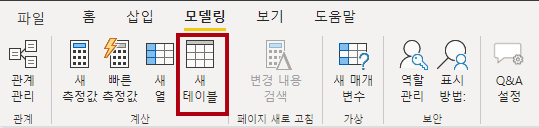

2. 계산을 만들거나 편집할 때 리본 바로 아래에 표시되는 수식 입력줄에서 **Salesperson =** 를 입력하고 **Shift + Enter** 키를 누르고, **'Salesperson (Performance)'** 를 입력한 다음 **Enter** 키를 누릅니다.

    > **참고**: *사용자의 편의를 위해 이 랩의 모든 DAX 정의는 **04-intro-dax\Snippets.txt**에 있는 조각 파일에서 복사할 수 있습니다.*

     

    > *이 테이블 정의는 **영업 직원(성과)** 테이블의 복사본을 만듭니다. 데이터는 복사할 수 있지만 표시 유형, 서식 지정 등과 같은 모델 속성은 복사할 수 없습니다.*

1. **데이터** 창에는 테이블 아이콘에 계산 아이콘도 있습니다(계산 테이블을 나타냄).

    

    > ***참고**: 계산된 테이블은 테이블을 반환하는 DAX 수식을 사용하여 정의됩니다. 계산된 테이블은 값을 구체화하고 저장하기 때문에 데이터 모델의 크기를 늘린다는 것을 이해해야 합니다. 이들 테이블은 수식 종속성을 새로 고칠 때마다 다시 계산됩니다. 이 데이터 모델에서는 새(미래) 날짜 값이 테이블에 로드되는 경우입니다.*
    >
    > Power Query 원본 테이블과는 달리, 계산된 테이블을 사용하여 외부 데이터 원본의 데이터를 로드할 수 없습니다. 데이터 모델에 이미 로드된 항목에 따라 데이터만 변환할 수 있습니다.

1. 모델 뷰로 전환하고 **Salesperson** 테이블을 사용할 수 있는지 확인합니다(테이블을 찾으려면 보기를 다시 설정해야 할 수도 있음).

1. **Salesperson \| EmployeeKey** 열에서 **Sales \| EmployeeKey** 열로 관계를 만듭니다.

1. **Salesperson (Performance)** 테이블과 **Sales** 테이블 간의 비활성 관계를 마우스 오른쪽 단추로 클릭한 다음 **삭제**를 선택합니다. 삭제를 확인할지 묻는 메시지가 표시되면 **예**를 선택합니다.

1. **Salesperson ** 테이블에서 다음 열을 한꺼번에 선택하여 숨깁니다(**숨김** 속성을 **예**로 설정).

    - EmployeeID
    - EmployeeKey
    - UPN

1. 모델 다이어그램에서 **Salesperson** 테이블을 선택합니다.

1. **속성** 창의 **설명** 상자에 **판매와 관련된 영업 직원**
    
    > *사용자가 테이블이나 필드에 커서를 가져가면 해당 설명이 **데이터** 창에 도구 설명으로 나타납니다.*

1. **Salesperson (Performance)** 테이블에 대한 설명을 다음과 같이 설정합니다. **지역과 관련된 영업 직원**

이제 데이터 모델이 영업 직원을 분석할 때 두 가지 대안을 제공합니다. **영업 직원** 테이블에서는 영업 직원의 판매를 분석할 수 있으며, **영업 직원(성과)** 테이블에서는 영업 직원에게 할당된 판매 지역의 매출을 분석할 수 있습니다.

## 날짜 테이블 만들기

이 작업에서는 **Date** 테이블을 만듭니다.

1. 테이블 보기로 다시 전환합니다. **홈** 리본 탭의 **계산** 그룹 내에서 **새 테이블**을 선택합니다.

    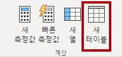

1. 수식 표시줄에서 다음 DAX를 입력합니다.

    ```DAX
    Date =  
    CALENDARAUTO(6)
    ```

    

    > CALENDARAUTO() 함수는 날짜 값으로 구성된 단일 열 테이블을 반환합니다. "Auto" 동작은 모든 데이터 모델 날짜 열을 검색하여 데이터 모델에 저장된 가장 빠른 날짜 값과 가장 늦은 날짜 값을 결정합니다. 그런 다음, 이 범위의 각 날짜에 대해 한 개의 행을 만들어 전체 연도의 데이터가 저장되도록 이 범위를 어느 방향으로든 확장합니다.
    >
    > 이 함수에는 1년의 마지막 달 번호를 단일 선택적 인수로 사용할 수 있습니다. 생략할 경우 값은 12입니다. 즉, 12월이 연도의 마지막 달입니다. 이 경우 6을 입력합니다. 즉, 6월이 연도의 마지막 달입니다.

1. 날짜 값 열이 미국 지역 설정(즉, mm/dd/yyyy)을 사용하여 형식이 지정된 것을 확인할 수 있습니다.

    

1. 상태 표시줄의 왼쪽 아래 모서리에 있는 테이블 통계에서 5개 전체 연도의 데이터를 나타내는 1,826개 행의 데이터가 생성되었는지 확인합니다.

    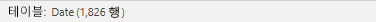

## 계산 열 만들기

이 작업에서는 다양한 기간별로 필터링하고 그룹화할 수 있도록 더 많은 열을 추가합니다. 또한 다른 열의 정렬 순서를 제어하는 계산 열을 만듭니다.

> **참고**: *사용자의 편의를 위해 이 랩의 모든 DAX 정의는 **Snippets.txt** 파일에서 복사할 수 있습니다.*

1. **테이블 도구** 상황별 리본에서 **계산** 그룹 내에 있는 **새 열**을 선택합니다.

    > *먼저 열 이름을 입력하고, 그 뒤에 등호 기호(=)를 입력한 다음, 단일 값 결과를 반환하는 DAX 수식을 입력하여 계산 열을 만듭니다. 열 이름은 테이블에 이미 존재하면 안 됩니다.*

    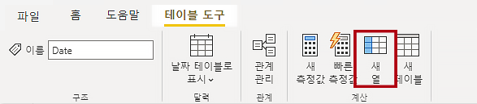

1. 수식 표시줄에서 다음을 입력(하거나 코드 조각 파일에서 복사)한 후 **Enter** 키를 누릅니다.
    > 이 수식에서는 날짜의 연도 값을 사용하지만 7월부터는 연도 값에 1을 더합니다. 이것은 Adventure Works의 회계 연도를 계산하는 방법입니다.

   ```DAX
   Year =
   "FY" & YEAR('Date'[Date]) + IF(MONTH('Date'[Date]) > 6, 1)
   ```


1. 코드 조각 파일 정의를 사용하여 **Date** 테이블에 대해 다음 두 개의 계산 열을 만들 수 있습니다.

    - Quarter
    - Month

1. 새 열이 추가되었는지 확인합니다.

    

1. 계산의 유효성을 검사하려면 보고서 뷰로 전환합니다.

1. 새 보고서 페이지를 만들려면 페이지 1 옆에 있는 더하기 아이콘을 선택합니다.

    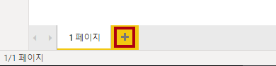

1. 새 보고서 페이지에 행렬 시각적 개체를 추가하려면 **시각화** 창에서 행렬 시각적 개체 유형을 선택합니다.

    > *팁: 각 아이콘 위에 커서를 올려 놓으면 시각적 개체 유형을 설명하는 도구 설명을 표시할 수 있습니다.*

    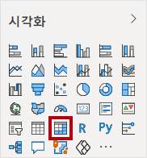

1. **데이터 ** 창의 **Date** 테이블 내부에서 **Year** 필드를 **행** 웰/영역으로 끌어옵니다.

    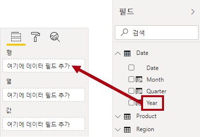

1. **Month** 필드를 **Year** 필드 바로 아래 **행** 웰/영역으로 끌어갑니다.

1. 행렬 시각적 개체의 오른쪽 위(또는 시각적 개체 위치에 따라 맨 아래)에서 이중으로 갈라진 화살표 아이콘(모든 연도를 한 수준 아래로 확장)을 선택합니다.

    

1. 연도가 월로 확장되고 월은 시간순이 아닌 알파벳 순으로 정렬됩니다.

    

    > *기본적으로 텍스트 값은 알파벳 순으로 정렬되고 숫자는 가장 작은 값에서 가장 큰 값으로 정렬되며 날짜는 가장 빠른 날짜에서 가장 늦은 날짜로 정렬됩니다.*

1. **Month** 필드 정렬 순서를 사용자 지정하려면 테이블 뷰로 전환합니다.

1. **Date** 테이블에 **MonthKey** 열을 추가합니다.

    ```DAX
    MonthKey =
    (YEAR('Date'[Date]) * 100) + MONTH('Date'[Date])
    ```

    > *이 수식은 각 연도/월 조합에 대해 숫자 값을 계산합니다.*

1. 테이블 뷰에서 새 열에 숫자 값이 포함되어 있는지 확인합니다(예: 2017년 7월의 경우 201707 등).

    

1. 보고서 뷰로 다시 전환합니다. **데이터** 창에서 **월**을 선택합니다.

1. **열 도구** 상황별 리본의 **정렬** 그룹에서 **열 기준 정렬**을 선택한 다음, **MonthKey**를 선택합니다.

    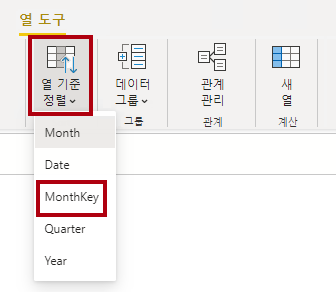

1. 행렬 시각적 개체에서 월이 시간순으로 정렬되어 있습니다.

    

## 날짜 테이블 완료

이 작업에서는 열을 숨기고 계층 구조를 만들어 **Date** 테이블의 디자인을 완료합니다. 그런 다음, **Sales** 열과 **Targets** 테이블 간의 관계를 만듭니다.

1. 모델 뷰로 전환합니다. **Date** 테이블에서 **MonthKey** 열을 숨깁니다(**숨김**을 **예**로 설정).

1. **데이터** 오른쪽 창에서 **Date** 테이블을 선택하고 **Year** 열을 마우스 오른쪽 단추로 선택한 다음 **계층 만들기**을 선택합니다.

1. 오른쪽 선택 및 **이름 바꾸기**를 통해 새로 만들어진 계층 구조의 이름을 **회계**로 바꿉니다.

1. 다음 두 개의 나머지 필드를 **데이터** 창에서 선택하고 마우스 오른쪽 단추를 클릭한 후 **계층 구조에 추가** -> **회계**를 선택하여 회계 계층 구조에 추가합니다.

    - Quarter
    - Month

    

1. 다음 두 가지 모델 관계를 만듭니다.

    - **Date \| Date**에서 **Sales \| OrderDate**로
    - **Date \| Date**에서 **Targets \| TargetMonth**로


    > 랩에서는 약식 표기법을 사용하여 필드를 참조합니다. 다음과 같이 표시됩니다. **Sales \| Unit Price**. 이 예에서 **Sales**는 테이블 이름이고 **Unit Price**는 필드 이름입니다.

1. 다음 두 열을 숨깁니다.

    - 판매 \| OrderDate
    - 목표 \| TargetMonth

## Date 테이블에 표시를 합니다.

이 작업에서는 **Date** 테이블을 날짜 테이블로 표시합니다.

1. 보고서 뷰로 전환합니다. **데이터** 창에서 **Date** 테이블(**Date** 필드 아님)을 선택합니다.

1. **테이블 도구** 상황별 리본의 **달력** 그룹에서 **날짜 테이블로 표시**를 선택합니다.

1. **날짜 테이블로 표시** 창에서 **날짜 테이블로 표시** 속성을 **예**로 밀고 **날짜 열 선택** 드롭다운 목록에서 **날짜**를 선택합니다. **저장**을 선택합니다.

    

1. Power BI Desktop 파일을 저장합니다.

> *이 테이블이 날짜(시간)를 정의한다는 것을 이제 Power BI Desktop이 이해합니다. 날짜 테이블에 대한 이 디자인 접근 방식은 데이터 원본에 날짜 테이블이 없는 경우에 적합합니다. 데이터 웨어하우스가 있는 경우 데이터 모델에서 날짜 논리를 "재정의"하는 대신 해당 날짜 차원 테이블에서 날짜 데이터를 로드하는 것이 적절합니다.*

## 단순 측정값 만들기

이 작업에서는 단순 측정값을 만듭니다. 간단한 측정값은 단일 열의 값을 집계하거나 테이블의 행 개수를 계산합니다.

1. 보고서 뷰의 **2 페이지**에 있는 **데이터** 창에서 **Sales \| Unit Price** 필드를 행렬 시각적 개체로 끌어옵니다.

    

1. 시각적 필드 창(**시각화** 창 아래에 위치)의 **값** 필드 웰/영역에서 **단가**가 **평균 단가**로 나열되어 있는 것을 확인할 수 있습니다. **Unit Price**의 아래쪽 화살표를 선택한 다음, 사용 가능한 메뉴 옵션을 확인합니다.

    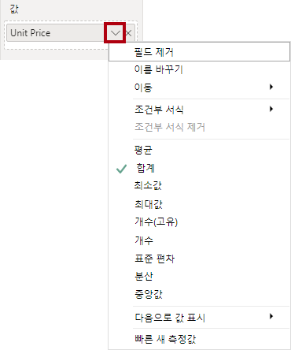

    > *시각적 숫자 열을 사용하면 보고서 작성자가 보고서 디자인 시 열 값이 요약되는(또는 요약되지 않는) 방식을 결정할 수 있습니다. 그러면 부적절한 보고가 발생할 수 있습니다. 그러나 일부 데이터 모델러는 운에 맡기는 것을 좋아하지 않아 이러한 열을 숨기고 대신 측정값에 의해 정의된 집계 논리를 노출하도록 선택합니다. 이것이 바로 이 랩에서는 이 방법을 사용합니다.*

1. 측정값을 만들려면 **데이터** 창에서 **Sales** 테이블을 마우스 오른쪽 단추로 클릭한 다음 **새 측정값**을 선택합니다.

1. 수식 입력줄에 다음 측정값 정의를 추가합니다.

    ```DAX
    Avg Price =  
    AVERAGE(Sales[Unit Price])
    ```

1. 행렬 시각적 개체에 **평균 가격** 측정값을 추가하면 **단가** 열과 동일한 결과가 나오는 것을 알 수 있습니다(단, 서식 지정은 다름).

1. **값** 웰에서 **Avg Price** 필드의 상황에 맞는 메뉴를 열면 집계 기술을 변경할 수 없다는 것을 알 수 있습니다.

    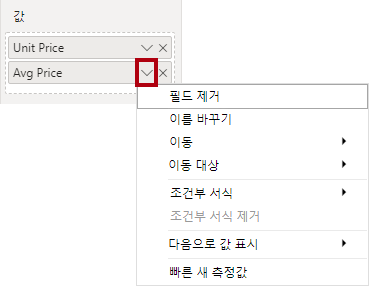

    > 측정값의 집계 동작을 수정할 수는 없습니다.

1. 조각 파일 정의를 사용하여 **Sales** 테이블에 대해 다음 5개의 측정값을 만듭니다.

    - Median Price
    - Min Price
    - Max Price
    - Orders
    - Order Lines

    > **Orders** 측정값에 사용되는 DISTINCTCOUNT() 함수는 주문을 한 번만 계수합니다(중복 항목은 무시함). **Order Lines** 측정값에 사용되는 COUNTROWS() 함수는 테이블만 계산합니다.
    >
    > 이 경우 주문 수는 별개의 **SalesOrderNumber** 열 값을 계수하여 계산되고, 주문 줄 수는 단순히 테이블 행의 수입니다(각 행이 주문 한 줄임).

1. 모델 뷰로 전환한 다음 4개의 가격 측정값을 다중 선택합니다. **Avg Price**, **Max Price**, **Median Price**, **Min Price**.

11. 측정값을 다중 선택하는 경우 다음 요구 사항을 구성합니다.

    - 소수점 이하 두 자리로 서식 지정

    - **Pricing**이라는 표시 폴더에 할당

    

12. **Unit Price** 열을 숨깁니다.

    > 이제 보고서 작성자가 **단가** 열을 사용할 수 없습니다. 보고서 작성자는 모델에 추가된 가격 측정값을 사용해야 합니다. 이 디자인 방법을 사용하면 보고서 작성자가 예를 들어 합계를 계산하는 등 가격을 잘못 집계하는 것이 방지됩니다.

13. **Order Lines** 및 **Orders** 측정값을 다중 선택하고 다음 요구 사항을 구성합니다.

    - 천 단위 구분 기호를 사용하도록 서식 지정

    - **Counts**라는 표시 폴더에 할당

    

14. 보고서 뷰에서, 행렬 시각적 개체의 **값** 웰/영역에서 **Unit Price** 필드의 **X**를 선택하여 제거합니다.

15. 행렬 시각적 개체의 크기를 늘려 페이지 너비와 높이를 채웁니다.

16. 다음의 다섯 가지 측정값을 행렬 시각적 개체에 추가합니다.

    - Median Price
    - Min Price
    - Max Price
    - Orders
    - Order Lines

17. 결과가 적절하게 표시되고 서식이 올바르게 지정되었는지 확인합니다.

    

## 추가 측정값 만들기

이 작업에서는 더 복잡한 수식을 사용하는 더 많은 측정값을 만듭니다.

1. 보고서 뷰에서 **페이지 1**을 선택하고 표 시각적 개체를 검토하여 **대상** 열의 합계를 확인합니다.

    

1. 테이블 시각적 개체를 선택하고 **시각화** 창에서 **Target** 필드를 제거합니다.

1. **Targets \| Target** 열의 이름을 **Targets \| TargetAmount**로 바꿉니다.

    > *팁: 보고서 뷰에서 열의 이름을 바꾸는 방법은 여러 가지가 있습니다. **데이터** 창에서 열을 마우스 오른쪽 단추로 클릭한 다음 **이름 바꾸기**를 선택합니다. 또는 열을 두 번 클릭하거나 **F2** 키를 누릅니다.*

1. **Targets** 테이블에 다음 측정값을 만듭니다.

    ```DAX
    Target =
    IF(
    HASONEVALUE('Salesperson (Performance)'[Salesperson]),
    SUM(Targets[TargetAmount])
    )
    ```

    > HASONEVALUE() 함수는 **Salesperson** 열의 단일 값이 필터링되었는지 여부를 테스트합니다. True로 설정되면 식이 해당 판매 직원에 대해 목표 금액 합계를 반환합니다. False로 설정되면 빈 값이 반환됩니다.

1. **Target** 측정값의 서식을 소수점 이하 0자리로 지정합니다.

    > *팁: **측정값 도구** 상황별 리본을 사용할 수 있습니다.*

1. **TargetAmount** 열을 숨깁니다.

    > *팁: **데이터** 창에서 열을 마우스 오른쪽 단추로 클릭한 다음 **숨기기**를 선택할 수 있습니다.*

1. 테이블 시각적 개체에 **Target** 측정값을 추가합니다.

1. **Target** 열 합계는 이제 비어 있습니다.

    

1. 조각 파일 정의를 사용하여 **Targets** 테이블에 대해 다음 2개의 측정값을 만듭니다.

    - Variance
    - Variance Margin

1. **Variance** 측정값의 서식을 소수점 이하 0자리로 지정합니다.

1. **Variance Margin** 측정값의 서식을 소수점 이하 두 자리 백분율로 지정합니다.

1. **Variance** 및 **Variance Margin** 측정값을 테이블 시각적 개체에 추가합니다.

1. 모든 열과 행을 확인할 수 있도록 테이블 시각적 개체의 크기를 조정합니다.

    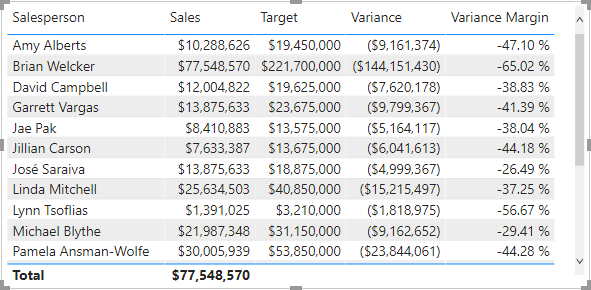

    > *모든 영업 직원이 목표를 충족하지 못하는 것처럼 보이지만, 테이블 시각적 개체는 아직 특정 기간별로 필터링되지 않았음을 기억하세요. **Power BI Desktop에서 보고서 디자인** 랩에서 사용자가 선택한 기간을 기준으로 필터링하는 판매 성과 보고서를 생성합니다.*

1. **데이터** 창의 오른쪽 상단에서 창을 접었다가 펼쳐 엽니다.

    > *창을 축소했다가 다시 열면 내용이 다시 설정됩니다.*

1. 이제 **Targets** 테이블이 목록의 맨 위에 나타납니다.

    

    *표시되는 측정값으로만 구성된 테이블은 자동으로 목록의 맨 위에 나열됩니다.*

## 랩 완료
