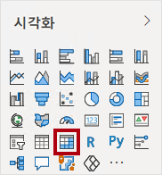
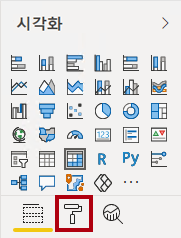
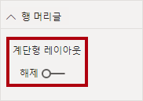

---
lab:
  course: PL-300
  title: Power BI Desktop에서 고급 DAX 계산 만들기
  module: Create Model Calculations using DAX in Power BI
---


# Power BI Desktop에서 고급 DAX 계산 만들기

## **랩 사례**

이 랩에서는 필터 컨텍스트 조작과 관련된 DAX 식을 사용하여 측정값을 만듭니다.

이 랩에서는 다음 작업을 수행하는 방법을 알아봅니다.

- CALCULATE() 함수를 사용하여 필터 컨텍스트를 조작
- 시간 인텔리전스 함수를 사용

**이 랩에는 약 45분이 소요됩니다.**

## **필터 컨텍스트 작업**

*중요: 이전 랩에서 계속 진행하는 경우(해당 랩을 성공적으로 완료한 경우) 이 작업을 완료하지 마세요. 대신 다음 작업에서 계속합니다.*

1. Power BI Desktop을 실행합니다.

    

    *팁: 기본적으로 Power BI Desktop 앞에 시작 대화 상자가 열립니다. 로그인하도록 선택한 다음 팝업을 닫을 수 있습니다.*

1. 시작 Power BI Desktop 파일을 열려면 파일 > 보고서 열기 > 보고서** 찾아보기를 선택합니다**.

1. **열기** 창에서 D:\Allfiles\Labs\05-create-dax-calculations-in-power-bi-desktop-advanced\Starter** 폴더로 이동하고 **Sales Analysis** 파일을 엽니다**.

1. 열려 있는 정보 창을 모두 닫습니다.

1. 리본 아래에 경고 메시지가 표시됩니다. 

    *이 메시지는 쿼리가 모델 테이블로 로드에 적용되지 않았다는 사실을 경고합니다. 이 랩의 뒷부분에서 쿼리를 적용합니다.*
    
    *경고 메시지를 해제하려면 경고 메시지 오른쪽에서 X**를 선택합니다**.*

1. 파일의 복사본을 만들려면 파일 > 다른 이름으로 저장으로** 이동하여 **D:\Allfiles\MySolution** 폴더에 저장**합니다.

## **행렬 시각적 개체 만들기**

이 작업에서는 새 측정값 테스트를 지원하는 행렬 시각적 개체를 만듭니다.

1. Power BI Desktop의 보고서 뷰에서 새 보고서 페이지를 만듭니다.

1. **3페이지**에서 행렬 시각적 개체를 추가합니다.

    

1. 전체 페이지를 채우도록 행렬 시각적 개체의 크기를 조정합니다.

1. 행렬 시각적 개체 필드를 구성하려면 데이터** 창에서 **지역 \| 영역** 계층 구조를 끌어**서 시각적 개체 내부에 놓습니다.
    
    랩에서는 약식 표기법을 사용하여 필드나 계층 구조를 참조합니다. **Region \| Regions과 같이 표시됩니다**.이 예에서 **Region**은 테이블 이름이고 **Regions**은 계층 구조 이름입니다.

1. **판매 \| 판매** 필드도 추가합니다.

1. 전체 계층을 확장하려면 행렬 시각적 개체의 오른쪽 위에 있는 포크 모양 이중 화살표 아이콘을 두 번 선택합니다.
    
    **Regions** 계층 구조에 **Group**, **Country**, **Region** 수준이 있습니다.

    

1. 시각적 개체의 서식을 지정하려면 **시각화** 창에서 **서식** 창을 선택합니다.

    

1. **검색** 상자에 **계단형**을 입력합니다.

1. **계단형 레이아웃** 속성을 **끄기**로 설정합니다.

    

1. 행렬 시각적 개체에 이제 열 머리글 네 개가 있는지 확인합니다.

    

    Adventure Works에서 판매 지역은 그룹, 국가, 지역으로 구성됩니다. 미국을 제외한 모든 국가에는 국가 이름을 따라 명명된 하나의 지역만 있습니다. 미국은 대규모 판매 지역이므로 다섯 개 판매 지역으로 나눠집니다.

    *이 연습에서는 여러 측정값을 만든 다음 행렬 시각적 개체에 추가하여 테스트합니다.*

## **필터 컨텍스트 조작**

이 작업에서는 CALCULATE() 함수를 사용하여 필터 컨텍스트를 조작하는 DAX 식을 사용하여 여러 측정값을 만듭니다.

1. 다음 식에 따라 **판매** 테이블에 측정값을 추가합니다.
    
     *편의상 이 랩의 모든 DAX 정의는 D:\Allfiles\Labs\05-create-dax-calculations-in-power-bi-desktop-advanced\Assets\Snippets.txt** 파일에서 **복사할 수 있습니다.*


    **DAX**


    ```
    Sales All Region =

    CALCULATE(SUM(Sales[Sales]), REMOVEFILTERS(Region))
    ```


    CALCULATE() 함수는 필터 컨텍스트를 조작하는 데 사용되는 강력한 함수입니다. 첫 번째 인수는 식 또는 측정값을 사용합니다(측정값은 단지 명명된 식입니다). 후속 인수를 사용하여 필터 컨텍스트를 수정할 수 있습니다.

    REMOVEFILTERS() 함수는 활성 필터를 제거합니다. 아무 인수도 사용하지 않거나 테이블, 열 또는 여러 열을 인수로 사용할 수 있습니다.

    이 수식에서 측정값은 수정된 필터 컨텍스트에서 **Sales** 열의 합계를 평가하여 **Region** 테이블의 열에 적용된 필터를 모두 제거합니다.

1. **Sales All Region** 측정값을 행렬 시각적 개체에 추가합니다.

    

1. **Sales All Region** 측정값은 각 지역, 국가(소계) 및 그룹(소계)의 모든 지역 매출에 대한 합계를 계산합니다.

    새 측정은 아직 유용한 결과를 제공하지 않습니다. 그룹, 국가 또는 지역의 매출이 이 값으로 나눠지면 “총계의 백분율”이라고 하는 유용한 비율이 생성됩니다.

1. **데이터** 창에서 Sales All Region** 측정값이 선택되어 있는지 확인하고**(선택하면 진한 회색 배경이 있음) 수식 입력줄에서 측정값 이름과 수식을 다음 수식으로 바꿉다.

    *팁: 기존 수식을 바꾸려면 먼저 코드 조각을 복사합니다. 그런 다음 수식 입력줄 내부를 선택하고 Ctrl+A**를 눌러 **모든 텍스트를 선택합니다. 그런 다음 Ctrl+V**를 눌러 **선택한 텍스트를 덮어쓰려면 코드 조각을 붙여넣습니다. 그런 다음 Enter 키를 누릅니**다**.*


    **DAX**


    ```
    Sales % All Region =  
    DIVIDE(  
     SUM(Sales[Sales]),  
     CALCULATE(  
     SUM(Sales[Sales]),  
     REMOVEFILTERS(Region)  
     )  
    )
    ```

    측정값의 이름이 변경되어 업데이트된 수식을 정확하게 반영합니다. DIVIDE() 함수는 **Region** 테이블에 적용된 모든 필터를 제거하는 수정된 컨텍스트의 **Sales** 측정값으로 필터 컨텍스트에 의해 수정되지 않은 **Sales** 측정값을 나눕니다.

1. 행렬 시각적 개체에서 측정값의 이름이 바뀌었으며 이제 각 그룹, 국가 및 지역에 대해 다른 값이 나타납니다.

1. **Sales % All Region** 측정값을 소수점 이하 두 자리 백분율로 지정합니다.

1. 행렬 시각적 개체에서 **Sales % All Region** 측정값의 값을 검토합니다.

    

1. 다음 식을 기반으로 **Sales** 테이블에 다른 측정값을 추가하고 백분율로 서식을 지정합니다.


    **DAX**

    ```
    Sales % Country =  
    DIVIDE(  
     SUM(Sales[Sales]),  
     CALCULATE(  
     SUM(Sales[Sales]),  
     REMOVEFILTERS(Region[Region])  
     )  
    )
    ```

1. **Sales % Country** 측정값 수식은 **Sales % All Region** 측정값 수식과 약간 다릅니다.

    *차이점은 분모가 Region** 테이블의 모든 열이 아니라 Region** 테이블의 **지역** 열에서 **필터를 제거하여 필터 컨텍스트를 수정한다는 **것입니다. 즉, 그룹 또는 국가 열에 적용된 모든 필터가 유지됩니다. 그것은 국가의 비율로 판매를 나타내는 결과를 달성한다.*

1. 행렬 시각적 개체에 **Sales % Country** 측정값을 추가합니다.

1. 미국 지역만 100%가 아닌 값을 생성합니다.
    
    *미국 여러 지역이 있다는 것을 기억할 수 있습니다. 다른 모든 국가는 단일 지역으로 구성되며, 이 지역은 모두 100%인 이유를 설명합니다.*

    

    

1. 시각적 개체에서 이 측정값의 가독성을 향상시키기 위해 **Sales % Country** 측정값을 개선된 다음 수식으로 덮어씁니다.


    **DAX**


    ```
    Sales % Country =  
    IF(  
     ISINSCOPE(Region[Region]),  
     DIVIDE(  
     SUM(Sales[Sales]),  
     CALCULATE(  
     SUM(Sales[Sales]),  
     REMOVEFILTERS(Region[Region])  
     )  
     )  
    )
    ```


    *IF() 함수는 ISINSCOPE() 함수를 사용하여 지역 열이 수준 계층 구조의 수준인지 여부를 테스트합니다. true이면 DIVIDE() 함수가 평가됩니다. false이면 영역 열이 범위에 없기 때문에 빈 값이 반환됩니다.*

1. 이제 지역이 범위 내에 있는 경우에만 **Sales % Country** 측정값이 값을 반환합니다.

    

1. 다음 식을 기반으로 **Sales** 테이블에 다른 측정값을 추가하고 백분율로 서식을 지정합니다.


    **DAX**


    ```
    Sales % Group =  
    DIVIDE(  
     SUM(Sales[Sales]),  
     CALCULATE(  
     SUM(Sales[Sales]),  
     REMOVEFILTERS(  
     Region[Region],  
     Region[Country]  
     )  
     )  
    )
    ```


    *매출을 그룹의 백분율로 구할 수 있도록 두 개의 열에서 필터를 효과적으로 제거하기 위해 두 개의 필터를 적용할 수 있습니다.*

1. 행렬 시각적 개체에 **Sales % Group** 측정값을 추가합니다.

1. 시각적 개체에서 이 측정값의 가독성을 향상시키기 위해 **Sales % Group** 측정값을 개선된 다음 수식으로 덮어씁니다.


    **DAX**


    ```
    Sales % Group =  
    IF(  
     ISINSCOPE(Region[Region])  
     || ISINSCOPE(Region[Country]),  
     DIVIDE(  
     SUM(Sales[Sales]),  
     CALCULATE(  
     SUM(Sales[Sales]),  
     REMOVEFILTERS(  
     Region[Region],  
     Region[Country]  
     )  
     )  
     )  
    )
    ```


1. 이제 지역 또는 국가가 범위 내에 있는 경우에만 **Sales % Group** 측정값이 값을 반환합니다.

1. 모델 뷰에서 3개의 새 측정값을 **Ratios**라는 표시 폴더에 추가합니다.

    

1. Power BI Desktop 파일을 저장합니다.

**판매** 테이블에 추가된 측정값은 계층적 탐색을 수행하기 위해 수정된 필터 컨텍스트를 갖습니다. 소계 계산을 수행하는 패턴은 필터 컨텍스트에서 일부 열을 제거해야 하고, 총계를 계산하려면 모든 열을 제거해야 합니다.

## **시간 인텔리전스 작업**

이 연습에서는 YTD(연간 판매액) 측정값과 전년 대비 매출(YoY) 증가 측정값을 만듭니다.

## **YTD 측정값 만들기**

이 작업에서는 판매 YTD 측정값을 만듭니다.

1. 보고서 뷰의 **2페이지**에서 행렬 시각적 개체에는 행에 연수와 개월이 그룹화된 다양한 측정값이 표시됩니다.

2. 다음 식을 기반으로 하는 **Sales** 테이블에 측정값을 추가하고 소수점 이하 0자리로 지정합니다.


    **DAX**


    ```
    Sales YTD =  
    TOTALYTD(SUM(Sales[Sales]), 'Date'[Date], "6-30")
    ```


    *TOTALYTD() 함수는 지정된 날짜 열에 대한 식(이 경우 Sales** 열의 **합계)을 평가합니다. 날짜 열은 Power BI Desktop** 랩에서 DAX 계산 만들기에서 **수행한 것처럼 날짜 테이블로 표시된 날짜 테이블에 속해야 합니다.*

    또한 함수는 연도의 마지막 날짜를 나타내는 세 번째 선택적 인수를 사용할 수 있습니다. 이 날짜가 없으면 12월 31일이 연도의 마지막 날짜입니다. Adventure Works의 경우 연도의 마지막 달이 6월이므로 “6-30”이 사용됩니다.

3. 행렬 시각적 개체에 **Sales** 필드와 **Sales YTD** 측정값을 추가합니다.

4. 그러면 해당 연도의 매출이 누적됩니다.

    

    TOTALYTD() 함수는 필터 조작, 특히 시간 필터 조작을 수행합니다. 예를 들어 2017년 9월(회계연도의 세 번째 월)의 YTD 매출을 계산하기 위해 **날짜** 테이블의 모든 필터가 제거되고 연도가 시작하는 날짜 2017년 7월 1일부터 컨텍스트 내 마지막 날짜 2017년 9월 30일까지의 새 필터로 대체됩니다.

    *DAX에서는 공용 시간 필터 조작을 지원하기 위해 많은 시간 인텔리전스 함수를 사용할 수 있습니다.*

## **YoY 증가 측정값 만들기**

이 작업에서는 매출 YoY 증가 측정값을 만듭니다.

1. 다음 식에 **따라 Sales** 테이블에 다른 측정값을 추가합니다.


    **DAX**


    ```
    Sales YoY Growth =  
    VAR SalesPriorYear =  
     CALCULATE(  
     SUM(Sales[Sales]),  
     PARALLELPERIOD(  
     'Date'[Date],  
     -12,  
     MONTH  
     )  
     )  
    RETURN  
     SalesPriorYear
    ```


    *Sales YoY Growth** 측정값은 **변수를 사용합니다. 변수는 수식을 단순화하는 데 도움이 되며 수식 내에서 논리를 여러 번 사용하는 경우 더 효율적입니다.*

    *변수는 고유한 이름으로 선언되고 측정값 식은 RETURN** 키워드(keyword) 후에 **출력되어야 합니다. 다른 코딩 언어 변수와 달리 DAX 변수는 단일 수식 내에서만 사용할 수 있습니다.*

    ***SalesPriorYear** 변수에는 PARALLELPERIOD() 함수를 사용하여 필터 컨텍스트의 각 날짜에서 12개월 뒤로 이동하는 수정된 컨텍스트에서 Sales** 열의 **합계를 계산하는 식이 할당됩니다.*

1. 행렬 시각적 개체에 **Sales YoY Growth** 측정값을 추가합니다.

1. 새 측정값은 처음 12개월 동안은 BLANK를 반환합니다(2017 회계연도 이전에 기록된 매출이 없기 때문입니다).

1. **2018년 7월**에 대한 **Sales YoY Growth** 측정값은 **2017년 7월**에 대한 **Sales** 값입니다.

    

    *이제 수식의 "어려운 부분"이 테스트되었으므로 증가 결과를 계산하는 최종 수식으로 측정값을 덮어쓸 수 있습니다.*

1. 측정값을 완료하려면 이 수식을 사용하여 **Sales YoY Growth** 측정값을 덮어써 서식을 소수점 이하 두 자리 백분율로 지정합니다.


    **DAX**


    ```
    Sales YoY Growth =  
    VAR SalesPriorYear =  
     CALCULATE(  
     SUM(Sales[Sales]),  
     PARALLELPERIOD(  
     'Date'[Date],  
     -12,  
     MONTH  
     )  
     )  
    RETURN  
     DIVIDE(  
     (SUM(Sales[Sales]) - SalesPriorYear),  
     SalesPriorYear  
     )
    ```


1. 수식의 **RETURN** 절에서 변수가 두 번 참조됩니다.

1. **2018 Jul**의 YoY 증가율이 **392.83%** 인지 확인합니다.

    

    *YoY 증가 측정값은 전년 같은 기간 동안 거의 400%(또는 4배) 증가한 것으로 확인됩니다.*

1. 모델 뷰에서 두 개의 새 측정값을 **Time Intelligence**라는 표시 폴더에 넣습니다.

    

### **마침(Finish up)**

이번 작업에서는 랩을 마무리합니다.

1. 보고서 개발용으로 준비한 솔루션을 정리하려면 왼쪽 하단에서 **2페이지** 탭을 마우스 오른쪽 단추로 클릭한 다음 **페이지 삭제**를 선택합니다. 페이지를 삭제하라는 메시지가 표시되면 삭제**를 선택합니다**.

1. **3페이지**도 삭제합니다.

1. 나머지 페이지에서 페이지를 지우려면 테이블 시각적 개체를 선택하고 **Delete** 키를 누릅니다.

1. Power BI Desktop 파일을 저장합니다.

1. 다음 랩을 시작하려는 경우 Power BI Desktop을 열어 둡니다.

*Power BI Desktop 랩에서 보고서 디자인의 **데이터 모델을 기반으로 보고서를 만듭니다** .*
