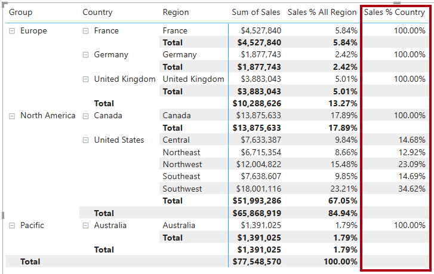

---
lab:
  title: Power BI에서 DAX 필터 컨텍스트 수정
  module: Modify DAX filter context in Power BI
---

# Power BI에서 DAX 필터 컨텍스트 수정

## 랩 사례

이 랩에서는 필터 컨텍스트 조작을 포함하는 DAX 식을 사용하여 측정값을 만듭니다.

다음 방법에 대해 설명합니다.

 - `CALCULATE` 함수를 사용하여 필터 컨텍스트를 조작합니다.

**이 랩은 30분 정도 소요됩니다.**

## 시작하기

이 연습을 완료하려면 먼저 웹 브라우저를 열고 다음 URL을 입력하여 zip 파일을 다운로드합니다.

`https://github.com/MicrosoftLearning/PL-300-Microsoft-Power-BI-Data-Analyst/raw/Main/Allfiles/Labs/05-modify-dax-filter-context/05-modify-dax-filter-context.zip`

파일을**C:\Users\Student\Downloads\05-modify-dax-filter-context** 폴더에 추출합니다.

**05-스타터-영업 분석.pbix** 파일을 엽니다.

> _**참고**: 파일이 로드되면 로그인 대화 상자가 표시될 수 있습니다.**취소**를 선택하여 로그인 대화 상자를 닫습니다. 다른 정보 창을 모두 닫습니다. 변경 내용을 적용하라는 프롬프트가 표시되면**나중에 적용**을 선택하세요._

## 행렬 시각적 개체 만들기

이 작업에서는 새 측정값의 테스트를 지원하는 행렬 시각적 개체를 만듭니다.

1. Power BI Desktop에서 새 보고서 페이지를 만듭니다.

1. **3페이지**에서 행렬 시각적 개체를 추가합니다.

    

1. 전체 페이지를 채우도록 행렬 시각적 개체의 크기를 조정합니다.

1. 행렬 시각적 필드를 구성하려면**데이터** 창에서`Region | Regions` 계층 구조를 끌어 시각적 개체 안에 놓습니다.

    > 랩에서는 약식 표기법을 사용하여 필드나 계층 구조를 참조합니다. `Region | Regions`과 같이 표시됩니다. 이 예에서`Region`은 테이블 이름이고`Regions`는 계층 구조 이름입니다._

1. `Sales | Sales` 필드를**값** 웰에 추가합니다.

1. 전체 계층을 확장하려면 행렬 시각적 개체의 오른쪽 위에 있는 포크 모양 이중 화살표 아이콘을 두 번 선택합니다.

    

1. 시각적 개체의 서식을 지정하려면**시각화** 창에서**서식** 창을 선택합니다.

    

1. **검색** 상자에_레이아웃_을 입력합니다.

1. **레이아웃** 속성을_테이블 형식_으로 설정합니다.

    

1. 행렬 시각적 개체에 이제 4개의 열 머리글이 있는지 확인합니다.

    

    > _Adventure Works에서 판매 지역은 그룹, 국가, 지역으로 구성됩니다. 미국을 제외한 모든 국가에는 국가 이름을 따라 명명된 하나의 지역만 있습니다. 미국은 대규모 판매 지역이므로 다섯 개 판매 지역으로 나눠집니다._

이 연습에서는 여러 측정값을 만든 다음 행렬 시각적 개체에 추가하여 테스트합니다.

## 필터 컨텍스트 조작

이 작업에서는`CALCULATE` 함수를 사용하여 필터 컨텍스트를 조작하는 DAX 식으로 여러 측정값을 만듭니다.

> _`CALCULATE` 함수는 필터 컨텍스트를 조작하는 데 사용할 수 있는 강력한 함수입니다. 첫 번째 인수는 식 또는 측정값을 사용합니다(측정값은 단지 명명된 식입니다). 후속 인수를 사용하여 필터 컨텍스트를 수정할 수 있습니다._

1. 다음 식에 따라`Sales` 테이블에 측정값을 추가합니다.

    > _**참고**: 사용자의 편의를 위해 이 랩의 모든 DAX 정의는**C:\Users\Student\Downloads\05-modify-dax-filter-context\Snippets.txt** 파일에서 복사할 수 있습니다._

    ```dax
    Sales All Region =
    CALCULATE(
        SUM(Sales[Sales]),
        REMOVEFILTERS(Region)
    )
    ```

    > _`REMOVEFILTERS` 함수는 활성 필터를 제거합니다. 아무 인수도 사용하지 않거나 테이블, 열 또는 여러 열을 인수로 사용할 수 있습니다._
    >
    > _이 수식에서 측정값은 수정된 필터 컨텍스트에서`Sales` 열의 합계를 평가하여`Region` 테이블의 열에 적용된 필터를 모두 제거합니다._

1. `Sales All Region` 측정값을 행렬 시각적 개체에 추가합니다.

    

1. 이 측정값은 각 지역, 국가(소계), 그룹(소계)의 모든 지역 매출의 총액을 계산한다는 점에 유의하세요.

    > _새 측정은 아직 유용한 결과를 제공하지 않습니다. 그룹, 국가 또는 지역의 매출이 이 값으로 나눠지면 "총계의 백분율"이라고 하는 유용한 비율이 생성됩니다._

1. **데이터** 창에서`Sales All Region` 측정값이 선택되었는지 확인하고(이 측정을 선택하면 배경이 진한 회색으로 표시됨) 수식 입력줄에서 측정값 이름과 수식을 다음 수식으로 바꿉니다.

    > _팁: 기존 수식을 바꾸려면 먼저 코드 조각을 복사합니다. 그런 다음 수식 입력줄 내부를 선택하고**Ctrl+A**를 눌러 모든 텍스트를 선택합니다. 그런 다음**Ctrl + V**를 눌러 코드 조각을 붙여넣어 선택한 텍스트를 덮어씁니다. 그런 다음,**Enter** 키를 누릅니다._

    ```dax
    Sales % All Region =
    DIVIDE(
        SUM(Sales[Sales]),
        CALCULATE(
            SUM(Sales[Sales]),
            REMOVEFILTERS(Region)
        )
    )
    ```

    > _측정값의 이름이 변경되어 업데이트된 수식을 정확하게 반영합니다.`DIVIDE` 함수는 필터 컨텍스트에 의해 수정되지 않은`Sales` 열의 합계를 수정된 컨텍스트의`Sales` 열의 합계로 나눕니다. 이렇게 하면`Region` 테이블에 적용된 모든 필터가 제거됩니다._

1. 행렬 시각적 개체에서 측정값의 이름이 변경되고 각 그룹, 국가 및 지역에 대해 다른 값이 표시된 것을 볼 수 있습니다.

1. `Sales % All Region` 측정값의 서식을 소수점 이하 두 자리 백분율로 지정해야 합니다.

1. 행렬 시각적 개체에서`Sales % All Region` 측정값의 값을 검토합니다.

    

1. 다음 식을 기반으로`Sales` 테이블에 다른 측정값을 추가하고 백분율로 서식을 지정합니다.

    ```dax
    Sales % Country =
    DIVIDE(
        SUM(Sales[Sales]),
        CALCULATE(
            SUM(Sales[Sales]),
            REMOVEFILTERS(Region[Region])
        )
    )
    ```

1. `Sales % Country` 측정값 수식은`Sales % All Region` 측정값 수식과 약간 다릅니다.

    > _차이점은`Region` 테이블의 모든 열이 아니라`Region` 테이블의`Region` 열에서 필터를 제거하여 분모가 필터 컨텍스트를 수정한다는 것입니다. 즉, 그룹 또는 국가 열에 적용된 필터는 유지됩니다. 그러면 매출을 국가의 백분율로 나타내는 결과가 얻어집니다._

1. `Sales % Country` 측정값을 행렬 시각적 개체에 추가합니다.

1. 미국 지역에서만 100%가 아닌 값을 생성한다는 점에 유의하세요.

    

    > _미국에만 여러 지역이 있다는 점을 기억하세요. 다른 모든 국가가 100%인 이유는 모두 단일 지역으로 구성되어 있기 때문입니다._

1. 시각적 개체에서 이 측정값의 가독성을 향상시키기 위해`Sales % Country` 측정값을 개선된 다음 수식으로 덮어씁니다.

    ```dax
    Sales % Country =
    IF(
        ISINSCOPE(Region[Region]),
        DIVIDE(
            SUM(Sales[Sales]),
            CALCULATE(
                SUM(Sales[Sales]),
                REMOVEFILTERS(Region[Region])
            )
        )
    )
    ```

    > _`IF` 함수는`ISINSCOPE` 함수를 사용하여 지역 열이 수준 계층 구조의 수준인지 여부를 테스트합니다. True로 설정되면`DIVIDE` 함수를 계산합니다. false로 설정되면 지역 열이 범위 내에 있지 않기 때문에`BLANK`가 반환됩니다._

1. 이제 지역이 범위 내에 있는 경우에만`Sales % Country` 측정값이 값을 반환합니다.

    

1. 다음 식을 기반으로`Sales` 테이블에 다른 측정값을 추가하고 백분율로 서식을 지정합니다.

    ```dax
    Sales % Group =
    DIVIDE(
        SUM(Sales[Sales]),
        CALCULATE(
            SUM(Sales[Sales]),
            REMOVEFILTERS(
                Region[Region],
                Region[Country]
            )
        )
    )
    ```

    > _매출을 그룹의 백분율로 구할 수 있도록 두 개의 열에서 필터를 효과적으로 제거하기 위해 두 개의 필터를 적용할 수 있습니다._

1. `Sales % Group` 측정값을 행렬 시각적 개체에 추가합니다.

1. 시각적 개체에서 이 측정값의 가독성을 향상시키기 위해`Sales % Group` 측정값을 다음 수식으로 덮어씁니다.

    ```dax
    Sales % Group =
    IF(
        ISINSCOPE(Region[Region])
            || ISINSCOPE(Region[Country]),
        DIVIDE(
            SUM(Sales[Sales]),
            CALCULATE(
                SUM(Sales[Sales]),
                REMOVEFILTERS(
                    Region[Region],
                    Region[Country]
                )
            )
        )
    )
    ```

1. 이제 지역 또는 국가가 범위 내에 있는 경우에만`Sales % Group` 측정값이 값을 반환합니다.

1. **모델 뷰**에서 3개의 새 측정값을_Ratios_라는 표시 폴더에 추가합니다.

    

1. Power BI Desktop 파일을 저장합니다.

> _`Sales` 테이블에 추가된 측정값은 계층적 탐색을 수행하기 위해 수정된 필터 컨텍스트를 갖습니다. 소계 계산을 수행하는 패턴은 필터 컨텍스트에서 일부 열을 제거해야 하고, 총계를 계산하려면 모든 열을 제거해야 합니다._

## 랩 완료

이 랩에서는 필요하지 않지만, Power BI 보고서를 저장하도록 선택할 수 있습니다. 다음 연습에서는 미리 만들어진 시작 파일을 사용합니다.

1. 왼쪽 위 모서리에 있는 **"파일"** 메뉴로 이동하여 **"다른 이름으로 저장"** 을 선택합니다. 
1. **이 디바이스 찾아보기**를 선택합니다.
1. 파일을 저장할 폴더를 선택하고 설명이 포함된 이름을 지정합니다. 
1. **저장** 버튼을 선택하여 보고서를 .pbix 파일로 저장합니다. 
1. 보류 중인 쿼리 변경 내용을 적용하라는 대화 상자가 나타나면**적용**을 선택합니다.
1. Power BI Desktop을 닫습니다.