---
lab:
  title: Power BI Desktop 보고서 디자인
  module: Create Reports in Power BI Desktop
---

# Power BI Desktop 보고서 디자인

## **랩 사례**

이 랩에서는 세 페이지로 구성된 보고서를 만듭니다. 그런 다음 보고서를 열고 상호 작용하는 Power BI에 게시합니다.

이 랩에서는 다음 작업을 수행하는 방법을 알아봅니다.

- 보고서 디자인
- 시각적 개체 필드 및 서식 속성 구성

**이 랩에는 약 45분이 소요됩니다.**

## **보고서 만들기**

이 작업에서는 시작 보고서를 열어 랩에 대한 환경을 설정합니다.

1. Power BI Desktop **파일** > **열기 보고서** > **보고서 찾아보기로 이동합니다**.

1. **D:\PL300\Labs\06-design-report-in-power-bi-desktop\Starter 폴더에서** **판매 분석** 파일을 엽니다.

1. 파일**다른 이름으로 저장****으로 이동하여**파일의 복사본을  >  만들고 **D:\PL300\MySolution** 폴더에 복사본을 저장합니다.

## **페이지 디자인 1**

이 작업에서는 첫 번째 보고서 페이지를 디자인합니다. 디자인을 완료하면 페이지는 다음과 같은 모습이 됩니다.

1. Power BI Desktop 페이지의 이름을 바꾸려면 왼쪽 아래에서 **페이지 1**을 마우스 오른쪽 단추로 클릭한 다음 페이지 이름을 **개요**로 **바꿉니다**.

    *팁: 페이지 이름을 두 번 클릭하여 이름을 바꿀 수도 있습니다.*

1. 이미지를 추가하려면 **삽입** 리본 탭의 **요소** 그룹 안에서 **이미지**를 선택합니다.

    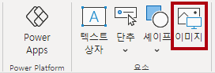

1. **열기** 창에서 **D:\PL300\Resources** 폴더로 이동합니다.

1. **AdventureWorksLogo.jpg** 파일을 선택한 다음, **열기**를 선택합니다.

1. 이미지를 끌어 왼쪽 위에 놓고 안내선 표식도 끌어 크기를 조정합니다.

     

1. 슬라이서를 추가하려면 먼저 보고서 페이지의 빈 영역을 클릭하여 이미지를 선택 해제한 다음 **시각화** 창에서 **슬라이서** 를 선택합니다.

     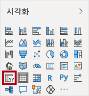

1. **데이터** 창에서 날짜 연도 필드(계층 구조의 **연도** 수준이 아님)를 시각화 창의 슬라이서 **필드**로 끕 **\|** 니다.
    
    랩에서는 약식 표기법을 사용하여 필드를 참조합니다. 다음과 같이 표시됩니다. **Date \| Year**. 이 예에서 **Date**는 테이블 이름이고 **Year**는 필드 이름입니다.

1. 목록에서 드롭다운으로 슬라이서를 변환하려면 **시각화 > 시각적 개체 > Visual > 슬라이서 설정 > 스타일 서식으로** 이동한 다음 드롭 **다운 메뉴에서 드롭다운** 을 선택합니다.

    

1. 너비가 이미지 너비와 같아지도록 슬라이서 크기를 조정하여 이미지 아래에 오도록 배치합니다.

     

1. **Year** 슬라이서에서 드롭다운 목록을 열고 **FY2020**을 선택한 다음 드롭다운 목록을 축소합니다.
    1. 보고서 페이지는 이제 **FY2020**년을 기준으로 필터링됩니다.

     

1. 보고서 페이지의 빈 영역을 클릭하여 슬라이서를 선택 취소합니다.

1. **Region \| Region** 필드(계층의 **Region** 수준 아님)를 기준으로 두 번째 슬라이서를 만듭니다.

1. 슬라이서를 목록으로 유지하고 크기를 조정한 다음 **Year** 슬라이서 아래에 배치합니다.

     

1. 보고서 페이지의 빈 영역을 클릭하여 슬라이서를 선택 취소합니다.

1. 페이지에 차트를 추가하려면 **시각화** 창에서 **꺾은선형 및 누적 세로 막대형 차트** 시각적 개체 유형을 선택합니다.

     

1. 보고서 페이지의 전체 너비를 채우도록 시각적 개체의 크기를 조정한 다음 로고 오른쪽에 배치합니다.

     

1. 다음 필드를 시각적 개체에 끌어서 놓습니다.

     - Date \| Month
     - Sales \| Sales

1. 시각적 개체 필드 창( **시각화** 창 아래에 있음)에서 필드는 **X축** 및 **열 y축** 웰/영역에 할당됩니다.
    
    *필드를 시각적 개체로 끌어 기본 웰/영역에 추가합니다. 정밀도를 위해 다음처럼 필드를 웰/영역으로 직접 끌어올 수 있습니다.*

     

1. **데이터** 창에서 **Sales \| Profit Margin** 필드를 **선 y축** 웰/영역으로 끌어옵니다.

     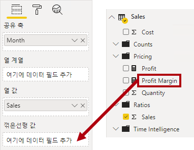

1. 시각적 개체에는 11개월만 있습니다.
    
    *2020년 6월의 마지막 달에는 판매액이 없습니다(아직). 기본적으로 시각적 개체는 BLANK 판매로 월을 제거했습니다. 이제 모든 월을 표시하도록 시각적 개체를 구성합니다.*

1. 시각적 필드 창의 **X축** 웰/영역에서 **월** 필드에 대해 아래쪽 화살표를 선택한 다음 데이터가 **없는 항목 표시를** 선택합니다.
    
    ***이제 2020년 6월**이 표시됩니다.*

     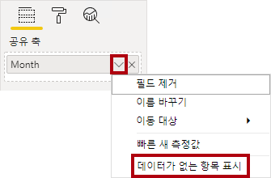

1. 보고서 페이지의 빈 영역을 클릭하여 차트를 선택 취소합니다.

1. 페이지에 차트를 추가하려면 **시각화** 창에서 **누적 세로 막대형 차트** 시각적 개체 유형을 선택합니다.

     

1. 위에 있는 차트의 너비 절반을 채우도록 시각적 개체의 크기를 조정한 다음 세로 막대형 차트/꺾은선형 차트 아래에 배치합니다.

     

1. 다음 필드를 시각적 개체 웰/영역에 추가합니다.

     - X축: **지역 \| 국가**
     - Y축: **판매 \| 판매**
     - 범례: **Product \|Category**

1. 보고서 페이지의 빈 영역을 클릭하여 차트를 선택 취소합니다.

1. 페이지에 차트를 추가하려면 **시각화** 창에서 **누적 가로 막대형 차트** 시각적 개체 유형을 클릭합니다.

     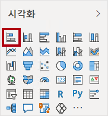

1. 나머지 보고서 페이지 공간을 채우도록 시각적 개체의 크기를 조정하여 배치합니다.

     

1. 다음 필드를 시각적 개체 웰/영역에 추가합니다.

     - Y축: **제품 \| 범주**
     - X축: **판매 \| 수량**

1. 시각적 개체의 서식을 지정하려면 **형식** 창을 엽니다.

     

1. **막대**와 **Color** 그룹을 차례로 확장한 후 **기본 Color** 속성을 적절한 Color(세로 막대형 차트/꺾은선형 차트를 보완하는 Color)으로 설정합니다.

1. **데이터 레이블** 속성을**켜짐**으로 설정합니다.

     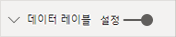

1. Power BI Desktop 파일을 저장합니다.

*이제 첫 번째 페이지의 디자인이 완료되었습니다.*

## **페이지 디자인 2**

이 작업에서는 두 번째 보고서 페이지를 디자인합니다. 디자인을 완료하면 페이지는 다음과 같은 모습이 됩니다.

 

*중요: 랩에서 자세한 지침을 제공하기 때문에 랩 단계에서는 간결한 지침을 제공합니다. 자세한 지침이 필요한 경우 이 랩의 다른 작업을 참조하세요.*

1. 새 페이지를 만들려면 왼쪽 아래에서 더하기 아이콘을 선택하고 새 페이지의 이름을 Profit으로 바꿉 **니다**.

1. **Region \| Region** 필드에 따라 슬라이서를 추가합니다.

1. **서식** 창을 사용하여 (**선택** 그룹의) “모두 선택” 옵션을 사용하도록 설정합니다.

1. 높이가 보고서 높이의 절반 정도가 되도록 시각적 개체의 크기를 조정한 다음 보고서 페이지 왼쪽에 배치합니다.

     

1. 행렬 시각적 개체를 추가한 다음 보고서 페이지의 나머지 공간을 채우도록 크기를 조정하여 배치합니다.

     

1. **Date \| Fiscal** 계층을 **행** 웰/영역 행렬에 추가합니다.

     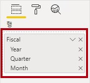

1. 다음 5개의 매출 테이블 필드를 **값** 웰/영역에 추가합니다.

     - Orders(**개수** 폴더)
     - Sales
     - 비용
     - Profit
     - Profit Margin

     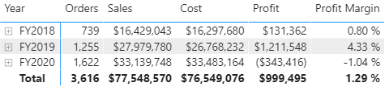

1. **필터** 창(**시각화** 창 왼쪽에 위치)에서 **이 페이지의 필터** 웰/영역을 잘 확인하세요(아래로 스크롤해야 할 수 있음).

     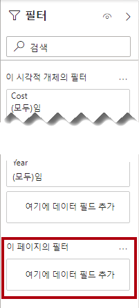

1. **데이터** 창에서 **제품 \| 범주** 필드를 **이 페이지의 필터** 웰/영역으로 끌어옵니다.
    
    **필터** 창에 추가된 필드는 슬라이서와 동일한 결과를 얻을 수 있습니다. 한 가지 차이점은 보고서 페이지의 공간을 차지하지 않는다는 것입니다. 또 다른 차이점은 더 정교한 필터링 요구 사항에 맞게 구성할 수 있다는 것입니다.

1. 필터 카드 내에서 오른쪽 위에 있는 화살표를 선택하여 카드를 축소합니다.

1. 다음 각 **Product** 테이블 필드를 **이 페이지의 필터** 웰/영역에 추가하여 **Category** 카드 바로 아래에 각각 축소합니다.

     - 하위 범주
     - 제품
     - 색

     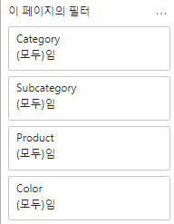

1. Power BI Desktop 파일을 저장합니다.

 *이제 두 번째 페이지의 디자인이 완료되었습니다.*

## **페이지 디자인 3**

이 작업에서는 세 번째이자 마지막 보고서 페이지를 디자인합니다. 디자인을 완료하면 페이지는 다음과 같은 모습이 됩니다.

 

1. 새 페이지를 만든 다음, **내 실적**으로 이름을 바꿉니다.

1. 행 수준 보안 필터의 성능을 시뮬레이션하려면 **Salesperson (Performance) \| Salesperson** 필드를 필터 창의 페이지 수준 필터로 끌어옵니다.

     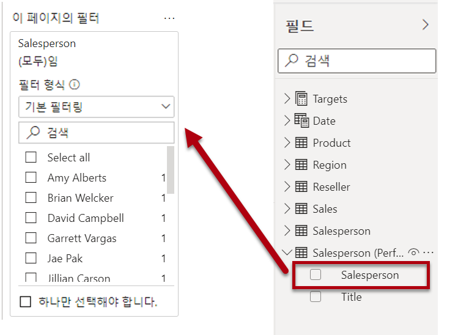

1. **Michael Blythe**를 선택합니다. 이제 **내 실적** 보고서 페이지의 데이터가 Michael Blythe의 데이터만 표시하도록 필터링됩니다.

1. **Date \| Year** 필드를 기준으로 드롭다운 슬라이서를 추가한 다음, 페이지 왼쪽 위 모서리에 표시되도록 크기를 조정하고 위치를 변경합니다.

     

1. 슬라이서에서 **FY2019**를 기준으로 필터링하도록 페이지를 설정합니다.

     

1. **다중 행 카드** 시각적 개체를 추가한 다음, 이 시각적 개체가 슬라이서 오른쪽에 배치되어 페이지의 나머지 너비를 채우도록 크기 및 위치를 조정합니다.

     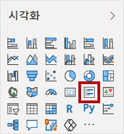

     

1. 시각적 개체에 다음 4개의 필드를 추가합니다.

     - Sales \| Sales
     - Targets \| Targets
     - Targets \| Variance
     - Targets \| Variance 여백

1. 시각적 개체의 형식을 지정합니다.

     - **설명선 값** 그룹에서 **텍스트 크기** 속성을 **28pt**로 늘립니다.

     - **일반 > 효과 > 배경** 그룹에서 **색**을 밝은 회색 색(예: "흰색, 20% 더 어둡게")으로 설정하여 대비를 지정합니다.

         

1. **묶인 막대형 차트** 시각적 개체를 추가한 다음 크기를 조정하고 배치하여 다중 행 카드 시각적 개체 아래에 배치하고 페이지의 나머지 높이와 다중 행 카드 시각적 개체 너비의 절반을 채웁니다.

     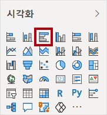

     

1. 다음 필드를 시각적 개체 웰/영역에 추가합니다.

     - Y축: **날짜 \| 월**
     - X축: **Sales \| Sales** 및 **Targets \| Target**

         

1. 시각적 개체의 복사본을 만들려면 **Ctrl+C**를 누른 다음, **Ctrl+V**를 누릅니다.

1. 새 시각적 개체를 원래 시각적 개체 오른쪽에 배치합니다.

     

1. 시각화 유형을 수정 하려면 **시각화** 창에서 **묶은 세로 막대형 차트**를 선택합니다.

     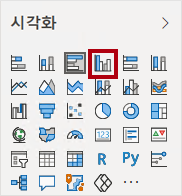

 *이제 두 가지 시각화 형식으로 표현된 동일한 데이터를 볼 수 있습니다. 이는 페이지 레이아웃을 잘 사용하지는 않지만 시각적 개체를 겹쳐서 **Power BI Desktop 보고서 향상 랩에서** 개선합니다. 페이지에 단추를 추가하면 보고서 사용자가 표시되는 두 시각적 개체 중 어느 것이 표시되는지 확인할 수 있습니다.*

 *이제 세 번째이자 마지막 페이지의 디자인이 완료되었습니다.*

## **보고서 게시**

이 작업에서는 보고서를 Power BI 서비스 게시합니다.

1. **개요** 페이지를 선택한 다음, Power BI Desktop 파일을 저장합니다.

1. **홈** 리본 탭의 **공유** 그룹 내에서 **게시**를 선택합니다.
    
    *아직 Power BI Desktop 로그인하지 않은 경우 로그인하여 게시해야 합니다.*

     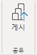

1. **Power BI에 게시** 창에서 **내 작업 영역**이 선택된 것을 확인할 수 있습니다.
    
    *이 랩의 Power BI 서비스 내의 다양한 항목에 대해서는 자세히 설명하지 않습니다.*

1. 보고서를 게시하려면 **선택을 선택합니다**. 어느 정도 시간이 걸릴 수 있습니다. 
1. 게시가 성공하면 **확인**을 선택합니다.

## **보고서 살펴보기**

이 작업에서는 Power BI에 게시된 보고서를 탐색합니다.

1. Microsoft Edge 브라우저를 연 다음 에서 **https://app.powerbi.com**로그인합니다.

1. Microsoft Edge 브라우저 창의 Power BI 서비스 내 **탐색** 창(왼쪽에 위치, 축소 가능함)에서 **내 작업 영역**을 확장합니다.

    

1. 작업 영역의 내용을 검토합니다. 모두, 콘텐츠 및 데이터 세트 + 데이터 흐름의 탐색 옵션을 확인합니다.
    1. *작업 영역에는 네 가지 유형의 항목이 있으며 **보고서** 및 **데이터 세트**에 대해 살펴보겠습니다.*
    1. *데이터 세트가 표시되지 않는 경우 Microsoft Edge 브라우저를 새로 고쳐야 할 수 있습니다.*
    1. *Power BI Desktop 파일을 게시할 때 데이터 모델이 데이터 세트로 게시되었습니다.*

1. 보고서를 탐색하려면 **판매 분석** 보고서를 선택합니다.

1. 왼쪽의 **페이지** 창에서 **개요** 페이지를 선택합니다.

1. **Region** 슬라이서에서 **Ctrl** 키를 누르면 여러 Region을 선택합니다.

1. 세로 막대형/꺾은선형 차트에서 Month 열을 선택하여 페이지를 교차 필터링합니다.

1. **Ctrl** 키를 누르는 동안 다른 달을 선택합니다.

     *참고: 기본적으로 교차 필터링은 페이지의 다른 모든 시각적 개체를 필터링합니다.*

1. 가로 막대형 차트가 필터링되고 강조 표시되며, 필터링된 월을 나타내는 가로 막대가 굵게 표시됩니다.

1. 막대형 차트 시각적 개체 위를 커서로 가리킨 다음 오른쪽 위에 있는 필터 아이콘 위를 커서로 가리킵니다. 
    
    *필터 아이콘을 사용하면 다른 시각적 개체의 슬라이서 및 교차 필터를 포함하여 시각적 개체에 적용되는 모든 필터를 이해할 수 있습니다.*

1. 막대 위로 커서를 가져간 후 도구 설명 정보를 확인합니다.

1. 교차 필터를 실행 취소하려면 세로 막대형/꺾은선형 차트에서 시각적 개체의 빈 영역을 선택합니다.

1. 누적 세로 막대형 차트 시각적 개체 위로 커서를 가리킨 다음 오른쪽 위에서 **포커스 모드** 아이콘을 선택합니다.
    
    *포커스 모드에서 시각적 개체가 전체 페이지 크기로 확대됩니다.*

     

1. 막대형 차트의 다른 세그먼트 위를 커서로 가리켜 도구 설명을 표시합니다.

1. 보고서 페이지로 돌아가려면 왼쪽 위에서 **보고서로 돌아가기**를 선택합니다.

     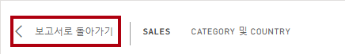

1. 시각적 개체 중 하나 위로 커서를 다시 가져간 다음 오른쪽 위에서 줄임표(...)를 선택한 다음 메뉴 옵션을 확인합니다. **Teams에서 채팅**을 제외한 각 옵션을 사용해 보세요.

     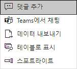

1. 왼쪽의 **페이지** 창에서 **Profit** 페이지를 선택합니다.

     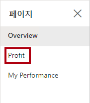

1. **Region** 슬라이서는 **개요** 페이지의 **Region** 슬라이서와는 다음 선택 옵션을 포함합니다.
    
    *슬라이서는 동기화되지 않습니다. 보고서 디자인을 수정하여 보고서 디자인이 **Power BI Desktop 보고서 향상 랩의** 페이지 간에 동기화되도록 합니다.*

1. 오른쪽에 있는 **필터** 창에서 필터 카드를 확장하고 일부 필터를 적용합니다.
    
    **필터** 창을 사용하면 페이지에 표시될 수 있는 것보다 더 많은 필터를 슬라이서로 정의할 수 있습니다.

1. 행렬 시각적 개체에서 더하기(+) 단추를 사용하여 **Fiscal** 계층 구조로 드릴다운합니다.

1. **내 실적** 페이지를 선택합니다.

     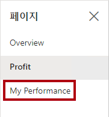

1. 메뉴 모음의 오른쪽 위에서 **보기**를 선택하고 **전체 화면**을 선택합니다.

     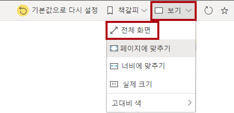

1. 슬라이서를 수정하여 페이지와 상호 작용하고 페이지를 교차 필터링합니다.

1. 창 아래에서 페이지를 변경하거나, 페이지 간을 앞뒤로 이동하거나, 전체 화면 모드를 종료하는 명령을 확인합니다.

1. 오른쪽 아이콘을 선택하여 전체 화면 모드를 종료합니다.

     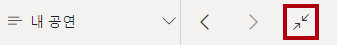

### **완료**

이번 작업에서는 랩을 마무리합니다.

"내 작업 영역"으로 돌아가려면 창 웹 페이지의 배너에서 **내 작업 영역을** 선택합니다.

 *Power BI Desktop 랩에서 보고서 개선의 고급 기능을 사용하여 보고서 디자인을 향상**시킵**니다.*
