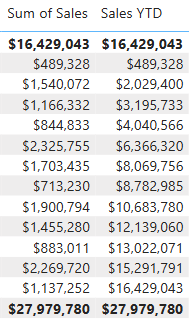
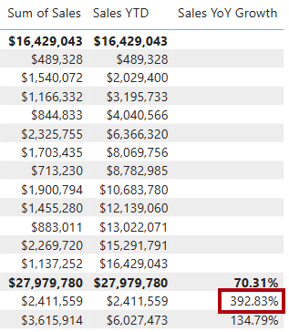

---
lab:
  title: Power BI에서 DAX 시간 인텔리전스 함수 사용
  module: Use DAX time intelligence functions in Power BI
---

# Power BI에서 DAX 시간 인텔리전스 함수 사용

## 랩 사례

이 랩에서는 시간 인텔리전스를 포함하는 DAX 식을 사용하여 측정값을 만듭니다.

이 랩에서는 다음 작업을 수행하는 방법을 알아봅니다.

 - 다양한 시간 정보 함수를 사용하여 특정 날짜와 관련된 필터 컨텍스트를 조작합니다.

**이 랩은 15분 정도 소요됩니다.**

## 시작하기

이 연습을 완료하려면 먼저 웹 브라우저를 열고 다음 URL을 입력하여 zip 파일을 다운로드합니다.

`https://github.com/MicrosoftLearning/PL-300-Microsoft-Power-BI-Data-Analyst/raw/Main/Allfiles/Labs/06-use-dax-time-intelligence/06-time-intelligence.zip`

파일을**C:\Users\Student\Downloads\06-time-intelligence** 폴더에 추출합니다.

**06-스타터-영업 분석.pbix** 파일을 엽니다.

> _**참고**: 파일이 로드되면 로그인 대화 상자가 표시될 수 있습니다.**취소**를 선택하여 로그인 대화 상자를 닫습니다. 다른 정보 창을 모두 닫습니다. 변경 내용을 적용하라는 프롬프트가 표시되면**나중에 적용**을 선택하세요._

## YTD 측정값 만들기

이 작업에서는 시간 인텔리전스 함수를 사용하여 YTD(연간 판매) 측정값을 만듭니다.

1. Power BI Desktop의**보고서 뷰**에서**2페이지**를 보면 행렬 시각적 개체에는 행에 연수와 개월이 그룹화된 다양한 측정값이 표시됩니다.

2. 다음 식을 기반으로 하는`Sales` 테이블에 측정값을 추가하고 소수점 이하 0자리로 지정합니다.

    ```dax
    Sales YTD =
    TOTALYTD(
        SUM(Sales[Sales]),
        'Date'[Date],
        "6-30"
    )
    ```

    > _`TOTALYTD` 함수는 지정된 날짜 열에 대해 식을 계산합니다. 이 경우`Sales` 열의 합계입니다. 날짜 열은 날짜 테이블로 표시된 날짜 테이블에 속해야 합니다._
    >
    > _또한 함수는 연도의 마지막 날짜를 나타내는 세 번째 선택적 인수를 사용할 수 있습니다. 이 날짜가 없으면 12월 31일이 연도의 마지막 날짜입니다. Adventure Works의 경우, 연도의 마지막 달이 6월이므로 "6-30"이 사용됩니다._

3. `Sales` 필드와`Sales YTD` 측정값을 행렬 시각적 개체에 추가합니다.

4. 그러면 해당 연도의 매출이 누적됩니다.

    

> _`TOTALYTD` 함수는 필터 조작, 특히 시간 필터 조작을 수행합니다. 예를 들어 2017년 9월(회계연도의 세 번째 월)의 YTD 매출을 계산하기 위해`Date` 테이블의 모든 필터가 제거되고 연도가 시작하는 날짜 2017년 7월 1일부터 컨텍스트 내 마지막 날짜 2017년 9월 30일까지의 새 필터로 대체됩니다._
>
> _DAX에서는 일반적인 시간 필터 조작을 지원하기 위해 많은[시간 인텔리전스 함수](/dax/time-intelligence-functions-dax/?azure-portal=true)를 사용할 수 있습니다._

## YoY 증가율 측정값 만들기

이 작업에서는 변수를 사용하여 전년 대비 영업 성장률 측정값을 만듭니다.

> 변수는 수식을 간소화하는 데 도움이 되며 수식 내에서 논리를 여러 번 사용하는 경우 더 효율적입니다. 변수는 고유 이름으로 선언되고, 측정값 식은`RETURN` 키워드 후에 출력되어야 합니다. 다른 코딩 언어 변수와 달리 DAX 변수는 단일 수식 내에서만 사용할 수 있습니다._

1. 다음 식을 기반으로`Sales` 테이블에 다른 측정값을 추가합니다.

    ```dax
    Sales YoY Growth =
    VAR SalesPriorYear =
        CALCULATE(
            SUM(Sales[Sales]),
            PARALLELPERIOD(
                'Date'[Date],
                -12,
                MONTH
            )
        )
    RETURN
        SalesPriorYear
    ```

    > _`SalesPriorYear` 변수에는 수정된 컨텍스트에서`Sales` 열의 합계를 계산하는 표현식이 할당됩니다. 해당 컨텍스트에서는`PARALLELPERIOD` 함수를 사용하여 필터 컨텍스트의 각 날짜로부터 12개월을 뒤로 이동합니다._

1. `Sales YoY Growth` 측정값을 행렬 시각적 개체에 추가합니다.

1. 새 측정값은 처음 12개월 동안은`BLANK`를 반환합니다(2017 회계연도 이전에 기록된 매출이 없기 때문입니다).

1. _2018년 7월_의`Sales YoY Growth` 측정값은_2017년 7월_의 판매값입니다.

    

    > _이제 수식의 "어려운 부분"을 테스트했으므로 증가율 결과를 계산하는 최종 수식으로 측정값을 덮어쓸 수 있습니다._

1. 측정값을 완료하려면 이 수식을 사용하여`Sales YoY Growth` 측정값을 덮어써 서식을 소수점 이하 두 자리 백분율로 지정합니다.

    ```dax
    Sales YoY Growth =
    VAR SalesPriorYear =
        CALCULATE(
            SUM(Sales[Sales]),
            PARALLELPERIOD(
                'Date'[Date],
                -12,
                MONTH
            )
        )
    RETURN
        DIVIDE(
            (SUM(Sales[Sales]) - SalesPriorYear),
            SalesPriorYear
        )
    ```

1. 수식의`RETURN` 절에서 변수가 두 번 참조됩니다.

1. _2018년 7월_의 YoY 증가율이 392.83%인지 확인합니다.

    

    > _YoY 성장 측정을 통해 전년도 같은 기간 동안 매출이 거의 400%(또는 4배) 증가한 것으로 나타납니다._

1. **모델 뷰**에서 두 개의 새 측정값을_Time intelligence_라는 표시 폴더에 넣습니다.

    

1. Power BI Desktop 파일을 저장합니다.

## 랩 완료

이 랩에서는 필요하지 않지만, Power BI 보고서를 저장하도록 선택할 수 있습니다. 다음 연습에서는 미리 만들어진 시작 파일을 사용합니다.

1. 왼쪽 위 모서리에 있는 **"파일"** 메뉴로 이동하여 **"다른 이름으로 저장"** 을 선택합니다. 
1. **이 디바이스 찾아보기**를 선택합니다.
1. 파일을 저장할 폴더를 선택하고 설명이 포함된 이름을 지정합니다. 
1. **저장** 버튼을 선택하여 보고서를 .pbix 파일로 저장합니다. 
1. 보류 중인 쿼리 변경 내용을 적용하라는 대화 상자가 나타나면**적용**을 선택합니다.
1. Power BI Desktop을 닫습니다.