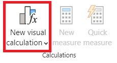
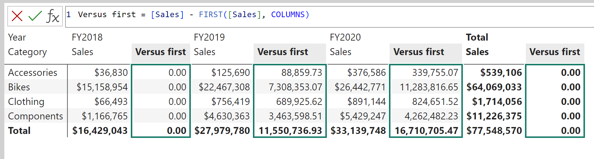

---
lab:
  title: Power BI Desktop에서 시각적 계산 만들기
  module: Create visual calculations in Power BI Desktop
---

# Power BI Desktop에서 시각적 계산 만들기

## **랩 사례**

이 랩에서 DAX(Data Analysis Expressions)를 사용하여 시각적 계산을 만듭니다.

이 랩에서는 다음 사항들을 수행하는 방법에 대해 알아봅니다.

- 시각적 개체 계산을 만들고 편집하세요.
- PREVIOUS(), RUNNINGSUM(), MOVINGAVERAGE() 함수를 사용하여 각 회계 연도 간에 비교 메트릭을 만들 수 있습니다.
- 비교 메트릭을 만들 때 선택적 축 매개 변수를 사용합니다.
- 선택적 초기화화 매개 변수를 사용하여 다중 수준 축에서 누적 계산을 사용자 지정합니다.

**이 랩은 30분 정도 소요됩니다.**

## 시작하기

이 연습을 완료하려면 먼저 웹 브라우저를 열고 다음 URL을 입력하여 zip 폴더를 다운로드합니다.

`https://github.com/MicrosoftLearning/PL-300-Microsoft-Power-BI-Data-Analyst/raw/Main/Allfiles/Labs/07-create-visual-calculations/07-visual-calculations.zip`

폴더를 **C:\Users\Student\Downloads\07-visual-calculations** 폴더로 추출합니다.

**07-스타터-영업 분석.pbix** 파일을 엽니다.

> ***참고**: **취소**를 선택하여 로그인을 해제할 수 있습니다. 다른 정보 창을 모두 닫습니다. 변경 사항을 적용하라는 메시지가 표시되면 **나중에 적용**을 선택합니다.*

## 막대형 차트 시각적 개체 만들기

이 작업에서는 비교 메트릭을 도구 설명으로 사용하여 판매 금액, 총 제품 비용 및 회계 연도별 이익을 보여 주는 막대형 차트를 만듭니다.

1. **시각화** 창에서 묶은 가로 막대형 차트 시각적 개체 유형을 선택합니다.

   

1. **데이터** 창의 **날짜** 테이블 내부에서 **연도** 필드를 **Y축** 웰/영역으로 끌어옵니다.

1. **Sales** 테이블에서 **X축** 웰/영역으로 **Sales** 및 **Cost** 필드를 끌어옵니다.

    > 시각적 개체에 Sales 및 Cost를 추가하면 각 필드의 합계가 자동으로 계산됩니다.

1. 세 개의 점 메뉴를 사용하여 **연도**를 선택한 다음 **오름차순 정렬**을 수행함으로써 결과 막대형 차트를 오름차순 **연도**로 정렬합니다.

   

    > 이제 시간순으로 정렬된 판매액 합계와 연도별 비용 합계를 보여 주는 막대형 차트가 있습니다.

### 계산 

1. 막대형 차트를 선택한 상태에서 리본에서 **새 시각적 계산**을 선택합니다.

   

1. 시각적 계산 편집 모드 창이 열립니다. 시각적 행렬 위의 수식 입력줄에서 다음 식을 입력한 다음 Enter 키를 눌러 계산을 커밋합니다.

    ```DAX
   Profit = [Sum of Sales] - [Sum of Cost]
    ```

1. 이제 화면 아래쪽의 시각적 행렬에 Profit 열이 표시되는지 확인합니다.

   

1. **새 시각적 계산**에서 메뉴를 확장하고 템플릿 옵션에서 **이전과 비교**를 선택합니다.

    > **이전과 비교**는 값을 이전 값과 비교하므로 이전 연도 값과 비교하여 수익을 알 수 있습니다.

   

1. 수식 입력줄에서 `[Field]`자리 표시자`[Profit]`를 두 번으로 바꾸고 계산을 커밋합니다.

1. 템플릿 메뉴에서 **누적 합계**를 선택하고 `[Field]`자리 표시자`[Profit]`를 계산으로 바꾸고 커밋합니다.

    > **누적 합계**는 값의 합계를 계산하여 이전 값에 현재 값을 추가하므로 현재 및 이전 연도의 합계를 볼 수 있습니다.

1. 템플릿 메뉴에서 **이동 평균**을 선택하고 `[Field]`자리 표시자`[Profit]`와 `WindowSize`자리 표시자 2를 바꿉니다. 설정은 다음과 같습니다.

    > **이동 평균**은 값의 합계를 창의 크기로 나누어 지정된 창에 있는 값 집합의 평균을 계산합니다. 창 크기를 2로 설정하여 두 개의 연속 값의 평균을 계산합니다. 이 예제에서 값은 연간 수익이므로 FY2019의 이동 평균은 FY2018 및 FY2019의 이익 평균임을 알 수 있습니다.

   

1. **X축** 웰/영역 아래에서 다음 필드의 가시성 아이콘을 선택하여 시각적 개체에서 숨깁니다.

    - 판매 합계
    - 비용 합계
    - 이윤

   

    > 숨긴 필드와 계산이 시각적 개체에 더 이상 표시되지 않는 방법을 확인합니다.

1. **시각화** 창에서 **누적 합계** 및 **이동 평균**을 **도구 설명** 웰/영역으로 끌어옵니다.  

1. 시각적 개체가 이제 목표를 충족하는지 확인합니다. 시각적 계산 편집 모드 화면을 종료하고 보고서로 이동합니다.

   

    > 이제 수익 *누적 합계* 및 수익 *이동 평균*에 대한 도구 설명과 함께 판매 합계, 비용 합계, 수익, 수익 *이전과 비교*의 값이 표시된 막대형 차트를 볼 수 있습니다.

## 행렬형 시각적 개체 만들기

이 작업에서는 범주당 판매액을 다음 연도의 첫 번째 회계 연도와 비교하는 행렬 시각적 개체를 만듭니다.

1. **보고서 뷰**에서 새 보고서 페이지를 만듭니다.

1. **2페이지**에서 행렬 시각적 개체를 추가합니다.

1. 다음 필드를 시각적 개체 웰/영역에 추가합니다.

    - 행: **제품 \| 범주**
    - 열: **날짜 \| 연도**
    - 값: **판매 \| 판매**

    > *랩에서는 약식 표기법을 사용하여 필드를 참조하고 **날짜 \| 연도**와 같이 표시합니다. 이 예에서 **날짜**는 테이블 이름이고 **연도**는 필드 이름입니다.*

### 계산 추가

1. 행렬을 선택한 상태에서 리본에서 **새 시각적 계산**을 선택합니다.

1. 시각적 계산 편집 모드 창에서 다음 계산을 입력하고 저장합니다.

    ```DAX
   Versus first = [Sum of Sales] - FIRST([Sum of Sales])
    ```

    > 행렬이 각 범주와 첫 번째 범주의 판매액 차이를 표시하는 방법을 확인합니다.

1. **값** 웰/영역에서 필드 **첫 번째와 비교**를 선택하고 축 매개 변수의 ROWS 값을 FIRST에 추가하여 계산을 업데이트합니다.

    ```DAX
   Versus first = [Sum of Sales] - FIRST([Sum of Sales], ROWS)
    ```

    > 행이 축 매개 변수의 기본값이므로 아무것도 변경되지 않습니다.

1. 행을 열로 바꾸고 이제 계산에서 범주당 판매액을 첫 번째 회계 연도와 비교합니다.

   

    > **총 판매**의 **첫 번째와 비교** 열이 첫 회계 연도와의 차이 대신 0을 반환하는 방법을 확인합니다. **총 판매**는 연간 합계와 다른 계층적 수준에 있으므로 해당 수준의 첫 번째 열로 간주됩니다.

1. 시각적 계산 편집 모드 화면을 종료하고 보고서로 이동합니다.

## 꺾은선형 차트 시각적 개체 만들기

이 작업에서는 판매의 누적 합계를 보여 주는 꺾은선형 차트를 만듭니다. 이 합계는 매 회계 연도 초에 다시 설정됩니다.

1. **보고서 뷰**에서 새 보고서 페이지를 만듭니다.

1. **3페이지**에서 꺾은선형 차트 시각적 개체를 추가합니다.

1. 다음 필드를 시각적 개체 웰/영역에 추가합니다.

    - X축: **날짜 \| 연도** 및 **날짜 \| 분기**
    - Y축: **판매 \| 판매**

### 누적 합계 추가

1. 꺾은선형 차트를 선택한 상태에서 **새 시각적 계산** 아래의 메뉴를 확장하고 템플릿 옵션에서 **누적 합계**를 선택합니다.

1. `[Field]` 자리 표시자`[Sum of Sales]`를 변경 내용으로 바꾸고 커밋합니다. 시각적 개체는 다음과 같이 표시됩니다.

   

### 새 회계 연도마다 다시 시작하도록 누적 합계 업데이트

1. 시각적 계산 편집 모드 창에 있는 동안 **Y축**에서 **누적 합계** 필드를 선택하고 HIGHESTPARENT 재설정 매개 변수를 추가하여 이 계산에 대한 식을 업데이트하고 변경 내용을 커밋합니다.

    ```DAX
   Running sum = RUNNINGSUM([Sum of Sales], HIGHESTPARENT)
    ```

새 회계 연도마다 누적 합계가 실제로 다시 시작되는지 확인합니다.

   

## 랩 완료
