---
lab:
  course: PL-300
  title: Power BI Desktop에서 보고서 향상
  module: Create Reports in Power BI desktop
---

# Power BI Desktop에서 보고서 향상

## **랩 사례**

이 랩에서는 고급 디자인 기능을 사용하여 **판매 분석**을 개선해 봅니다.

이 랩에서는 다음 작업을 수행하는 방법을 알아봅니다.

- 슬라이서 동기화
- 드릴스루 페이지 만들기
- 조건부 서식 적용
- 책갈피 만들기 및 사용

**이 랩은 약 45분 정도 소요됩니다.**

## **시작 - 로그인**

이 작업에서는 Power BI에 로그인하여 랩 환경을 설정합니다.

*참고: Power BI에 이미 로그인한 경우 다음 작업으로 건너뜁니다.*

1. Microsoft Edge를 열려면 작업 표시줄에서 Microsoft Edge 프로그램 바로 가기를 선택합니다.

     

1. Microsoft Edge 브라우저 창에서 **https://app.powerbi.com**으로 이동합니다.

    *팁: Microsoft Edge 즐겨찾기 표시줄에서 Power BI 서비스 즐겨찾기를 사용할 수도 있습니다.*

1. 조직 자격 증명(또는 제공 받은 자격 증명)을 사용하여 로그인 프로세스를 완료합니다. Microsoft Edge에서 로그인 상태를 유지할지 묻는 프롬프트가 표시되면 **예**를 선택합니다.

1. Microsoft Edge 브라우저 창의 Power BI 서비스 **탐색** 창에서 **내 작업 영역**을 확장합니다. Microsoft Edge 브라우저 창을 열어 둡니다.

     

## **시작 - 보고서 열기**

이 작업에서는 시작 보고서를 열어 랩의 환경을 설정합니다.

*중요: 이전 랩에서 계속 진행해 온 경우(그리고 해당 랩을 성공적으로 완료한 경우) 이 작업을 완료하지 마세요. 대신, 다음 작업으로 건너뜁니다.*

1. Power BI Desktop을 실행합니다.

    

1. Power BI Desktop 시작 파일을 열려면 **열기 > 이 장치 탐색하기**를 선택합니다.

1. **열기** 창에서 **D:\Allfiles\Labs\07-design-report-in-power-bi-desktop-enhanced\Starter** 폴더로 이동하여 **판매 분석** 파일을 엽니다.

   *참고: 이 시점에서 Power BI는 아직 로그인하지 않은 경우 로그인하도록 요청합니다. 로그인하거나 **취소**를 선택하고 랩을 계속할 수 있습니다.*

1. 열려 있는 정보 창을 모두 닫습니다.

1. 리본 아래에 있는 경고 메시지를 확인합니다.

    *이 메시지는 모델 테이블로 로드하기 위해 쿼리가 적용되지 않았다는 사실을 경고합니다. 이 랩의 후반에서 쿼리를 적용하겠습니다.*

    *경고 메시지를 닫으려면 경고 메시지 오른쪽에 있는 **X**를 선택합니다.*

1. 파일 복사본을 만들려면 **파일 > 다른 이름으로 저장**으로 이동하여 **D:\Allfiles\MySolution** 폴더에 저장합니다.

1. 변경 내용을 적용할지 묻는 프롬프트가 표시되면 **나중에 적용**을 선택합니다.

## **슬라이서 동기화**

이 작업에서는 **연도** 및 **지역** 슬라이서를 동기화하여 **Power BI Desktop에서 보고서 디자인** 랩에서 만들어진 보고서 개발을 계속합니다.

1. Power BI Desktop의 **개요** 페이지에서 **Year** 슬라이서를 **FY2018**로 설정합니다.

1. **My Performance** 페이지로 이동하면 **Year** 슬라이서가 다른 값으로 설정되어 있음을 알 수 있습니다.

    *슬라이서가 동기화되지 않은 경우에는 데이터가 잘못 표현될 수 있고 보고서 사용자에게 불편을 유발할 수 있습니다. 이제 보고서 슬라이서를 동기화합니다.*

1. **개요** 페이지로 돌아가 **Year** 슬라이서를 선택합니다.

1. **보기** 리본 탭의 **창 표시** 그룹에서 **슬라이서 동기화**를 선택합니다.

     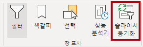

1. **시각화** 창의 왼쪽에 있는 **슬라이서 동기화** 창의 동기화를 나타내는 두 번째 열에서 **Overview** 페이지와 **My Performance** 페이지의 확인란을 선택합니다.

     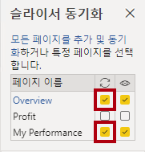

1. **Overview** 페이지에서 **지역** 슬라이서를 선택합니다.

1. 슬라이서를 **Overview** 페이지 및 **Profit** 페이지와 동기화합니다.

     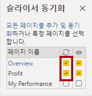

1. 다른 필터 옵션을 선택한 다음, 동기화된 슬라이서가 동일한 선택 사항으로 필터링되는 것을 확인하여 슬라이서 동기화를 테스트합니다.

1.  **슬라이서 동기화** 페이지를 닫으려면 **보기** 리본 탭에 있는 **슬라이서 동기화** 옵션을 선택합니다.

## **드릴스루 구성**

이 연습에서는 새 페이지를 만들어서 드릴스루 페이지로 구성합니다. 디자인을 완료하면 페이지는 다음과 같은 모습이 됩니다.

## **드릴스루 페이지 만들기**

이 작업에서는 새 페이지를 만들어서 드릴스루 페이지로 구성합니다.

1. **Product Details**라는 새 보고서 페이지를 추가합니다.

1. **Product Details** 페이지 탭을 마우스 오른쪽 단추로 클릭하고 **페이지 숨기기**를 선택합니다.

    보고서 사용자는 드릴스루 페이지로 직접 이동할 수 없습니다. 다른 페이지의 시각적 개체에서 액세스해야 합니다. 이 랩의 마지막 연습에서 페이지로 드릴스루하는 방법을 알아봅니다.

1. **시각화** 창 아래의 **드릴스루** 섹션에서 **여기에 드릴스루 필드 추가**상자에 **Product \| Category** 필드를 추가합니다.

    랩에서는 약식 표기법을 사용하여 필드를 참조합니다. 다음과 같이 표시됩니다. **Product \| Category**. 이 예에서 **Product**은 테이블 이름이고 **Category**는 필드 이름입니다.

     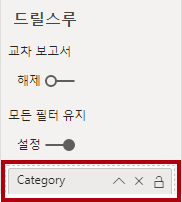

1. 드릴스루 페이지를 테스트하려면 드릴스루 필터 카드에서 **Bikes**를 선택합니다.

     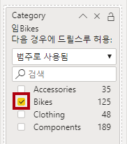

1. 보고서 페이지의 왼쪽 위에 화살표 단추가 표시된 것을 확인합니다.

    *드릴스루 웰/영역에 필드를 추가하면 화살표 단추가 자동으로 추가됩니다. 보고서 사용자는 이 단추를 사용하여 드릴스루한 페이지에서 되돌아갈 수 있습니다.*

1. 페이지에 **카드** 시각적 개체를 추가한 다음 크기를 조정하고 단추 오른쪽에 배치하여 페이지의 나머지 너비를 채웁니다.

    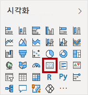

    

1. **Product \| Category** 필드를 카드 시각적 개체로 끌어옵니다.

1. 시각적 개체에 대한 Formatting 옵션을 구성한 다음, **Category 레이블** 속성을 **끔**으로 설정합니다.

     

1. **효과 > 백그라운드** 색 속성을 *흰색, 20% 더 어둡게*와 같은 밝은 회색 음영으로 설정합니다.

     

1. 페이지에 **테이블** 시각적 개체를 추가한 다음 크기를 조정하고 카드 시각적 개체 아래에 배치하여 페이지의 나머지 공간을 채웁니다.

     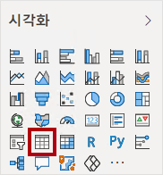

     

1. 시각적 개체에 다음 필드를 추가합니다.

     - Product \| 하위 Category
     - Product \| Color
     - Sales \| Quantity
     - Sales \| Sales
     - Sales \| Profit Margin

1. 시각적 개체에 대한 Formatting 옵션을 구성한 다음, **값** 섹션에서 **텍스트 크기** 속성을 **20pt**로 설정합니다.

드릴스루 페이지의 디자인이 거의 완료되었습니다. 다음 연습에서 조건부 Formatting을 사용하여 페이지를 개선할 것입니다.

## **조건부 서식 추가**

이 연습에서는 조건부 서식을 사용하여 드릴스루 페이지를 개선합니다. 디자인을 완료하면 페이지는 다음과 같은 모습이 됩니다.

## **조건부 서식 추가**

이 작업에서는 조건부 서식을 사용하여 드릴스루 페이지를 개선합니다.

1. 테이블 시각적 개체를 선택합니다. 시각화 창에서 **이익률** 값의 아래쪽 화살표를 선택하고 **조건부 서식 \| 아이콘**을 선택합니다.

    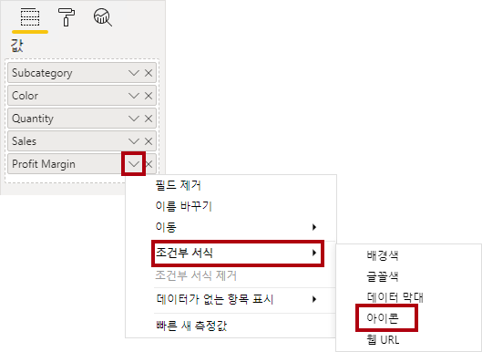

1. **아이콘 – Profit Margin** 창의 **아이콘 레이아웃** 드롭다운 목록에서 **데이터의 오른쪽**을 선택합니다.

     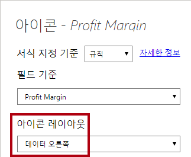

1. 중간 규칙을 삭제하려면 노란색 삼각형 오른쪽에서 **X**를 선택합니다.

     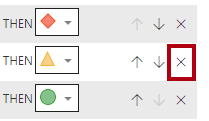

1. 첫 번째 규칙(빨간Color 다이아몬드)을 다음과 같이 구성합니다.

    - 두 번째 컨트롤에서 값을 제거합니다.
    - 세 번째 컨트롤에서 **숫자**를 선택합니다.
    - 다섯 번째 컨트롤에서 **0**을 입력합니다.
    - 여섯 번째 컨트롤에서 **숫자**를 선택합니다.

1. 두 번째 규칙(녹색 원)을 다음과 같이 구성한 후 **확인**을 선택합니다.

    *이 규칙은 다음과 같이 해석할 수 있습니다. 이익률이 0보다 작으면 빨간색 다이아몬드를 표시하고, 0보다 크거나 같으면 녹색 원을 표시합니다.*

     - 두 번째 컨트롤에서 **0**을 입력합니다.
     - 세 번째 컨트롤에서 **숫자**를 선택합니다.
     - 다섯 번째 컨트롤에서 값을 제거합니다.
     - 여섯 번째 컨트롤에서 **숫자**를 선택합니다.

     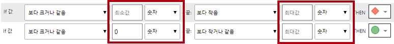

1. 테이블 시각적 개체에서 올바른 아이콘이 표시되는지 확인합니다.

     

1. **Color** 필드의 배경Color 조건부 Formatting을 구성합니다.

1. **배경Color - Color** 창의 **Formatting 스타일** 드롭다운 목록에서 **필드 값**을 선택합니다.

1. **이 값은 어떤 필드를 기반으로 해야 하나요?** 드롭다운 목록에서 **제품 \| 서식\| 배경색 서식**을 선택한 다음 **확인**을 선택합니다.

     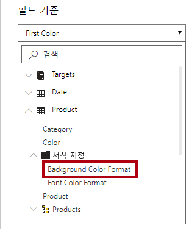

1. 이전 단계를 반복하여 **Product \| Formatting \| 글꼴 Color Formatting** 필드를 사용하여 **Color** 필드에 대한 글꼴 Color 조건부 Formatting을 구성합니다.

배경Color과 글꼴 Color은 **Power BI Desktop에서 데이터 준비** 랩에서 사용했던 **ColorFormats.csv** 파일에서 가져온 다음, **Power BI Desktop에서 데이터 로드** 랩에서 만든 **Product** 쿼리와 통합한 것입니다.

## **책갈피 및 단추 추가**

이 연습에서는 보고서 사용자가 표시할 시각적 개체 유형을 선택할 수 있도록 단추를 사용하여 **My Performance** 페이지를 개선해 봅니다. 디자인을 완료하면 페이지는 다음과 같은 모습이 됩니다.

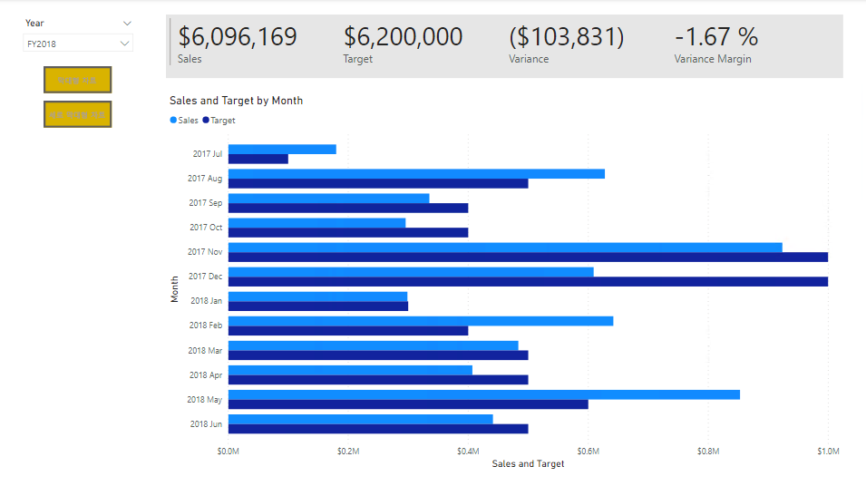

## **책갈피 추가**

이 작업에서는 각각 월별 매출 시각적 개체와 월별 목표 시각적 개체를 표시하는 두 개의 책갈피를 추가합니다.

1. **My Performance** 페이지로 이동합니다. **보기** 리본 탭의 **창 표시** 그룹에서 **책갈피**를 선택합니다.

     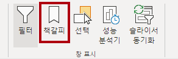

1. **보기** 리본 탭의 **창 표시** 그룹에서 **선택 영역**을 선택합니다.

1. **선택 영역** 창에서 **월별 매출 및 목표** 항목 중 하나 옆에서 눈 모양 아이콘을 선택하여 시각적 개체를 숨깁니다.

     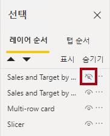

1. **책갈피** 창에서 **추가**를 선택합니다.

    *책갈피의 이름을 바꾸려면 책갈피를 두 번 클릭합니다.*

     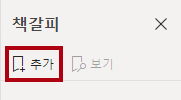

1. 표시되는 차트가 가로 막대형 차트인 경우 책갈피 이름을 **Bar Chart ON**으로 바꾸고 그렇지 않은 경우 책갈피 이름을 **Column Chart ON**으로 바꿉니다.

1. 책갈피를 편집하려면 **책갈피** 창에서 책갈피 위로 커서를 가져간 다음 줄임표를 선택하고 **데이터**를 선택합니다.
     
     **데이터** 옵션을 사용하지 않도록 설정하면 책갈피는 현재 필터 상태를 사용하지 않습니다. 이 기능은 중요합니다. 이 옵션을 비활성화하지 않는 경우 책갈피가 **Year** 슬라이서에 의해 현재 적용되어 있는 필터로 영구 고정되기 때문입니다.

     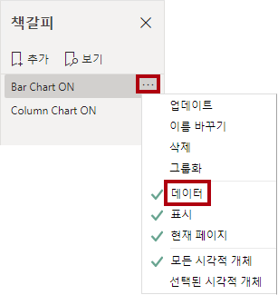

1. 책갈피를 업데이트하려면 줄임표를 다시 선택한 다음 **업데이트**를 선택합니다.

     *다음 단계에서는 두 번째 책갈피를 만들고 구성하여 두 번째 시각적 개체를 표시합니다.*

1. **선택 영역** 창에서 두 **월별 매출 및 목표** 항목의 표시 여부를 토글합니다.

     *즉, 표시된 시각적 개체를 숨기고 숨겨진 시각적 개체를 표시하도록 설정합니다.*

     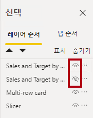

1. 두 번째 책갈피를 만들고 적절한 이름을 지정합니다(**Column Chart ON** 또는 **Bar Chart ON**).

     

1. 필터를 무시(**데이터** 옵션 해제)하고 책갈피를 업데이트하도록 두 번째 책갈피를 구성합니다.

1. **선택** 창에서 두 시각적 개체를 모두 표시하려는 경우 숨겨진 시각적 개체만 표시하면 됩니다.

1. 두 시각적 개체가 다중 카드 시각적 개체 아래에 배치되고 서로 완전히 중첩되도록 크기와 위치를 조정합니다.

    *중첩된 시각적 개체를 선택하려면 **선택 영역** 창에서 해당 시각적 개체를 선택합니다.*

    

1. **책갈피** 창에서 각 책갈피를 선택하면 둘 중 하나의 시각적 개체만 표시되는 것을 알 수 있습니다.

*보고서 디자인의 다음 단계는 보고서 사용자가 책갈피를 선택하는 데 사용할 수 있는 단추 두 개를 페이지에 추가하는 것입니다.*

## **단추 추가**

이 작업에서는 두 개의 단추를 추가하고 각각에 책갈피 동작을 할당합니다.

1. **삽입** 리본의 **요소** 그룹에서 **단추**를 선택하고 **비어 있음**을 선택합니다.

     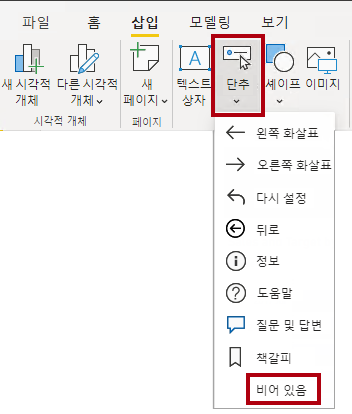

1. **Year** 슬라이서 바로 아래에 단추를 배치합니다.

1. 단추를 선택한 다음 **서식 단추** 창에서 **단추**을 선택하고 **스타일** 섹션을 확장한 다음 **텍스트** 속성을 **켜기**로 설정합니다.

     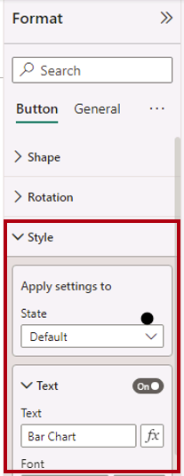

1. **텍스트** 섹션을 펼친 다음 **텍스트** 상자에 **막대형 차트**를 입력합니다.

1. **채우기** 섹션을 확장한 다음 보색을 사용하여 채우기 색을 설정합니다.

1. **단추**을 선택하고 **작업** 속성을 **켜기**로 설정합니다.

    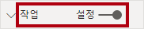

1. **작업** 섹션을 확장하고 **형식** 드롭다운 목록을 **책갈피**로 설정합니다.

1. **책갈피** 드롭다운 목록에서 **Bar Chart ON**을 선택합니다.

    

1. 복사 및 붙여넣기를 사용하여 단추의 복사본을 만들고 다음과 같이 새 단추를 구성합니다.

    *팁: 복사 및 붙여넣기 작업의 바로 가기 명령은 **Ctrl+C**와 **Ctrl+V**를 차례로 사용하는 것입니다.*

    - **단추 텍스트** 속성을 **세로 막대형 차트**로 설정합니다.
    - **작업** 섹션에서 **책갈피** 드롭다운 목록을 **Column Chart ON**으로 설정합니다.

*이제 Sales 분석 보고서 디자인이 완료되었습니다.*

## **보고서 게시**

이 작업에서는 보고서를 게시합니다.

1. **Overview** 페이지를 선택합니다.

1. **Year** 슬라이서에서 **FY2020**을 선택합니다.

1. **지역** 슬라이서에서 **모두 선택**을 선택합니다.

1. Power BI Desktop 파일을 저장합니다.

    *Power BI 서비스에 게시하기 전에 파일을 항상 저장해야 합니다.*

1. **홈** 리본 탭의 **공유** 그룹 내에서 **게시**를 선택합니다.

     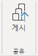

1. **Power BI에 게시** 창에서 **내 작업 영역**이 선택된 것을 확인할 수 있습니다.

1. 보고서를 게시하려면 **선택**을 선택합니다.
    1. 의미 체계 모델을 바꾸라는 메시지가 나타나면 **바꾸기**를 선택합니다.
    1. 게시가 성공하면 **확인**을 선택합니다.

1. Power BI Desktop을 닫습니다.

*다음 연습에서 Power BI 서비스에서 보고서를 살펴봅니다.*

## **보고서 살펴보기**

이 작업에서는 Power BI 서비스의 보고서를 탐색합니다.

1. Microsoft Edge 브라우저 창에서 Power BI 서비스 > **내 작업 영역**으로 이동한 다음 **판매 분석** 보고서를 선택합니다.

1. 드릴스루 기능을 테스트하려면 **개요** 페이지 > **범주별 수량** 시각적 개체로 이동합니다. 그런 다음 **의류** 막대를 마우스 오른쪽 단추로 클릭하고 **드릴스루 \| 제품 세부 정보**를 선택합니다.

     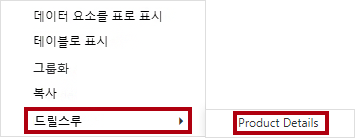

1. **Product Details** 페이지는 **의류**에 대한 것임을 알 수 있습니다.

1. 원본 페이지로 돌아가려면 페이지 왼쪽 상단에서 화살표 단추를 선택합니다.

1. **내 실적** 페이지를 선택합니다.

    *각 단추를 선택하면 다른 시각적 개체가 표시되는 것을 알 수 있습니다.*

### **완료**

이번 작업에서는 랩을 마무리합니다.

작업 영역으로 돌아가려면 창 웹 페이지 배너에서 **내 작업 영역**을 선택합니다.

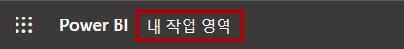
