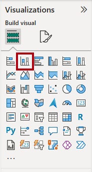

---
lab:
  title: Power BI 보고서 디자인
  module: Design Power BI reports
---

# Power BI 보고서 디자인

## 랩 사례

이 랩에서는 세 페이지로 구성된 보고서를 만듭니다. 그런 다음, 보고서를 열고 상호 작용할 Power BI 서비스에 게시합니다.

이 랩에서는 다음 사항들을 수행하는 방법에 대해 알아봅니다.

- 보고서를 디자인해 보세요.
- 시각적 개체 필드 및 서식 속성을 구성합니다.
- 슬라이서를 동기화하세요.
- Power BI 서비스에 보고서를 게시합니다.
- 보고서 및 시각적 개체와 상호 작용합니다.

**이 랩은 약 45분 정도 소요됩니다.**

## 시작하기

이 연습을 완료하려면 먼저 웹 브라우저를 열고 다음 URL을 입력하여 zip 파일을 다운로드합니다.

`https://github.com/MicrosoftLearning/PL-300-Microsoft-Power-BI-Data-Analyst/raw/Main/Allfiles/Labs/08-design-power-bi-reports/08-design-report.zip`

파일을 **C:\Users\Student\Downloads\08-design-report** 폴더로 추출합니다.

**08-Starter-Sales Analysis.pbix** 파일을 엽니다.

> _**참고**: **취소**를 선택하면 로그인을 취소할 수 있습니다. 다른 정보 창을 모두 닫습니다. 변경 내용을 적용하라는 프롬프트가 표시되면 **나중에 적용**을 선택하세요._

## 페이지 디자인 1

이 에서는 첫 번째 보고서 페이지를 설계합니다. 디자인을 완료하면 페이지가 다음과 같아집니다.

1. Power BI Desktop에서 페이지의 이름을 바꾸려면 왼쪽 하단에서 **1페이지**를 마우스 오른쪽 단추로 클릭한 다음, **이름 바꾸기**를 선택합니다. 페이지 이름을 _개요_로 바꾸세요.

    > _팁: 페이지 이름을 두 번 클릭하여 이름을 바꿀 수도 있습니다._

1. 이미지를 추가하려면 **삽입** 리본 탭의 **요소** 그룹 안에서 **이미지**를 선택합니다.

    

1. **열기** 창에서 **C:\Users\Student\Downloads\08-design-report** 폴더로 이동합니다.

1. **AdventureWorksLogo.jpg** 파일을 선택한 다음, **열기**를 선택합니다.

1. 이미지를 끌어 왼쪽 위에 놓고 안내선 표식도 끌어 크기를 조정합니다.

    

1. 슬라이서를 추가하려면 먼저 보고서 페이지의 빈 영역을 선택하여 이미지 선택을 취소한 다음, **시각화** 창에서 **슬라이서**를 선택합니다.

    

1. **데이터** 창에서 계층 구조의 `Year` 수준이 아닌 `Date | Year` 필드를 **시각화** 창의 슬라이서 **필드** 웰로 끌어다 놓습니다.

    > _랩에서는 약식 표기법을 사용하여 필드를 참조합니다. `Date | Year`와 같이 표시됩니다. 이 예시에서 `Date`는 테이블 이름이고 `Year`는 필드 이름입니다._

1. 슬라이서를 목록에서 드롭다운으로 변환하려면 **시각화** 창에서 **시각적 개체 서식**을 선택합니다. **슬라이서 설정**을 확장한 다음, **스타일** 드롭다운을 **드롭다운**으로 설정합니다.

    

1. 너비가 이미지 너비와 같아지도록 슬라이서 크기를 조정하여 이미지 아래에 오도록 배치합니다.

    

1. **Year** 슬라이서에서 드롭다운 목록을 열고 **FY2020**을 선택한 다음 드롭다운 목록을 축소합니다.

    > 보고서 페이지는 이제 **FY2020**년을 기준으로 필터링됩니다.

    

1. 보고서 페이지의 빈 영역을 선택하여 슬라이서를 선택 취소합니다.

1. 계층 구조의 `Region` 수준이 아닌 `Region | Region` 필드를 기반으로 두 번째 슬라이서를 만듭니다.

1. 슬라이서를 목록으로 유지하고 크기를 조정한 다음 **Year** 슬라이서 아래에 배치합니다.

    

1. 보고서 페이지의 빈 영역을 선택하여 슬라이서를 선택 취소합니다.

1. 페이지에 차트를 추가하려면 **시각화** 창에서 **꺾은선형 및 누적 세로 막대형 차트** 시각적 개체 유형을 선택합니다.

    

1. 보고서 페이지의 전체 너비를 채우도록 시각적 개체의 크기를 조정한 다음 로고 오른쪽에 배치합니다.

    

1. 다음 필드를 시각적 개체에 끌어서 놓습니다.

     - `Date | Month`
     - `Sales | Sales`

1. 시각적 필드 창(**시각화** 창에 위치)에서 필드가 **X축** 및 **열 y축** 웰에 할당되어 있는지 확인합니다.

    > _필드를 시각적 개체에 끌어 놓으면 기본 웰에 추가됩니다. 정확도를 위해 필드를 웰로 직접 끌어 올 수 있습니다(다음에 수행함)._

    

1. **데이터** 창에서 `Sales | Profit Margin` 필드를 **y-축 선** 웰로 끌어다 놓습니다.

    

1. 시각적 개체에 11개월만 있습니다.

    > _올해의 마지막 달인 2020년 6월에는 아직 매출이 없습니다. 기본적으로 시각적 개체는 `BLANK` 상태의 판매가 있었던 월을 제거했습니다. 이제 모든 달을 표시하도록 시각적 개체를 구성하게 됩니다._

1. 시각적 개체 필드 창의 **x-축** 웰에서 **월** 필드에 대해 아래쪽 화살표를 선택한 후, **데이터가 없는 항목 표시**를 선택합니다.

    

    > _이제 **2020년 6월**이 표시됩니다._

1. 보고서 페이지의 빈 영역을 선택하여 차트를 선택 취소합니다.

1. 페이지에 차트를 추가하려면 **시각화** 창에서 **누적 세로 막대형 차트** 시각적 개체 유형을 선택합니다.

    

1. 위에 있는 차트의 너비 절반을 채우도록 시각적 개체의 크기를 조정한 다음 세로 막대형 차트/꺾은선형 차트 아래에 배치합니다.

    

1. 시각적 개체 웰에 다음 필드를 추가합니다.

     - X축: `Region | Group`
     - Y축: `Sales | Sales`
     - 범례: `Product | Category`

1. 보고서 페이지의 빈 영역을 선택하여 차트를 선택 취소합니다.

1. 페이지에 차트를 추가하려면 **시각화** 창에서 **누적 가로 막대형 차트** 시각적 개체 유형을 선택합니다.

    

1. 나머지 보고서 페이지 공간을 채우도록 시각적 개체의 크기를 조정하여 배치합니다.

    

1. 시각적 개체 웰에 다음 필드를 추가합니다.

     - Y축: `Product | Category`
     - X축: `Sales | Quantity`

1. 시각적 개체의 서식을 지정하려면 **형식** 창을 엽니다.

    

1. **막대** 섹션을 확장한 다음, **색상** 그룹에서 **색상** 속성을 적절한 색상(막대형/꺾은선형 차트를 보완)으로 설정합니다.

1. **데이터 레이블** 섹션을**켜짐**으로 설정합니다.

    

1. Power BI Desktop 파일을 저장합니다.

    > _이제 첫 번째 페이지의 디자인이 완료되었습니다._

## 페이지 디자인 2

이 연습에서는 두 번째 보고서 페이지를 설계합니다. 디자인을 완료하면 페이지가 다음과 같아집니다.

> _**중요**: 랩에서 자세한 지침을 제공하기 때문에 랩 단계에서는 간결한 지침을 제공합니다. 자세한 지침이 필요한 경우 이 랩의 다른 작업을 참조하세요._

1. 새 페이지를 만들려면 왼쪽 아래에서 더하기 아이콘을 선택합니다. 페이지가 추가되면 이름을 _이익_으로 바꾸세요.

1. `Region | Region` 필드를 기반으로 슬라이서를 추가합니다.

1. **서식** 창을 사용하여 _모두 선택_ 옵션(**슬라이서 설정 > 선택** 섹션에 있음)을 표시합니다.

1. 높이가 보고서 높이의 절반 정도가 되도록 시각적 개체의 크기를 조정한 다음 보고서 페이지 왼쪽에 배치합니다.

    

1. 행렬 시각적 개체를 추가한 다음 보고서 페이지의 나머지 공간을 채우도록 크기를 조정하여 배치합니다.

    

1. `Date | Fiscal` 계층 구조를 **행** 웰에 추가합니다.

    

1. 다음 5개의 `Sales` 테이블 필드를 **값** 웰에 추가합니다.

     - `Orders`(`Counts` 폴더에서)
     - `Sales`
     - `Cost`
     - `Profit`(`Pricing` 폴더에서)
     - `Profit Margin`(`Pricing` 폴더에서)

    

1. **필터** 창(**시각화** 창 왼쪽에 있음)에서 **이 페이지의 필터** 섹션을 확인하세요(창을 확장하여 열고 아래로 스크롤해야 할 수도 있음).

    

1. **데이터** 창에서 `Product | Category` 필드를 **이 페이지의 필터** 웰로 끌어다 놓습니다.

    > **필터** 창에 추가된 필드는 슬라이서와 동일한 결과를 얻을 수 있습니다. 한 가지 차이점은 보고서 페이지에서 공간을 차지하지 않는다는 것입니다. 또 다른 차이점은 더 정교한 필터링 요구 사항에 맞게 구성할 수 있다는 것입니다.__

1. 필터 카드 내에서 오른쪽 위에 있는 화살표를 선택하여 카드를 축소합니다.

1. 다음 `Product` 테이블 필드 각각을 **이 페이지의 필터** 웰에 추가하고 접은 후 `Category` 필드 바로 아래에 놓습니다.

     - `Subcategory`
     - `Product`
     - `Color`

    

1. Power BI Desktop 파일을 저장합니다.

    > _이제 두 번째 페이지의 디자인이 완료되었습니다._

## 페이지 디자인 3

이 에서는 세 번째이자 최종 보고서 페이지를 설계합니다. 디자인을 완료하면 페이지가 다음과 같아집니다.

1. 새 페이지를 만들고 이름을 _내 실적_으로 바꾸세요.

1. 행 수준 보안 필터의 성능을 시뮬레이션하려면 `Salesperson (Performance) | Salesperson` 필드를 필터 창의 페이지 수준 필터로 끌어옵니다.

    

1. 필터 카드에서 **Michael Blythe**를 선택하세요.

    > _이제 보고서 페이지의 데이터가 Michael Blythe의 데이터만 표시하도록 필터링됩니다._

1. `Date | Year` 필드를 기준으로 드롭다운 슬라이서를 추가한 다음, 페이지 왼쪽 위 모서리에 표시되도록 크기를 조정하고 위치를 변경합니다.

    

1. 슬라이서에서 **FY2019**를 기준으로 필터링하도록 페이지를 설정합니다.

    

1. **다중 행 카드** 시각적 개체를 페이지에 추가한 다음, 이 시각적 개체가 슬라이서 오른쪽에 배치되어 페이지의 나머지 너비를 채우도록 크기 및 위치를 조정합니다.

    

    

1. 시각적 개체에 다음 4개의 필드를 추가합니다.

     - `Sales | Sales`
     - `Targets | Target`
     - `Targets | Variance`
     - `Targets | Variance Margin`

1. 시각적 개체의 형식을 지정합니다.

     - **설명선 값** 섹션에서 글꼴 크기 속성을 **28pt**로 늘립니다.
     - **일반** 탭의 **효과** 섹션에서 배경색 속성을 밝은 회색(예: _흰색, 10% 더 어둡게_)으로 설정하여 대비를 제공합니다.

        

1. **묶은 가로 막대형 차트** 시각적 개체를 페이지에 추가한 다음, 크기를 조정하고 배치하여 다중 행 카드 시각적 개체 아래에 배치하고 페이지의 나머지 높이와 다중 행 카드 시각적 개체 너비의 절반을 채웁니다.

    

    

1. 시각적 개체 웰에 다음 필드를 추가합니다.

     - Y축: `Date | Month`
     - X축: `Sales | Sales` 및 `Targets | Target`

        

1. 시각적 개체의 복사본을 만들려면 **Ctrl+C**를 누른 다음, **Ctrl+V**를 누릅니다.

1. 새 시각적 개체를 원래 시각적 개체 오른쪽에 배치합니다.

    

1. 시각화 유형을 수정 하려면 **시각화** 창에서 **묶은 세로 막대형 차트**를 선택합니다.

    

     > _이제 동일한 데이터가 두 가지 다른 시각화 유형으로 표현되는 것을 볼 수 있습니다. 최종 페이지의 디자인이 완료되었습니다._

## 슬라이서 동기화

이 작업에서는 _연도_ 슬라이서와 _지역_ 슬라이서를 동기화합니다.

1. _개요_ 페이지에서 _연도_ 슬라이서를 **FY2018**로 설정합니다.

1. _내 실적_ 페이지로 이동하면 _연도_ 슬라이서가 다른 값으로 설정되어 있음을 알 수 있습니다.

    > _슬라이서가 동기화되지 않은 경우에는 데이터가 잘못 표현될 수 있고 보고서 사용자에게 불편을 유발할 수 있습니다. 이제 보고서 슬라이서를 동기화합니다._

1. _개요_ 페이지로 돌아가 _Year_ 슬라이서를 선택합니다.

1. **보기** 리본 탭의 **창 표시** 그룹에서 **슬라이서 동기화**를 선택합니다.

    

1. **시각화** 창의 왼쪽에 있는 **슬라이서 동기화** 창의 동기화를 나타내는 두 번째 열에서 _Overview_ 페이지와 _My Performance_ 페이지의 확인란을 선택합니다.

    

1. _Overview_ 페이지에서 _지역_ 슬라이서를 선택합니다.

1. 슬라이서를 _Overview_ 페이지 및 _Profit_ 페이지와 동기화합니다.

    

1. 다른 필터 옵션을 선택한 다음, 동기화된 슬라이서가 동일한 선택 사항으로 필터링되는 것을 확인하여 슬라이서 동기화를 테스트합니다.

1. **슬라이서 동기화** 창을 닫으려면 **보기** 리본 탭에 있는 **슬라이서 동기화** 옵션을 선택하세요.

## 보고서 게시 및 탐색

이 연습에서는 보고서를 Power BI 서비스에 게시합니다. 그런 다음 게시된 보고서 동작을 살펴보겠습니다.

> _**참고**: 보고서를 게시하려면 최소한 **Power BI 무료** 라이선스가 필요합니다. Microsoft Edge 브라우저를 열고 `https://app.powerbi.com`에 로그인합니다. 퍼즐을 풀거나 무료 Fabric 평가판을 시작하라는 메시지가 표시되면 이를 건너뛰고 브라우저를 닫을 수 있습니다.

> _**참고**: 작업을 직접 수행하기 위해 Power BI 서비스에 액세스할 수 없는 경우에도 연습의 나머지 부분을 검토할 수 있습니다._

1. _개요_ 페이지를 선택한 다음 Power BI Desktop 파일을 저장합니다.

1. **홈** 리본 탭의 **공유** 그룹 내에서 **게시**를 선택합니다.

    > _아직 Power BI Desktop에 로그인하지 않은 경우, 보고서를 게시하기 전에 먼저 로그인해야 합니다._

    

1. **Power BI에 게시** 창에서 _내 작업 영역_이 선택된 것을 볼 수 있습니다.

    > _이 랩에서는 Power BI 서비스 내의 다양한 항목에 대해 자세히 설명하지 않습니다._

1. 보고서를 게시하려면 **선택**을 선택합니다. 게시가 완료될 때까지 기다리세요.

1. 게시에 성공하면 **확인**을 선택합니다.

1. Microsoft Edge 브라우저를 열고 `https://app.powerbi.com`에 로그인합니다.

1. 브라우저 창의 Power BI 서비스 내 **탐색** 창(왼쪽에 위치, 축소 가능함)에서 **내 작업 영역**을 확장합니다.

    

1. 작업 영역의 콘텐츠를 검토합니다.

    - 작업 영역에는 다양한 유형의 항목이 존재할 수 있지만, 이 랩과 관련된 것은 의미 체계 모델과 보고서입니다.
    - 의미 체계 모델이 표시되지 않으면 브라우저를 새로 고쳐야 할 수 있습니다.
    - 보고서를 게시할 때 데이터 모델이 의미 체계 모델로 게시되었습니다.

1. 보고서를 탐색하려면 _08-Starter-Sales 분석_ 보고서를 선택합니다.

1. 왼쪽의 **페이지** 창에서 **개요** 페이지가 선택되어 있는지 확인하세요.

1. _지역_ 슬라이서에서 **Ctrl** 키를 누르면 여러 지역을 선택할 수 있습니다.

1. 세로 막대형/꺾은선형 차트에서 Month 열을 선택하여 페이지를 교차 필터링합니다.

1. **Ctrl** 키를 누른 채 다른 달을 선택합니다.

     > _기본적으로 교차 필터링은 페이지의 다른 모든 시각적 개체를 필터링합니다._

1. 가로 막대형 차트가 필터링되고 강조 표시되며, 필터링된 월을 나타내는 가로 막대가 굵게 표시됩니다.

1. 막대형 차트 시각적 개체 위를 커서로 가리킨 다음 오른쪽 위에 있는 **필터** 아이콘 위를 커서로 가리킵니다.

    

    > _필터 아이콘을 사용하면 사용자는 다른 시각적 개체의 슬라이서 및 교차 필터를 포함하여 시각적 개체에 적용되는 모든 필터를 이해할 수 있습니다._

1. 막대 위로 커서를 가져간 후 도구 설명 정보를 확인합니다.

1. 교차 필터를 실행 취소하려면 세로 막대형/꺾은선형 차트에서 시각적 개체의 빈 영역을 선택합니다.

1. 누적 세로 막대형 차트 시각적 개체 위에 커서를 놓은 후 오른쪽 상단에서 **포커스 모드** 아이콘을 선택합니다.

    > _포커스 모드에서 시각적 개체가 전체 페이지 크기로 확대됩니다._

    

1. 막대형 차트의 다른 세그먼트 위를 커서로 가리켜 도구 설명을 표시합니다.

1. 보고서 페이지로 돌아가려면 왼쪽 위에서 **보고서로 돌아가기**를 선택합니다.

    

1. 시각적 개체 중 하나 위에 다시 커서를 놓은 다음 오른쪽 상단에서 줄임표(...)를 선택한 다음 메뉴 옵션을 확인합니다. **Share**에 있는 옵션을 제외한 각 옵션을 사용합니다.

    

1. 왼쪽의 **페이지** 창에서 **Profit** 페이지를 선택합니다.

    

1. 동기화된 슬라이서 덕분에 _지역_ 슬라이서에는 _개요_ 페이지에서 선택한 것과 동일한 선택이 있는 것을 알 수 있습니다.

1. 오른쪽에 있는 **필터** 창에서 필터 카드를 확장하고 일부 필터를 적용합니다.

    > **필터** 창을 사용하면 페이지에 표시될 수 있는 것보다 더 많은 필터를 슬라이서로 정의할 수 있습니다.

1. 행렬 시각적 개체에서 더하기(+) 단추를 사용하여 `Fiscal` 계층 구조로 드릴다운합니다.

1. **내 실적** 페이지를 선택합니다.

    

1. 메뉴 모음의 오른쪽 위에서 **보기**를 선택하고 **전체 화면**을 선택합니다.

    

1. 슬라이서를 수정하여 페이지와 상호 작용하고 페이지를 교차 필터링합니다.

1. 창 아래에서 페이지를 변경하거나, 페이지 간을 앞뒤로 이동하거나, 전체 화면 모드를 종료하는 명령을 확인합니다.

1. 전체 화면 모드를 종료하려면 오른쪽 아이콘을 선택합니다.

    

## 랩 완료
