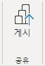

---
lab:
  course: PL-300
  title: AI 시각적 개체로 고급 분석 수행
  module: Perform Data Analysis in Power BI
---

# **Power BI에서의 데이터 분석 수행**

## **랩 사례**

이 랩에서는 **판매 탐색** 보고서를 만듭니다.

이 랩에서는 다음 작업을 수행하는 방법을 알아봅니다.

- 애니메이션 분산형 차트 만들기
- 시각적 개체를 사용한 값 예측

**이 랩은 약 30분 정도 소요됩니다.**

## **시작 - 로그인**

이 작업에서는 Power BI에 로그인에 로그인하여 랩의 환경을 설정합니다.

*참고: Power BI에 이미 로그인한 경우 다음 작업으로 건너뜁니다.*

1. Microsoft Edge를 열려면 작업 표시줄에서 Microsoft Edge 프로그램 바로 가기를 선택합니다.

     

1. Microsoft Edge 브라우저 창에서 **https://app.powerbi.com**으로 이동합니다.

    *팁: Microsoft Edge 즐겨찾기 표시줄에서 Power BI 서비스 즐겨찾기를 사용할 수도 있습니다.*

1. 조직(또는 제공된) 자격 증명을 사용하여 로그인 프로세스를 완료합니다. Microsoft Edge에서 로그인 상태를 유지할지 묻는 프롬프트가 표시되면 **예**를 선택합니다.

1. Microsoft Edge 브라우저 창의 Power BI 서비스 **탐색** 창에서 **내 작업 영역**을 확장합니다. Microsoft Edge 브라우저 창을 열어 둡니다.

     

## **시작 – 의미 체계 모델 만들기**

이 작업에서는 의미 체계 모델을 만들어 랩 환경을 설정합니다. *이미 의미 체계 모델을 게시한 경우 다음 작업으로 이동하세요.*

1. Microsoft Edge 브라우저 창의 Power BI 서비스에서 **내 작업 영역**으로 이동합니다.

1. **업로드 > 찾아보기**를 선택합니다.

1. **D:\Allfiles\Labs\08-perform-data-analytic-in-power-bi-desktop\Starter** 폴더로 이동합니다.

1. **Sales Analysis.pbix** 파일을 선택한 다음, **열기**를 선택합니다.

    *의미 체계 모델을 바꾸라는 메시지가 나타나면 **바꾸기**를 선택합니다.*

*이 방법으로 보고서와 의미 체계 모델이 만들어집니다. 이 연습에서는 새 보고서를 만들기 위해 의미 체계 모델만 사용합니다. 새 보고서를 업로드하는 대신 다른 보고서의 기존 의미 체계 모델을 사용하여 동일한 프로세스를 수행할 수 있습니다. 또한 보고서를 사용하지 않는 경우 작업 영역 모범 사례에서는 불필요한 파일을 삭제하는 것이 좋습니다.*

## **보고서 만들기**

이 작업에서는 마지막 작업에서 만든 Power BI 의미 체계 모델에 대한 라이브 연결을 만든 다음 새 **판매 탐색** 보고서를 만듭니다.

1. Power BI Desktop을 실행합니다.

    

    *중요: 이전 랩에서 Power BI Desktop을 열어 둔 경우 해당 인스턴스를 닫습니다.*

    *팁: 기본적으로 시작하기 대화 상자는 Power BI Desktop 앞에 열립니다. 로그인을 선택한 다음 팝업을 닫을 수 있습니다.*

1. 홈 리본에서 **데이터 가져오기 > Power BI 의미 체계 모델**을 선택합니다.

1. **데이터 허브** 창의 **내 작업 영역**에서 **판매 분석** 의미 체계 모델을 선택한 다음 **연결**을 선택하거나 두 번 클릭하여 의미 체계 모델을 로드합니다.

1. **파일 > 저장**으로 이동하여 **D:\Allfiles\MySolution** 폴더에 파일 이름을 **Sales Exploration**으로 저장합니다.

이제 2개의 새 보고서 페이지를 만들고 각 페이지에서 다른 시각적 개체를 사용하여 데이터를 분석하고 탐색할 수 있습니다.**

## **애니메이션 분산형 차트 만들기**

이 작업에서는 애니메이션을 적용할 수 있는 분산형 차트를 만듭니다.

1. **페이지 1**의 이름을 **분산형 차트**로 변경합니다.

1. 보고서 페이지에 **분산형 차트** 시각적 개체를 추가한 다음 전체 페이지를 채우도록 크기를 조정하여 배치합니다.
    
    필드가 **재생 축** 웰/영역에 추가되면 차트를 애니메이션화할 수 있습니다.

     

     

1. 다음 필드를 시각적 개체 웰/영역에 추가합니다.
    
    *랩에서는 약식 표기법을 사용하여 필드를 참조합니다. 다음과 같이 표시됩니다. **재판매인** **\|** **비즈니스 유형**. 이 예에서 **Reseller**는 테이블 이름이고 **Business Type**은 필드 이름입니다.*

     - X축: **판매 \| 판매**
     - Y축: **판매 \| 이익률**
     - 범례: **재판매인 \| 비즈니스 유형**
     - 크기: **판매 \| 수량**
     - Play Axis: **날짜 \| 분기**

1. **필터** 창에서 **이 페이지의 필터** 웰/영역에 **제품 \| 범주** 필드를 추가합니다.

1. 필터 카드에서 **자전거**를 기준으로 필터링합니다.

1. 차트에 애니메이션을 적용하려면 왼쪽 하단에서 **재생**을 선택합니다.

    

1. **FY2018 Q1**부터 **FY2020 Q4**까지의 전체 애니메이션 주기를 봅니다.
    
    분산형 차트에서는 측정값을 동시에 해석할 수 있습니다. 여기에서는 주문 수량, 판매 수익, 이익률을 동시에 해석할 수 있습니다.
    
    각 거품형은 재판매인 비즈니스 유형을 나타냅니다. 거품형 크기는 증가 또는 감소한 주문 수량을 반영하여 변경됩니다. 수평 이동은 판매 수익의 증가/감소를 나타내며 수직 이동은 수익성의 증가/감소를 나타냅니다.

1. 애니메이션이 중지되면 거품형 중 하나를 선택하여 시간에 따른 추적을 표시합니다.

1. 해당 시점에서 재판매인 유형에 대한 측정값을 설명하는 도구 설명을 표시하려면 거품형 위에 커서를 놓습니다.

1. **필터** 창에서 **Clothing**만을 기준으로 필터링하면 매우 다른 결과가 생성되는 것을 확인할 수 있습니다.

1. Power BI Desktop 파일을 저장합니다.

## **예측 만들기**

이 작업에서는 예상되는 향후 판매 수익을 판단하는 예측을 만듭니다.

1. 새 페이지를 추가하고 페이지 이름을 **예측**으로 변경합니다.

1. 보고서 페이지에 **꺾은선형 차트** 시각적 개체를 추가한 다음 전체 페이지를 채우도록 크기를 조정하여 배치합니다.

     

     

1. 다음 필드를 시각적 개체 웰/영역에 추가합니다.

     - X축: **날짜 \| 날짜**
     - Y축: **판매 \| 판매**

1. **필터** 창에서 **이 페이지의 필터** 웰/영역에 **날짜 \| 연도** 필드를 추가합니다.

1. 필터 카드에서 2년을 기준으로 필터링합니다. **FY2019** 및 **FY2020**.
    
    *시간대에 따라 예측하는 경우 정확하고 안정적인 예측을 생성하려면 적어도 두 개의 주기(연도)의 데이터가 필요합니다.*

1. **이 페이지의 필터** 웰/영역에 **제품 \| 범주** 필드도 추가한 다음, **자전거**를 기준으로 필터링합니다.

1. 예측을 추가하려면 **시각화** 창 아래에서 **Analytics** 창을 선택합니다.

     

8. **예측** 섹션을 확장합니다.
    
    ***예측** 섹션을 사용할 수 없는 경우 시각적 개체를 올바르게 구성하지 않았기 때문일 수 있습니다. 예측은 두 가지 조건이 충족되는 경우에만 사용할 수 있습니다. 축에는 날짜 형식의 단일 필드가 있고 값 필드가 하나만 있어야 합니다.*

1. **예측** 옵션을 **켜기**로 설정합니다.

1. 다음 예측 속성을 구성한 후 **적용**합니다.

    - 단위: **Months**
    - 예측 범위: **1개월**
    - 계절성: **365**
    - 신뢰도 간격: **80%**

    

1. 줄 시각적 개체에서 예측은 기록 데이터를 벗어나 1개월이 연장된 것을 알 수 있습니다.
    
    회색 영역은 신뢰도를 나타냅니다. 신뢰도 영역이 넓을수록 예측 안정성이 낮아지므로 정확성이 떨어집니다.
    
    주기의 길이(여기에서는 연간)를 알고 있으면 계절성 지점을 입력해야 합니다. 매주(7) 또는 매월(30)일 수도 있습니다.

1. **필터** 창에서 **Clothing**만을 기준으로 필터링하면 다른 결과가 생성되는 것을 확인할 수 있습니다.

### **완료**

이 작업에서는 Power BI Desktop에서 랩을 완료합니다.

1. **분산형 차트** 페이지를 선택합니다.

1. Power BI Desktop 파일을 저장합니다.

1. 파일을 **내 작업 영역**에 게시하려면 **홈** 리본 탭의 **공유** 그룹 내부에서 **게시**를 선택한 다음 **선택**을 선택하여 게시합니다.

    

1. Power BI Desktop을 닫습니다.
