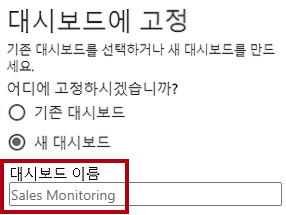
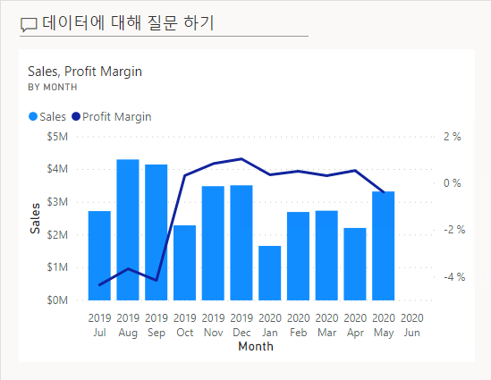
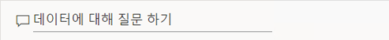
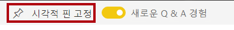
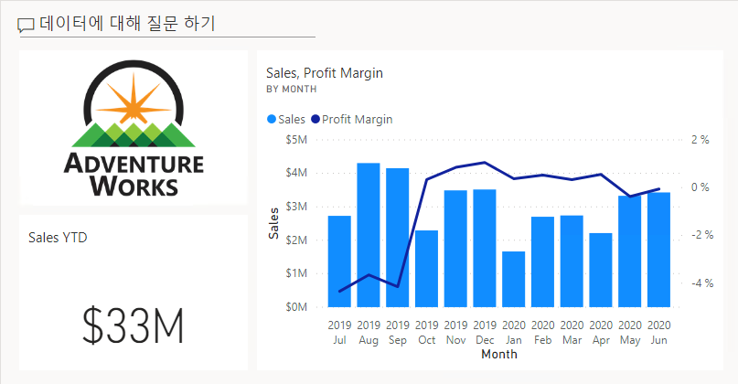
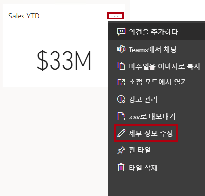
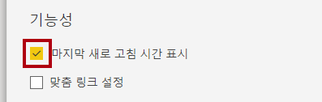
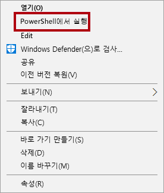
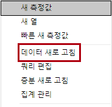
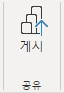

---
lab:
  title: Power BI 대시보드 만들기
  module: Create Dashboards
---

# Power BI 대시보드 만들기

## 랩 사례

이 랩에서는 기존 보고서를 사용하여 Power BI 서비스에 **Sales Monitoring** 대시보드를 만듭니다.

이 랩에서는 다음 작업을 수행하는 방법을 알아봅니다.

- 대시보드에 시각적 개체 고정
- 질문 및 답변을 사용하여 대시보드 타일 만들기

**이 랩은 30분 정도 소요됩니다.**

## 시작하기

이 연습을 완료하려면 먼저 웹 브라우저를 열고 다음 URL을 입력하여 zip 폴더를 다운로드합니다.

`https://github.com/MicrosoftLearning/PL-300-Microsoft-Power-BI-Data-Analyst/raw/Main/Allfiles/Labs/09-create-power-bi-dashboard/09-create-dashboard.zip`

**C:\Users\Student\Downloads\09-create-dashboard** 폴더로 폴더를 추출합니다.

## **보고서 게시**

이 작업에서는 의미 체계 모델을 만들어 랩 환경을 설정합니다.

1. Microsoft Edge 브라우저 창의 Power BI 서비스에서 **내 작업 영역**으로 이동합니다.

1. **업로드 > 찾아보기**를 선택합니다.

1. **C:\Users\Student\Downloads\09-create-dashboard** 폴더로 이동합니다.

1. **09-스타터-영업 분석.pbix** 파일을 선택한 다음, **열기**를 선택합니다.

    > *의미 체계 모델을 바꾸라는 메시지가 나타나면 **바꾸기**를 선택합니다.*

## **대시보드 만들기**

이 작업에서는 **Sales Monitoring** 대시보드를 만듭니다. 보고서에서 시각적 개체를 고정하고 이미지 데이터 URI를 기준으로 타일을 추가하고 Q&A를 사용하여 타일을 만듭니다.

1. Power BI 서비스에서 **09-스타터-영업 분석** 보고서를 엽니다.

1. **개요** 페이지에서 **연도** 슬라이서를 **FY2020**으로 설정합니다.

    

1. **지역** 슬라이서를 **모두 선택**으로 설정합니다.

    > *고정된 시각적 개체는 고정 시 필터 컨텍스트로 설정됩니다. 기본 시각적 개체가 변경되면 대시보드 타일도 업데이트해야 합니다. 시간 기반 필터의 경우 상대 날짜 슬라이서를 사용하는 것이 좋습니다(또는 상대 시간 기반 질문을 사용하는 질문 및 답변).*

1. 대시보드를 만들고 시각적 개체를 고정하려면 **월별 판매 및 이익률**(세로 막대형/꺾은선형) 시각적 개체 위를 커서로 가리키고 푸시핀을 선택합니다.

    

1. **대시보드에 고정** 창에서 **대시보드 이름** 상자에 **Sales Monitoring**을 입력한 다음 **고정**을 선택합니다.

    

1. **내 작업 영역**을 열고 **Sales Monitoring** 대시보드를 엽니다.

1. 대시보드에는 단일 타일이 있습니다.

    

1. 질문을 기반으로 타일을 추가하려면 대시보드의 왼쪽 위에서 **데이터에 대해 질문하기**를 선택합니다. 

    *질문 및 답변 기능을 사용하여 질문을 할 수 있으며 Power BI가 시각적로 응답합니다.*

    

1. Q&A 상자 아래에서 제안된 질문 중 하나를 선택하고 응답을 검토합니다.

1. Q&A 상자에서 모든 텍스트를 제거하고 다음을 입력합니다. **Sales YTD**

1. **(Blank)** 응답을 확인합니다.

    > ***Power BI Desktop의 고급 DAX 계산 만들기** 랩에서 **Sales YTD** 측정값을 추가한 것을 기억하실 것입니다. 이 측정값은 시간 인텔리전스 식이므로 결과를 생성하려면 **날짜** 테이블에 필터가 필요합니다.*

    

1. **in year FY2020**으로 질문을 확장합니다.

1. 이제 응답으로 **$33M**이 표시됩니다.

    

1. 대시보드에 응답을 고정하려면 오른쪽 위에서 **시각적 개체 고정**을 선택합니다.

    

1. 타일을 **영업 모니터링** 대시보드에 고정할지 묻는 프롬프트가 표시되면 **고정**을 선택합니다.

1. 대시보드로 돌아가려면 왼쪽 위에 있는 **질문&amp;답변 종료**를 선택합니다.

1. 회사 로고를 추가하려면 메뉴 모음에서 **편집**을 선택한 다음, **타일 추가**를 선택합니다.
    
    > *이 기술을 사용하여 대시보드 타일을 추가하면 웹 콘텐츠, 이미지, 서식 있는 텍스트 상자, 동영상(YouTube 또는 Vimeo 링크)을 비롯한 미디어로 대시보드를 향상할 수 있습니다.*

1. 오른쪽에 있는 **타일 추가** 창에서 **이미지** 타일과 **다음**을 차례대로 선택합니다.

1. **이미지 타일 추가** 창의 **URL** 상자에 **C:\Users\Student\Downloads\09-create-dashboard\AdventureWorksLogo_DataURL.txt** 파일에 있는 전체 URL을 입력한 다음 **적용**을 입력합니다.
    
    > *URL을 사용하여 이미지를 포함하거나 콘텐츠 인라인을 포함하는 데이터 URL을 사용할 수 있습니다.*

1. 로고 타일의 크기를 조정하려면 오른쪽 아래 모서리를 끌고 타일 크기를 1개 단위(너비) x 1개 단위(높이)로 조정합니다.
    
    > *타일 크기는 사각형 모양으로 제한됩니다.*

1. 로고가 왼쪽 위에 표시되고 그 아래에 **Sales YTD** 타일이 표시되고 오른쪽에 **Sales, Profit Margin** 타일이 표시되도록 타일을 구성합니다.

    

## **타일 세부 정보 편집**

이 작업에서는 두 타일의 세부 정보를 편집합니다.

1. 커서로 **Sales YTD** 타일을 가리킨 다음, 타일 오른쪽 위에 있는 줄임표를 선택하고, **세부 정보 편집**을 선택합니다.

    

1. 오른쪽에 있는 **타일 세부 정보** 창에서 **부제목** 상자에 **FY2020**을 입력한 다음 **적용**을 선택합니다.

1. **Sales YTD** 타일에 부제목이 표시됩니다.

    

1. **Sales, Profit Margin** 타일의 타일 세부 정보를 편집합니다.

1. **타일 세부 정보** 창의 **기능** 섹션에서 **마지막으로 새로 고친 시간 표시**를 선택한 다음 **적용**을 선택합니다.

    

1. 타일은 마지막 새로 고침 시간(Power BI Desktop에서 데이터 모델을 로드한 시간)을 설명합니다.

*다음 연습에서 의미 체계 모델을 새로 고칩니다. 데이터 및 보고서에 따라 언제든지 임시 데이터 새로 고침을 수행하거나 일정을 설정할 수 있습니다. 그러나 예약된 새로 고침에는 이 랩 대해 구성할 수 없는 게이트웨이가 필요합니다. 따라서 Power BI Desktop에서 수동 데이터 새로 고침을 수행하고, 작업 영역에 파일을 업로드합니다.*

## **의미 체계 모델 새로 고침**

이 연습에서는 먼저 2020년 6월의 판매 주문 데이터를 **AdventureWorksDW2020** 데이터베이스로 로드합니다. 그러 다음 Power BI Desktop 파일을 열고 데이터를 새로 고친 다음 작업 영역에 파일을 업로드합니다.

> ***참고**: 데이터베이스에 연결할 수 없는 경우 **09-솔루션-영업 분석.pbix** 파일을 사용할 수 있습니다. 데이터베이스를 업데이트하고 의미 체계 모델을 새로 고침하는 대신 솔루션 파일을 **내 작업 영역**에 업로드하고 다음 작업에서 참조된 변경 내용을 확인합니다.*

## **랩 데이터베이스 업데이트**

이 작업에서는 PowerShell 스크립트를 실행하여 **AdventureWorksDW2020** 데이터베이스의 데이터를 업데이트합니다.

1. 파일 탐색기에서 **C:\Users\Student\Downloads\09-create-dashboard** 폴더 내부에서 **UpdateDatabase-2-AddSales.ps1** 파일을 마우스 오른쪽 단추로 클릭한 다음 **PowerShell로 실행**을 선택합니다.

    

1. 실행 정책을 변경할지 묻는 프롬프트가 표시되면 **A** 키를 누릅니다.

1. 아무 키나 눌러 닫으라는 메시지가 표시되면 **Enter** 키를 다시 누릅니다.

이제 **AdventureWorksDW2020** 데이터베이스에 2020년 6월 판매 주문이 포함되어 있습니다.**

## **Power BI Desktop 파일 새로 고침**

이 작업에서는 **09-스타터-영업 분석** Power BI Desktop 파일을 열고, 데이터 새로 고침을 수행한 다음, **영업 분석** 작업 영역에 파일을 업로드합니다.

1. Power BI Desktop 파일의 **데이터** 창에서 **Sales** 테이블을 마우스 오른쪽 단추로 클릭한 다음, **데이터 새로 고침**을 선택합니다.

    

1. 새로 고침이 완료되면 Power BI Desktop 파일을 저장합니다.

1. 파일을 내 작업 영역에 게시하려면 **홈** 리본 탭의 **공유** 그룹 내부에서 **게시**를 선택한 다음 **선택**을 클릭하여 게시합니다.

    

1. 의미 체계 모델을 바꾸라는 메시지가 나타나면 **바꾸기**를 선택합니다.

1. Power BI Desktop을 닫습니다.

*이제 Power BI 서비스의 의미 체계 모델에 2020년 6월 판매 데이터가 포함됩니다.*

### **대시보드 검토**

이 작업에서는 대시보드를 검토하여 업데이트된 판매를 확인합니다.

1. Microsoft Edge 브라우저 창에서 Power BI 서비스를 연 다음 **내 작업 영역**에서 **Sales Monitoring** 대시보드를 검토합니다.

2. **Sales, Profit Margin** 타일의 부제목에서 데이터가 **이제 새로 고쳐짐 **이 확인됩니다.

3. 또한 이제 **2020년 6월**에 해당하는 열이 생겼습니다.

    > 2020년 6월 데이터가 표시되지 않으면 **F5** 키를 눌러 웹 브라우저를 다시 로드해야 할 수도 있습니다.**

    

## 랩 완료
