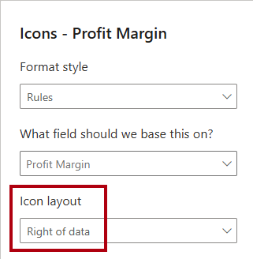
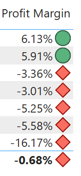

---
lab:
  title: Power BI 보고서 디자인 개선
  module: Enhance Power BI report designs for the user experience
---

# Power BI 보고서 디자인 개선

## 랩 사례

이 랩에서는 고급 디자인 기능을 사용하여 _판매 분석_ 보고서를 개선해 보겠습니다.

이 랩에서는 다음 사항들을 수행하는 방법에 대해 알아봅니다.

- 드릴스루 페이지를 만들어 보세요.
- 조건부 서식을 적용해 보세요.
- 책갈피 및 단추를 만들고 사용합니다.

**이 랩은 약 45분 정도 소요됩니다.**

## 시작하기

이 연습을 완료하려면 먼저 웹 브라우저를 열고 다음 URL을 입력하여 zip 파일을 다운로드합니다.

`https://github.com/MicrosoftLearning/PL-300-Microsoft-Power-BI-Data-Analyst/raw/Main/Allfiles/Labs/09-enhance-power-bi-reports/09-enhanced-report.zip`

파일을 **C:\Users\Student\Downloads\09-enhanced-report** 폴더로 추출합니다.

**09-Starter-Sales Analysis.pbix** 파일을 엽니다.

> _**참고**: **취소**를 선택하면 로그인을 취소할 수 있습니다. 다른 정보 창을 모두 닫습니다. 변경 내용을 적용하라는 프롬프트가 표시되면 **나중에 적용**을 선택하세요._

## 드릴스루 페이지 구성

이 연습에서는 새 페이지를 만들어서 드릴스루 페이지로 구성합니다. 디자인을 완료하면 페이지가 다음과 같아집니다.

1. 새 페이지를 만들고 이름을 _제품 세부 정보_로 바꾸세요.

1. **Product Details** 페이지 탭을 마우스 오른쪽 단추로 클릭하고 **페이지 숨기기**를 선택합니다.

    > _보고서 사용자는 드릴스루 페이지로 직접 이동할 수 없으며, 대신 다른 페이지의 시각적 개체에서 액세스해야 합니다. 이 랩의 마지막 연습에서 페이지로 드릴스루하는 방법을 알아봅니다._

1. **시각화** 창 아래의 **드릴스루** 섹션에서 **여기에 드릴스루 필드 추가** 상자에 `Product | Category` 필드를 추가합니다.

    > _랩에서는 약식 표기법을 사용하여 필드를 참조합니다. `Product | Category`와 같이 표시됩니다. 이 예시에서 `Product`는 테이블 이름이고 `Category`는 필드 이름입니다._

    

1. 드릴스루 페이지를 테스트하려면 드릴스루 필터 카드에서 _Bikes_를 선택합니다.

    

1. 보고서 페이지의 왼쪽 위에 화살표 단추가 표시된 것을 확인합니다.

    > _드릴스루 웰에 필드가 추가되면 보고서 디자이너는 자동으로 화살표 단추를 추가합니다. 보고서 사용자는 이 단추를 사용하여 드릴스루한 페이지에서 되돌아갈 수 있습니다._

1. 페이지에 **카드** 시각적 개체를 추가한 다음 크기를 조정하고 단추 오른쪽에 배치하여 페이지의 나머지 너비를 채웁니다.

    

    

1. `Product | Category` 필드를 카드 시각적 개체로 끌어다 놓습니다.

1. 시각적 개체의 서식 옵션을 구성한 다음, **범주 레이블** 속성을 **끄기**로 설정합니다.

    

1. **일반** 탭의 **효과** 섹션에서 배경색 속성을 밝은 회색(예: _흰색, 10% 더 어둡게_)으로 설정하여 대비를 제공합니다.

    

1. 페이지에 **테이블** 시각적 개체를 추가한 다음 크기를 조정하고 카드 시각적 개체 아래에 배치하여 페이지의 나머지 공간을 채웁니다.

    

    

1. 시각적 개체에 다음 필드를 추가합니다.

    - `Product | Subcategory`
    - `Product | Color`
    - `Sales | Quantity`
    - `Sales | Sales`
    - `Sales | Profit Margin`

1. 시각적 개체의 형식 옵션을 구성하려면 **그리드** 섹션에서 **전역 글꼴 크기** 속성을 **20pt**로 설정합니다.

    > _드릴스루 페이지의 디자인이 거의 완료되었습니다. 다음 연습에서 조건부 서식을 사용하여 페이지를 개선할 것입니다._

## 조건부 서식 추가

이 연습에서는 조건부 서식을 사용하여 드릴스루 페이지를 개선합니다. 디자인을 완료하면 페이지가 다음과 같아집니다.

1. 테이블 시각적 개체를 선택합니다. **열** 웰에서 **이익률** 필드의 아래쪽 화살표를 선택한 다음, **조건부 서식 > 아이콘**을 선택합니다.

    

1. **아이콘 – Profit Margin** 창의 **아이콘 레이아웃** 드롭다운 목록에서 **데이터의 오른쪽**을 선택합니다.

    

1. 중간 규칙을 삭제하려면 노란색 삼각형 오른쪽에서 **X**를 선택합니다.

    

1. 첫 번째 규칙(빨간Color 다이아몬드)을 다음과 같이 구성합니다.

    - 두 번째 컨트롤에서 값을 제거합니다.
    - 세 번째 컨트롤에서 **숫자**를 선택합니다.
    - 다섯 번째 컨트롤에서 **0**을 입력합니다.
    - 여섯 번째 컨트롤에서 **숫자**를 선택합니다.

1. 두 번째 규칙(녹Color 원)을 다음과 같이 구성합니다.

    - 두 번째 컨트롤에서 **0**을 입력합니다.
    - 세 번째 컨트롤에서 **숫자**를 선택합니다.
    - 다섯 번째 컨트롤에서 값을 제거합니다.
    - 여섯 번째 컨트롤에서 **숫자**를 선택합니다.

    

    > _이 규칙은 다음과 같이 해석할 수 있습니다. 이익률이 0보다 작으면 빨간색 다이아몬드를 표시하고, 0보다 크거나 같으면 녹색 원을 표시합니다._

1. **아이콘 - 이익률** 창의 **적용 대상** 드롭다운 목록에서 **값 및 합계**를 선택합니다.

    

1. **확인**을 선택합니다.

1. 테이블 시각적 개체에서 올바른 아이콘이 표시되는지 확인합니다.

    

1. **Color** 필드의 배경Color 조건부 Formatting을 구성합니다.

1. **배경Color - Color** 창의 **Formatting 스타일** 드롭다운 목록에서 **필드 값**을 선택합니다.

    

1. **이 값은 어떤 필드를 기준으로 해야 하나요?** 드롭다운 목록의 _모든 데이터_ 그룹에서 `Product | Formatting | Background Color Format` 필드를 선택합니다.

    

1. `Product | Formatting | Font Color Format` 필드를 사용하여 **색상** 필드에 대한 글꼴 색상 조건부 서식을 구성하려면 이전 단계를 반복합니다.

 > _배경색과 글꼴색은 **Power BI Desktop에서 데이터 준비** 랩의 **ColorFormats.csv** 파일에서 가져온 다음, **Power BI Desktop에서 데이터 로드** 랩의 **제품** 쿼리와 통합한 것을 기억하실 수 있을 겁니다._

## 책갈피 및 단추 추가

이 연습에서는 보고서 사용자가 표시할 시각적 개체 유형을 선택할 수 있도록 단추를 사용하여 _내 실적_ 페이지를 개선해 봅니다. 디자인을 완료하면 페이지가 다음과 같아집니다.

1. _My Performance_ 페이지로 이동합니다.

1. **보기** 리본 탭의 **창 표시** 그룹에서 **책갈피**를 선택합니다.

    

1. **보기** 리본 탭의 **창 표시** 그룹에서 **선택 영역**을 선택합니다.

    

1. **선택 영역** 창에서 _월별 매출 및 목표_ 항목 중 하나 옆에서 눈 모양 아이콘을 선택하여 시각적 개체를 숨깁니다.

    

1. **책갈피** 창에서 **추가**를 선택합니다.

    

    > _팁: 책갈피의 이름을 바꾸려면 책갈피를 두 번 클릭합니다._

1. 표시되는 차트가 가로 막대형 차트인 경우 책갈피 이름을 _Bar Chart ON_으로 바꾸고 그렇지 않은 경우 책갈피 이름을 _Column Chart ON_으로 바꿉니다.

1. 책갈피를 편집하려면 **책갈피** 창에서 책갈피 위로 커서를 가져간 다음 줄임표를 선택하고 **데이터**를 선택합니다.

    > _**데이터** 옵션을 사용하지 않도록 설정하면 책갈피는 현재 필터 상태를 사용하지 않습니다. 이 기능은 중요합니다. 이 옵션을 비활성화하지 않는 경우 책갈피가 연도 슬라이서에 의해 현재 적용되어 있는 필터로 영구 고정되기 때문입니다._

    

1. 책갈피를 업데이트하려면 줄임표를 다시 선택한 다음 **업데이트**를 선택합니다.

    > _다음 단계에서는 두 번째 책갈피를 만들고 구성하여 두 번째 시각적 개체를 표시합니다._

1. **선택 영역** 창에서 두 _월별 매출 및 목표_ 항목의 표시 여부를 토글합니다.

    > _즉, 표시된 시각적 개체를 숨기고 숨겨진 시각적 개체를 표시하도록 설정합니다._

    

1. 두 번째 책갈피를 만들고 적절한 이름을 지정합니다(_세로 막대형 차트 켜기_ 또는 _막대형 차트 켜기_).

    

1. 필터를 무시(**데이터** 옵션 해제)하고 책갈피를 업데이트하도록 두 번째 책갈피를 구성합니다.

1. **선택** 창에서 두 시각적 개체를 모두 표시하려는 경우 숨겨진 시각적 개체만 표시하면 됩니다.

1. 두 시각적 개체가 다중 카드 시각적 개체 아래에 배치되고 서로 완전히 중첩되도록 크기와 위치를 조정합니다.

    > _중첩된 시각적 개체를 선택하려면 **선택 영역** 창에서 해당 시각적 개체를 선택합니다._

    

1. **책갈피** 창에서 각 책갈피를 선택하면 둘 중 하나의 시각적 개체만 표시되는 것을 알 수 있습니다.

    > _디자인의 다음 단계는 페이지에 두 개의 단추를 추가하는 것입니다. 이 단추를 사용하면 보고서 사용자가 책갈피를 선택할 수 있습니다._

1. **삽입** 리본의 **요소** 그룹에서 **단추**를 선택하고 **비어 있음**을 선택합니다.

    

1. _Year_ 슬라이서 바로 아래에 단추를 배치합니다.

1. 단추를 선택한 다음, **서식 단추** 창에서 **스타일** 섹션을 확장하고, **텍스트** 섹션을 **켜기**로 설정합니다.

    

1. **텍스트** 섹션의 **텍스트** 상자에 _막대형 차트_를 입력합니다.

1. **채우기** 섹션을 **켜기**로 설정한 다음, 보색을 사용하여 색상을 설정합니다.

1. **작업** 섹션을 **켜기**로 설정한 다음, **유형** 속성을 **책갈피**로 설정합니다.

1. **단추**을 선택하고 **작업** 속성을 **켜기**로 설정합니다.

1. **작업** 섹션을 확장하고 **형식** 드롭다운 목록을 **책갈피**로 설정합니다.

1. **책갈피** 드롭다운 목록에서 **Bar Chart ON**을 선택합니다.

    

1. 복사 및 붙여넣기를 사용하여 단추의 복사본을 만들고 다음과 같이 새 단추를 구성합니다.

    > _팁: 복사 및 붙여넣기 작업의 바로 가기 명령은 **Ctrl+C**와 **Ctrl+V**를 차례로 사용하는 것입니다._

    - 단추 텍스트를 _막대형 차트_로 설정합니다.
    - 작업 책갈피를 **세로 막대형 차트 켜기**로 설정합니다.

    > _이제 Sales 분석 보고서 디자인이 완료되었습니다._

## 보고서 게시 및 탐색

이 연습에서는 보고서를 Power BI 서비스에 게시하고 게시된 보고서 동작을 니다.

> _**참고**: 보고서를 게시하려면 최소한 **Power BI 무료** 라이선스가 필요합니다. Microsoft Edge 브라우저를 열고 `https://app.powerbi.com`에 로그인합니다. 퍼즐을 풀거나 무료 Fabric 평가판을 시작하라는 메시지가 표시되면 이를 건너뛰고 브라우저를 닫을 수 있습니다.

> _**참고**: 작업을 직접 수행하기 위해 Power BI 서비스에 액세스할 수 없는 경우에도 연습의 나머지 부분을 검토할 수 있습니다._

1. _Overview_ 페이지를 선택합니다.

1. _Year_ 슬라이서에서 **FY2020**을 선택합니다.

1. _지역_ 슬라이서에서 선택된 지역이 없는지 확인하세요.

1. Power BI Desktop 파일을 저장합니다.

1. **홈** 리본 탭의 **공유** 그룹 내에서 **게시**를 선택합니다.

    > _아직 Power BI Desktop에 로그인하지 않은 경우, 보고서를 게시하기 전에 먼저 로그인해야 합니다._

    

1. **Power BI에 게시** 창에서 _내 작업 영역_이 선택된 것을 볼 수 있습니다.

1. 보고서를 게시하려면 **선택**을 선택합니다. 게시가 완료될 때까지 기다리세요.

1. 게시에 성공하면 **확인**을 선택합니다.

1. Power BI Desktop을 닫습니다.

1. Microsoft Edge 브라우저를 열고 `https://app.powerbi.com`에서 로그인하세요(또는 기존 브라우저 세션 사용).

1. 브라우저 창의 Power BI 서비스 내 **탐색** 창(왼쪽에 위치, 축소 가능함)에서 **내 작업 영역**을 선택합니다.

1. 보고서를 탐색하려면 _09-Starter-Sales 분석_ 보고서를 선택합니다.

1. 드릴스루 기능을 테스트하려면 _개요_ 페이지에서 _범주별 수량 합계_ 시각적 개체에서 _의류_ 표시줄을 마우스 오른쪽 단추로 클릭한 다음, **드릴스루 > 제품 세부 정보**를 선택합니다.

    

1. _제품 세부 정보_ 페이지에서는 _의류_에 대한 시각적 개체 정보가 필터링됩니다.

1. 원본 페이지로 돌아가려면 페이지 왼쪽 상단에서 화살표 단추를 선택합니다.

1. _My Performance_ 페이지로 이동합니다.

1. 각 단추를 선택하면 다른 시각적 개체가 표시되는 것을 알 수 있습니다.

## 랩 완료
