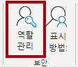
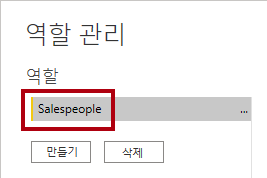
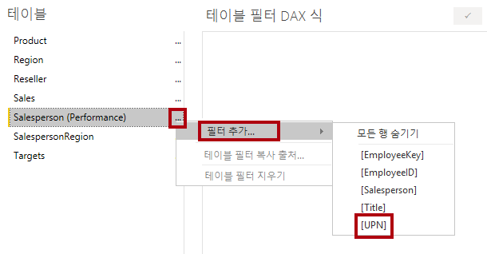
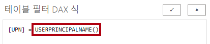
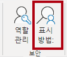
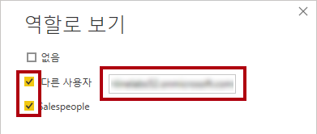
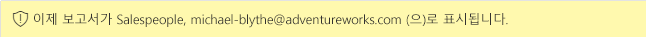
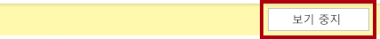
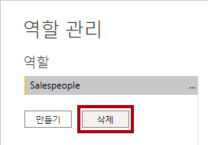

---
lab:
  course: PL-300
  title: 행 수준 보안 적용
  module: Enforce Row-Level Security
---

# **행 수준 보안 적용**

## **랩 사례**

이 랩에서는 판매원이 할당된 지역에 대한 판매 데이터만 분석할 수 있도록 행 수준 보안을 적용합니다.

이 랩에서는 다음 작업을 수행하는 방법을 알아봅니다.

- 행 수준 보안 적용
- 동적 메서드와 정적 메서드 중에서 선택

**이 랩은 약 20분 정도 소요됩니다.**

## **시작**

이 작업에서는 랩의 환경을 설정합니다.

*중요: 이전 랩에서 계속 진행해 온 경우(그리고 해당 랩을 성공적으로 완료한 경우) 이 작업을 완료하지 마세요. 대신, 다음 작업부터 계속하세요.*

1. Power BI Desktop을 실행합니다.

    

    *팁: 기본적으로 시작하기 대화 상자는 Power BI Desktop 앞에 열립니다. **로그인**한 다음 팝업을 닫습니다.*

1. 시작 Power BI Desktop 파일을 열려면 **파일 > 보고서 열기 > 보고서 찾아보기**를 선택합니다.

1. **열기** 창에서 **D:\Allfiles\Labs\10-row-level-security\Starter** 폴더로 이동하여 **판매 분석** 파일을 엽니다.

1. 열려 있는 정보 창을 모두 닫습니다.

1. 리본 아래에 있는 경고 메시지를 확인합니다. *이 메시지는 모델 테이블로 로드하기 위해 쿼리가 적용되지 않았다는 팩트를 알려 줍니다. 이 랩의 후반에서 쿼리를 적용하겠습니다.*
    
    *경고 메시지를 닫으려면 경고 메시지 오른쪽에 있는 **X**를 선택합니다.*

1. 파일 복사본을 만들려면 **파일 > 다른 이름으로 저장**으로 이동하여 **D:\Allfiles\MySolution** 폴더에 저장합니다.

1. 변경 내용을 적용할지 묻는 프롬프트가 표시되면 **나중에 적용**을 선택합니다.

## **행 수준 보안 적용**

이 작업에서는 영업 직원이 할당된 지역에 대한 판매량만 볼 수 있도록 행 수준 보안을 적용합니다.

1. 데이터 뷰로 전환합니다.

   

1. **데이터** 창에서 **Salesperson(Performance)** 테이블을 선택합니다.

1. 데이터를 검토하면 Michael Blythe(EmployeeKey 281)의 UPN 값이 **michael-blythe@adventureworks.com** 임을 확인할 수 있습니다.
    
    *Michael Blythe가 다음 3개 판매 지역에 할당되어 있다는 것을 기억하실 것입니다. 미국 북동부, 미국 중부, 미국 남동부.*

1. **모델링** 리본 탭의 **보안** 그룹 내에서 **역할 관리**를 선택합니다.

    

1. **역할 관리** 창에서 **만들기**를 선택합니다.

1. 상자에서 선택한 텍스트를 역할 이름인**Salespeople**으로 바꿉니다. 그 다음 **입력**을 누릅니다.

   

1. 필터를 할당하려면 **영업 직원(성과)** 테이블에서 줄임표(...) 문자를 선택한 다음 **필터 추가 \| [UPN]** 을 선택합니다.

   

1. **테이블 필터 DAX 식** 상자에서 **"값"** 을 **USERPRINCIPALNAME()** 으로 바꿔 식을 수정한 다음 **저장**합니다.
    
    USERPRINCIPALNAME()은 인증된 사용자의 이름을 반환하는 DAX(Data Analysis Expressions) 함수입니다. 즉, **영업 직원(성과)** 테이블이 모델을 쿼리하는 사용자의 UPN(사용자 계정 이름)을 기준으로 필터링됩니다.

   

1. 보안 역할을 테스트하려면 **모델링** 리본 탭의 **보안** 그룹 내에서 **표시 방법**을 선택합니다.

   

1. **역할로 보기** 창에서 **다른 사용자** 항목을 선택하고 해당하는 상자에 **michael-blythe@adventureworks.com** 을 입력합니다.

1. **영업 직원** 역할을 확인한 다음 **확인**을 선택합니다.
    
    이렇게 구성하면 **영업 직원** 역할을 사용하고 Michael Blythe의 이름으로 사용자를 가장하게 됩니다.

   

1. 보고서 페이지 위의 노란색 배너에서 테스트 보안 컨텍스트를 설명하는 것을 볼 수 있습니다.

   

1. 테이블 시각적 개체에는 영업 직원 **Michael Blythe**만 나열됩니다.

   

1. 테스트를 중지하려면 노란색 배너의 오른쪽에서 **보기 중지**를 선택합니다.

   

1. **영업 직원** 역할을 삭제하려면 **모델링** 리본 탭의 **보안** 그룹 내부에서 **역할 관리**를 선택합니다.

   

1. **역할 관리** 창에서 **삭제**를 선택합니다. 삭제를 확인할지 묻는 프롬프트가 표시되면 **예, 삭제**를 선택합니다.

   

### **완료**

이번 작업에서는 랩을 마무리합니다.

1. **저장**을 선택한 다음 Power BI Desktop 파일을 저장하여 랩을 종료합니다.

*참고: Power BI Desktop 파일이 Power BI 서비스에 게시될 때 게시 후 작업을 완료하여 보안 주체를 **Salespeople** 역할에 매핑해야 합니다. 이 랩에서는 해당 작업을 수행하지 않습니다.*
