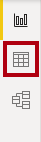
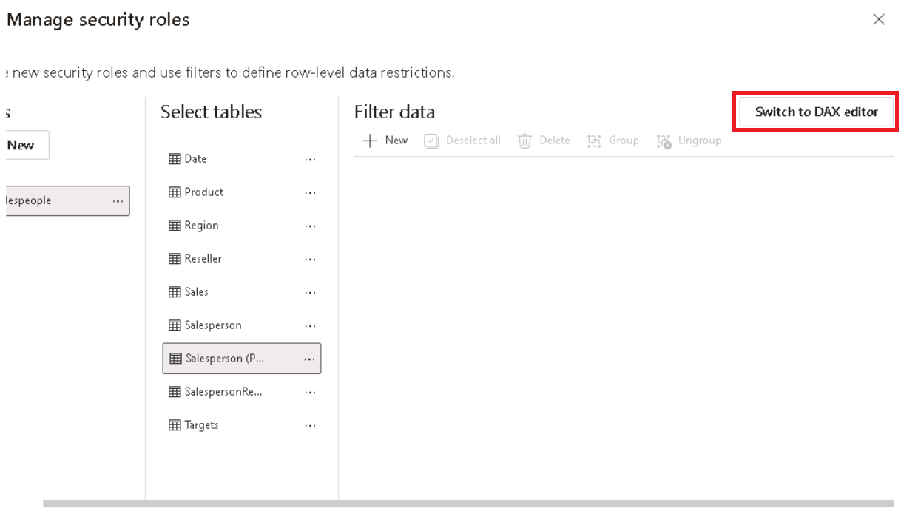
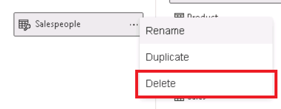

---
lab:
  title: Power BI 데이터 액세스 보호
  module: Secure data access in Power BI
---

# Power BI 데이터 액세스 보호

## 랩 사례

이 랩에서는 판매원이 할당된 지역에 대한 판매 데이터만 분석할 수 있도록 행 수준 보안을 적용합니다.

이 랩에서는 다음 사항들을 수행하는 방법에 대해 알아봅니다.

- 행 수준 보안을 적용합니다.
- 동적 메서드와 정적 메서드 중에서 선택하세요.

**이 랩은 약 20분 정도 소요됩니다.**

## 시작하기

이 연습을 완료하려면 먼저 웹 브라우저를 열고 다음 URL을 입력하여 zip 폴더를 다운로드합니다.

`https://github.com/MicrosoftLearning/PL-300-Microsoft-Power-BI-Data-Analyst/raw/Main/Allfiles/Labs/11-secure-data-access/11-secure-data.zip`

폴더를 **C:\Users\Student\Downloads\11-secure-data** 폴더로 추출합니다.

**11-Starter-Sales Analysis.pbix** 파일을 엽니다.

> ***참고**: **취소**를 선택하여 로그인을 해제할 수 있습니다. 다른 정보 창을 모두 닫습니다. 변경 사항을 적용하라는 메시지가 표시되면 **나중에 적용**을 선택합니다.*

## 행 수준 보안 적용

이 작업에서는 영업 직원이 할당된 지역에 대한 판매량만 볼 수 있도록 행 수준 보안을 적용합니다.

1. 테이블 보기로 다시 전환합니다.

   

1. **데이터** 창에서 **Salesperson(Performance)** 테이블을 선택합니다.

1. 데이터를 검토하면 Michael Blythe(EmployeeKey 281)의 UPN 값이 **`michael-blythe@adventureworks.com`** 임을 확인할 수 있습니다.
    
    > *Michael Blythe가 다음 3개 판매 지역에 할당되어 있다는 것을 기억하실 것입니다. 미국 북동부, 미국 중부, 미국 남동부.*

1. **홈** 리본 탭의 **보안** 그룹 내에서 **역할 관리**를 선택합니다.

    

1. **보안 역할 관리** 창의 **역할** 섹션에서 **새로 만들기**를 선택합니다.

1. 상자에서 선택한 텍스트를 역할 이름인**Salespeople**으로 바꿉니다. 그 다음 **입력**을 누릅니다.

   

1. 필터를 할당하려면 **Salesperson(Performance)** 테이블을 선택한 다음, **데이터 필터** 섹션에서 **DAX 편집기로 전환**을 선택합니다.

   

1. DAX 편집기 상자에 다음 식을 입력합니다.

    ```DAX
    [UPN] = USERPRINCIPALNAME()
    ```

   

    > USERPRINCIPALNAME()은 인증된 사용자의 이름을 반환하는 DAX(Data Analysis Expressions) 함수입니다. 즉, **영업 직원(성과)** 테이블이 모델을 쿼리하는 사용자의 UPN(사용자 계정 이름)을 기준으로 필터링됩니다.

1. **저장 후** **닫기**를 선택합니다.

1. 보안 역할을 테스트하려면 **홈** 리본 탭의 **보안** 그룹 내에서 **표시 방법**을 선택합니다.

   

1. **역할로 보기** 창에서 **다른 사용자** 항목을 선택하고 해당하는 상자에 **`michael-blythe@adventureworks.com`** 을 입력합니다.

1. **영업 직원** 역할을 확인한 다음 **확인**을 선택합니다.
    
    > 이렇게 구성하면 **영업 직원** 역할을 사용하고 Michael Blythe의 이름으로 사용자를 가장하게 됩니다.

   

1. 보고서 페이지 위의 노란색 배너에서 테스트 보안 컨텍스트를 설명하는 것을 볼 수 있습니다.

   

1. 테이블 시각적 개체에는 영업 직원 **Michael Blythe**만 나열됩니다.

   

1. 테스트를 중지하려면 노란색 배너의 오른쪽에서 **보기 중지**를 선택합니다.

   

1. **영업 직원** 역할을 삭제하려면 **홈** 리본 탭의 **보안** 그룹 내부에서 **역할 관리**를 선택합니다.

   

1. **보안 역할 관리** 창에서 **영업 직원** 역할에서 줄임표(...)를 선택하고 **삭제**를 선택합니다. 삭제를 확인할지 묻는 프롬프트가 표시되면 **예, 삭제**를 선택합니다.

   

*참고: Power BI Desktop 파일이 Power BI 서비스에 게시될 때 게시 후 작업을 완료하여 보안 주체를 **Salespeople** 역할에 매핑해야 합니다. 이 랩에서는 해당 작업을 수행하지 않습니다.*

## 랩 완료
